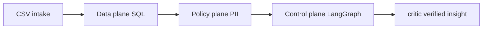

# Operator ETL

**Agentic data intake for FOIA and public comments** — deterministic medallion warehouse, LangGraph orchestration, MCP tool surface, PII policy plane.

[](https://github.com/khaosans/operator-etl/actions/workflows/ci.yml)

**Thesis:** Python and SQL decide what data exists. Agents orchestrate within typed boundaries. Tests prove the invariants — no LLM API key required for the MVP demo.

Built for government agencies and regulated bodies that must intake public comments, detect PII before release, quarantine bad rows, and produce **defensible insights** (every number verified against the warehouse).

---

## The problem

Regulatory agencies cannot safely give a chatbot direct warehouse access for FOIA and public-comment workflows:

- **PII leaks** before redaction review — emails and phones in bodies must never reach unconstrained agent context
- **Hallucinated counts** in leadership memos — numbers that do not exist in the warehouse cannot be defended under audit
- **Non-replayable runs** — without checkpoints and immutable bronze, you cannot answer "what ran when" in court or oversight

Operator ETL separates **deterministic ETL** from **bounded agent orchestration**. Agency workflow detail: [docs/FOIA-Public-Comments-Guide.md](docs/FOIA-Public-Comments-Guide.md)

---

## How we solve it

Three planes — each with a narrow job:



| Plane | Role |
|---|---|
| **Data** | Bronze (immutable) → silver (validated) → gold (SQL marts) + quarantine. Python and SQL execute; no LLM on raw rows. |
| **Policy** | PII scan, encrypted vault, fail-closed before insight. Vault never exposed via MCP. |
| **Control** | LangGraph pipeline, MCP allowlisted tools, critic verifies every number in the insight draft. |

Details: [okf/models/three-planes.md](okf/models/three-planes.md) · [docs/HOW-IT-WORKS.md](docs/HOW-IT-WORKS.md)

---

## Trust and proof

| Question | Answer |
|---|---|
| Does it work locally? | `make e2e` — OKF validate, **29 pytest**, FOIA demo on fresh warehouse |
| What does CI prove? | Same gate on every push ([badge above](https://github.com/khaosans/operator-etl/actions/workflows/ci.yml)) |
| What is **not** proven in CI? | Live GCP deploy, Presidio PII, LLM-generated insights — see honest audit below |

**Step-by-step:** [docs/WALKTHROUGH.md](docs/WALKTHROUGH.md) · **Full audit:** [docs/FINAL-REVIEW.md](docs/FINAL-REVIEW.md)

---

## Quick start

```bash
git clone https://github.com/khaosans/operator-etl.git
cd operator-etl
uv sync --extra dev
make e2e
```

**Expected:** OKF validation passes, 29 tests pass, FOIA demo prints `status=complete` and `silver=10`.

Full setup (MCP, dashboard, env vars, troubleshooting): **[docs/GETTING-STARTED.md](docs/GETTING-STARTED.md)**

**How it works →** [docs/HOW-IT-WORKS.md](docs/HOW-IT-WORKS.md) · **See it work →** [docs/WALKTHROUGH.md](docs/WALKTHROUGH.md) · **Scale out →** [docs/SCALING.md](docs/SCALING.md)

### Prerequisites

| Requirement | Version | Notes |
|---|---|---|
| Python | 3.12+ | Required by `pyproject.toml` |
| [uv](https://docs.astral.sh/uv/) | latest | Package manager (recommended) |
| git | any | Clone and contribute |
| Docker | optional | Only for `make docker-build` / GCP |

---

## What you just proved

| Metric | Expected |
|---|---|
| Sample comments | 12 (EPA/FCC dockets) |
| Silver (valid) | 10 |
| Quarantined | 2 |
| Graph status | `complete` |
| Critic | pass |

Details: [okf/models/mvp-demo.md](okf/models/mvp-demo.md)

---

## Engineering trade-offs

Decisions we made for this demo — and when you might choose differently:

| Decision | We chose | Benefit | Cost | When to change |
|---|---|---|---|---|
| Local warehouse | DuckDB | Zero-infra proof on a laptop | Not multi-tenant | Stage L3 BigQuery — [SCALING.md](docs/SCALING.md) |
| PII detection | Regex MVP | Simple, testable, no ML deps | Misses names, addresses; no gray-zone HITL | Presidio for production |
| Insight generation | Template + critic | No API key; deterministic | Less narrative flexibility | LLM node when agency approves |
| Agent data access | MCP allowlist (3 tools) | Least privilege ([MCP spec](https://modelcontextprotocol.io/)) | No ad-hoc SQL exploration | Do not relax for prod FOIA |
| Quality failures | Fail-closed ([Goodhart](docs/FOUNDATIONS.md#references)) | Trustworthy KPIs | Blocks insights until upstream fixed | Avoid warn-and-show banners |
| Scale trigger | CLI → GCS/Pub/Sub | Same graph, different warehouse | Manual Terraform step | [infra/README.md](infra/README.md) |

Full proof matrix and bibliography: **[docs/FOUNDATIONS.md](docs/FOUNDATIONS.md)**

---

## Standards we cite

We ground design choices in established patterns — each linked to a test in FOUNDATIONS:

- **[1] Medallion architecture** — bronze/silver/gold audit trail ([Databricks](https://www.databricks.com/glossary/medallion-architecture))
- **[4] Model Context Protocol** — typed agent tools, not raw warehouse access
- **[5] NIST SP 800-122** — PII confidentiality before release
- **[8] NIST AI RMF** — human oversight; agents orchestrate, humans publish
- **[10] OWASP LLM Top 10** — excessive agency mitigated by MCP allowlist

Full references (10 sources): [docs/FOUNDATIONS.md#references](docs/FOUNDATIONS.md#references) · Standards index: [docs/STANDARDS.md](docs/STANDARDS.md)

---

## Who this is for

| Role | What you need | Start here |
|---|---|---|
| **FOIA officer** | PII flags, redaction queue, defensible summary | Gov dashboard tab after demo |
| **Data engineer** | Extend sources, deploy infra, lift to BigQuery | [GETTING-STARTED.md](docs/GETTING-STARTED.md) → [SCALING.md](docs/SCALING.md) |
| **AI agent (MCP)** | Gold KPIs and allowlisted quality SQL only | [AGENTS.md](AGENTS.md), `operator-etl-mcp` |
| **Reviewer / adopter** | Proof the build works before trusting claims | `make e2e` → [WALKTHROUGH.md](docs/WALKTHROUGH.md) |

---

## Adopter ladder

| Level | Action | Outcome |
|---|---|---|
| **0 — Prove** | `make e2e` | 29 tests + FOIA demo pass |
| **1 — Run locally** | [docs/GETTING-STARTED.md](docs/GETTING-STARTED.md) | MCP, dashboard, manual pipeline |
| **2 — Extend** | [okf/playbooks/extend-new-source.md](okf/playbooks/extend-new-source.md) | New CSV source in registry |
| **3 — GCP staging** | [docs/SCALING.md](docs/SCALING.md) + [infra/README.md](infra/README.md) | Terraform + Cloud Run scaffold |
| **4 — Production** | [docs/FINAL-REVIEW.md](docs/FINAL-REVIEW.md) pre-scale checklist | Presidio, HITL, live BQ proof |

---

## Common commands

Run `make help` for all targets.

| Command | Action |
|---|---|
| `make e2e` | Full MVP proof gate (OKF + tests + FOIA demo) |
| `make demo` | FOIA demo only |
| `make test` | pytest (29 tests) |
| `uv run etl-graph --source public_comments` | FOIA agentic pipeline |
| `uv run etl run --source demo` | Orders demo (interviews) |
| `uv run etl dashboard` | Streamlit — Gov + Orders tabs |
| `uv run operator-etl-mcp` | MCP server for Cursor agents |
| `make share` | Regenerate PDF share pack (runs e2e first) |

---

## Configuration

All settings use the `OPERATOR_ETL_` prefix:

| Variable | Default | Purpose |
|---|---|---|
| `OPERATOR_ETL_WAREHOUSE` | `warehouse/operator.duckdb` | DuckDB file path |
| `OPERATOR_ETL_PIPELINE_NAME` | `demo` | Pipeline YAML name |
| `OPERATOR_ETL_DOMAIN` | `orders` | `orders` or `gov` |
| `OPERATOR_ETL_BACKEND` | `duckdb` | `duckdb` or `bigquery` |

Full table: [docs/GETTING-STARTED.md#environment-variables](docs/GETTING-STARTED.md#environment-variables)

---

## Architecture

| Plane | Package | Status |
|---|---|---|
| **Data** | `operator_etl/` | IMPLEMENTED |
| **Control** | `operator_etl_graph/` | IMPLEMENTED |
| **Policy** | `operator_etl_policy/` | IMPLEMENTED |
| **MCP** | `operator_etl_mcp/` | IMPLEMENTED |
| **GCP** | `operator_etl_gcp/` + `infra/` | PARTIAL |

**PARTIAL** = scaffold and unit tests exist; live deploy not proven in CI. Living matrix: [okf/models/implementation-status.md](okf/models/implementation-status.md)

---

## Scope boundaries

**This demo proves:**

- Local FOIA pipeline on DuckDB (ingest → PII → silver/quarantine → gold → insight → critic)
- PII scan and redact, MCP allowlist boundary, fail-closed quality gate
- 29 automated tests + CI on every push

**Not included in this MVP:**

- Production Presidio PII, Regulations.gov adapter, officer approval workflow
- Live GCP / BigQuery end-to-end proof (Terraform scaffold only)

**Before production or external scale claims:** [docs/FINAL-REVIEW.md — pre-scale checklist](docs/FINAL-REVIEW.md#pre-scale-checklist)

---

## Documentation

| Doc | Audience |
|---|---|
| [docs/README.md](docs/README.md) | Documentation index (depth after README) |
| [docs/FOUNDATIONS.md](docs/FOUNDATIONS.md) | Why this design — sources, invariants, tests |
| [docs/FINAL-REVIEW.md](docs/FINAL-REVIEW.md) | Proof, scale, security, trade-offs audit |
| [docs/HOW-IT-WORKS.md](docs/HOW-IT-WORKS.md) | Usage model and three planes |
| [docs/WALKTHROUGH.md](docs/WALKTHROUGH.md) | Step-by-step test case verification |
| [docs/SCALING.md](docs/SCALING.md) | Local MVP → GCP scale ladder |
| [docs/GETTING-STARTED.md](docs/GETTING-STARTED.md) | Install, verify, MCP, troubleshooting |
| [docs/STANDARDS.md](docs/STANDARDS.md) | Standards and best practices |
| [AGENTS.md](AGENTS.md) | AI agents — load order |
| [okf/index.md](okf/index.md) | OKF knowledge bundle |
| [docs/FOIA-Public-Comments-Guide.md](docs/FOIA-Public-Comments-Guide.md) | Agency workflow |
| [docs/Operator-ETL-White-Paper.md](docs/Operator-ETL-White-Paper.md) | Full engineering spec |

---

## Repository layout

```
operator-etl/
├── okf/              OKF v0.1 knowledge bundle
├── skills/           Agent skills (Cursor / Claude)
├── harness/          e2e proof gate (make e2e)
├── src/              Python packages (data, graph, policy, MCP, GCP)
├── infra/            GCP Terraform + deploy docs
├── docs/             Guides, white paper, share PDFs
├── scripts/          demo_mvp.sh, share_pack.sh, okf_validate.py
├── pipelines/        Source registry YAML
├── sql/              Gold marts + MCP allowlist
├── samples/          Demo CSV data
└── tests/            pytest (29)
```

Detailed map: [okf/references/repo-map.md](okf/references/repo-map.md)

---

## Sharing externally

**Repo is private.** Post PDFs from [docs/share/](docs/share/README.md) only — not the GitHub URL.

```bash
make share   # regenerates docs/share/latest/ after e2e
```

---

## Contributing · Security · Changelog

- [CONTRIBUTING.md](CONTRIBUTING.md) — PR checklist and OKF conventions
- [SECURITY.md](SECURITY.md) — reporting, secrets policy, production readiness
- [CHANGELOG.md](CHANGELOG.md) — release history

Private repository — government / operator use. See [LICENSE](LICENSE).
