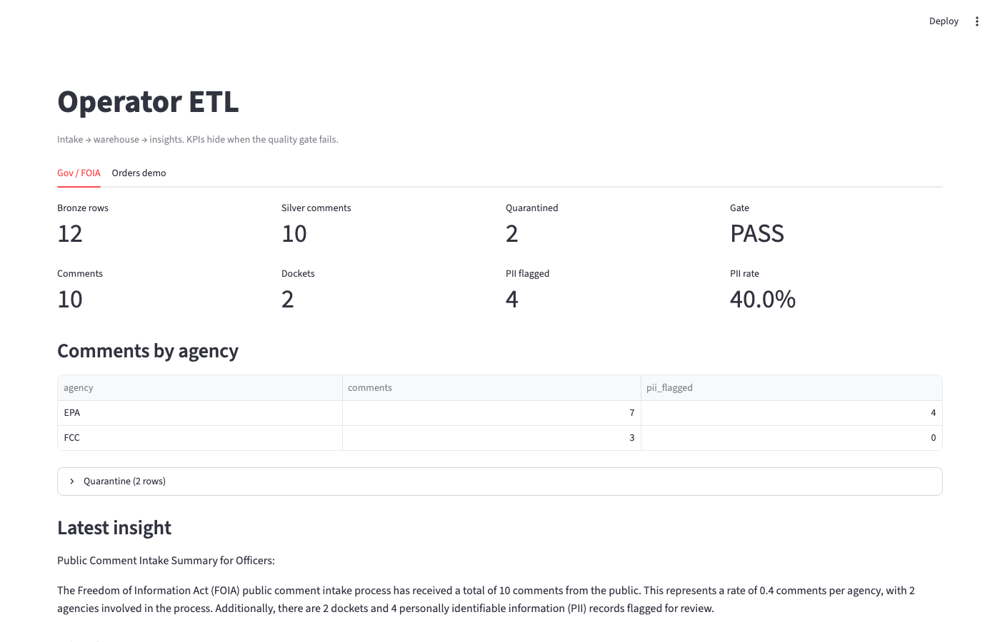
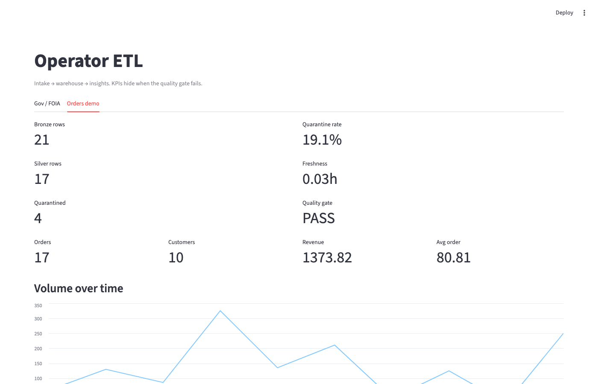
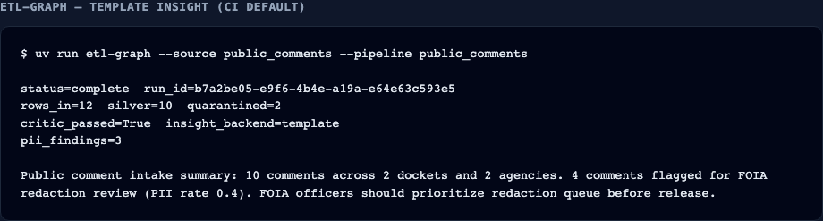
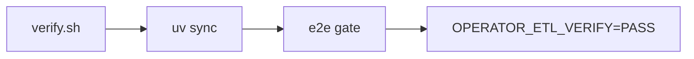
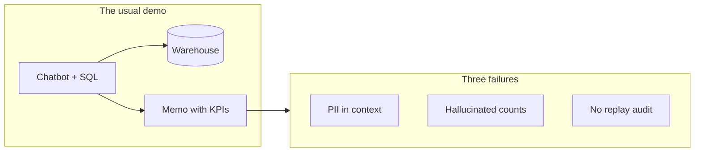
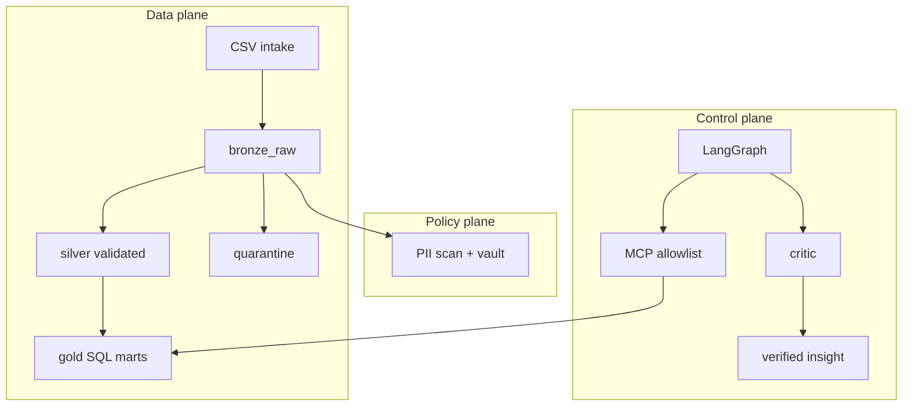
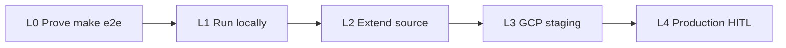

# Operator ETL

**Agentic data intake for FOIA and public comments** — deterministic medallion warehouse, LangGraph orchestration, MCP tool surface, PII policy plane.

[](https://github.com/khaosans/operator-etl/actions/workflows/ci.yml)
[](LICENSE)

> **Python and SQL decide what data exists. Agents orchestrate within typed boundaries. Tests prove the invariants** — no LLM API key required for the MVP demo.

Built for government agencies and regulated bodies that must intake public comments, detect PII before release, quarantine bad rows, and produce **defensible insights** (every number verified against the warehouse).

---

## Docs

**Wiki (searchable):** [https://khaosans.github.io/operator-etl/](https://khaosans.github.io/operator-etl/)

| Start here | Link |
|---|---|
| See it working | [Visual tour](docs/TOUR.md) (screenshots) |
| First run | [QUICKSTART](docs/QUICKSTART.md) — `./scripts/verify.sh` |
| Who it is for | [Personas](docs/PERSONAS.md) |
| Product UI (later) | [PRODUCT-UX](docs/PRODUCT-UX.md) — SPECIFIED, not this demo |

---

## Verify in one command

```bash
git clone https://github.com/khaosans/operator-etl.git
cd operator-etl
./scripts/verify.sh
```

Installs **uv** if missing, syncs deps, runs the full proof gate. Success ends with **`OPERATOR_ETL_VERIFY=PASS`**.

**Expected:** 41 pytest pass, FOIA demo prints `status=complete` and `silver=10`. Full screenshot set: [docs/TOUR.md](docs/TOUR.md).









Already have uv? `make e2e` · Details: [docs/QUICKSTART.md](docs/QUICKSTART.md) · Step-by-step: [docs/WALKTHROUGH.md](docs/WALKTHROUGH.md)



Operator ETL **separates** deterministic ETL from bounded agents. PII never reaches unconstrained tools; the **critic** rejects insight numbers that are not in gold; **bronze** gives you an immutable audit trail.

Deep dive: [docs/WHY.md](docs/WHY.md) · Agency workflow: [docs/FOIA-Public-Comments-Guide.md](docs/FOIA-Public-Comments-Guide.md)

---

## How it works — three planes



| Plane | Role |
|---|---|
| **Data** | Bronze (immutable) → silver (validated) → gold (SQL marts) + quarantine. Python and SQL execute; no LLM on raw rows. |
| **Policy** | PII scan, encrypted vault, fail-closed before insight. Vault never exposed via MCP. |
| **Control** | LangGraph pipeline, MCP allowlisted tools, critic verifies every number in the insight draft. |

Details: [docs/HOW-IT-WORKS.md](docs/HOW-IT-WORKS.md) · [okf/models/three-planes.md](okf/models/three-planes.md)

---

## Why not give the chatbot your warehouse?

## Trust and proof

| Question | Answer |
|---|---|
| Does it work locally? | `make e2e` — OKF validate, **41 pytest**, FOIA demo on fresh warehouse |
| What does CI prove? | Same gate on every push ([badge above](https://github.com/khaosans/operator-etl/actions/workflows/ci.yml)) |
| What is **not** proven in CI? | Live GCP deploy, Presidio PII, LLM-generated insights — see honest audit |

**Proof matrix:** [docs/FOUNDATIONS.md](docs/FOUNDATIONS.md) · **Full audit:** [docs/FINAL-REVIEW.md](docs/FINAL-REVIEW.md)

---

## What you just proved

| Metric | Expected |
|---|---|
| Sample comments | 12 (EPA/FCC dockets) |
| Silver (valid) | 10 |
| Quarantined | 2 |
| Graph status | `complete` |
| Critic | pass |

Details: [okf/models/mvp-demo.md](okf/models/mvp-demo.md)

---

## Engineering trade-offs

| Decision | We chose | Benefit | Cost | When to change |
|---|---|---|---|---|
| Local warehouse | DuckDB | Zero-infra proof on a laptop | Not multi-tenant | Stage L3 BigQuery — [SCALING.md](docs/SCALING.md) |
| PII detection | Regex MVP | Simple, testable, no ML deps | Misses names, addresses | Presidio for production |
| Insight generation | Template + critic | No API key; deterministic | Less narrative flexibility | LLM node when agency approves |
| Agent data access | MCP allowlist (3 tools) | Least privilege | No ad-hoc SQL exploration | Do not relax for prod FOIA |
| Quality failures | Fail-closed | Trustworthy KPIs | Blocks insights until fixed | Avoid warn-and-show banners |

Full proof matrix: **[docs/FOUNDATIONS.md](docs/FOUNDATIONS.md)**

---

## Who this is for

| Role | Start here |
|---|---|
| **FOIA officer** | [FOIA guide](docs/FOIA-Public-Comments-Guide.md) → [TOUR](docs/TOUR.md) · [PERSONAS](docs/PERSONAS.md) |
| **Data engineer** | [GETTING-STARTED](docs/GETTING-STARTED.md) → [SCALING](docs/SCALING.md) |
| **Architect / reviewer** | [WHY](docs/WHY.md) → [FOUNDATIONS](docs/FOUNDATIONS.md) → `make e2e` |
| **AI agent (MCP)** | [AGENTS.md](AGENTS.md) · `operator-etl-mcp` |

---

## Adopter ladder



| Level | Action | Doc |
|---|---|---|
| **0 — Prove** | `make e2e` | [WALKTHROUGH](docs/WALKTHROUGH.md) |
| **1 — Run locally** | MCP, dashboard | [GETTING-STARTED](docs/GETTING-STARTED.md) |
| **2 — Extend** | New CSV source | [extend-new-source](okf/playbooks/extend-new-source.md) |
| **3 — GCP staging** | Terraform + Cloud Run | [SCALING](docs/SCALING.md) |
| **4 — Production** | Presidio, HITL, live BQ, product UX | [FINAL-REVIEW](docs/FINAL-REVIEW.md) · [PRODUCT-UX](docs/PRODUCT-UX.md) |

---

## Common commands

| Command | Action |
|---|---|
| `./scripts/verify.sh` | **First run** — install uv if needed + full proof gate |
| `make verify` | Same as verify.sh |
| `make e2e` | Full MVP proof gate (OKF + tests + FOIA demo) |
| `make demo` | FOIA demo only |
| `make test` | pytest (41 tests) |
| `uv run etl-graph --source public_comments` | FOIA agentic pipeline |
| `uv run etl dashboard` | Streamlit — Gov + Orders tabs |
| `uv run operator-etl-mcp` | MCP server for Cursor agents |
| `make share` | Regenerate PDF share pack |

Run `make help` for all targets.

---

## Architecture

| Plane | Package | Status |
|---|---|---|
| **Data** | `operator_etl/` | IMPLEMENTED |
| **Control** | `operator_etl_graph/` | IMPLEMENTED |
| **Policy** | `operator_etl_policy/` | IMPLEMENTED |
| **MCP** | `operator_etl_mcp/` | IMPLEMENTED |
| **GCP** | `operator_etl_gcp/` + `infra/` | PARTIAL |

Living matrix: [okf/models/implementation-status.md](okf/models/implementation-status.md)

---

## Scope boundaries

**This demo proves:** Local FOIA pipeline · PII scan · MCP boundary · fail-closed quality · **41 tests** + CI

**Not included:** Production Presidio · Regulations.gov adapter · live GCP/BQ E2E · production officer UX (responsive, streaming, gen UI) — [docs/PRODUCT-UX.md](docs/PRODUCT-UX.md)

The demo UI is **Streamlit**. Product UX is SPECIFIED, not this MVP.

Before production claims: [FINAL-REVIEW pre-scale checklist](docs/FINAL-REVIEW.md#pre-scale-checklist)

---

## Documentation

| Doc | Why open it |
|---|---|
| **[Wiki (GitHub Pages)](https://khaosans.github.io/operator-etl/)** | Searchable human wiki — start here |
| [docs/TOUR.md](docs/TOUR.md) | Screenshots of verify, CLI, Streamlit |
| [docs/PERSONAS.md](docs/PERSONAS.md) | Who the demo is for |
| [docs/PRODUCT-UX.md](docs/PRODUCT-UX.md) | Product UI backlog (SPECIFIED) |
| [docs/QUICKSTART.md](docs/QUICKSTART.md) | **First run** — `./scripts/verify.sh` |
| [docs/GETTING-STARTED.md](docs/GETTING-STARTED.md) | Install, MCP, env vars |
| [docs/WALKTHROUGH.md](docs/WALKTHROUGH.md) | Step-by-step proof |
| [docs/DASHBOARD.md](docs/DASHBOARD.md) | Streamlit Gov / Orders |
| [docs/LLM.md](docs/LLM.md) | Optional local Ollama / OpenAI-compatible insights |
| [docs/SCALING.md](docs/SCALING.md) | DuckDB → GCP |
| [docs/FOUNDATIONS.md](docs/FOUNDATIONS.md) | Citations + proof matrix |
| [docs/TESTING.md](docs/TESTING.md) | What each test proves |
| [docs/README.md](docs/README.md) | Full index by persona |

Also: [HOW-IT-WORKS](docs/HOW-IT-WORKS.md) · [WHY](docs/WHY.md) · [white paper](docs/Operator-ETL-White-Paper.md)

---

## Share and present

**Open source:** https://github.com/khaosans/operator-etl — clone and run `make e2e`.

For interviews, LinkedIn, or proposals, attach PDFs from [docs/share/](docs/share/README.md) (one-pager, white paper, slides):

```bash
make share   # regenerates docs/share/latest/ after e2e
```

---

## Contributing · License · Security

Licensed under **[Apache License 2.0](LICENSE)**. Sample data is synthetic — do not commit real FOIA records.

- [CONTRIBUTING.md](CONTRIBUTING.md) · [CODE_OF_CONDUCT.md](CODE_OF_CONDUCT.md)
- [SECURITY.md](SECURITY.md) · [CHANGELOG.md](CHANGELOG.md)
- [docs/RELEASING.md](docs/RELEASING.md) — safe updates and dependency workflow

Issues and PRs welcome.
