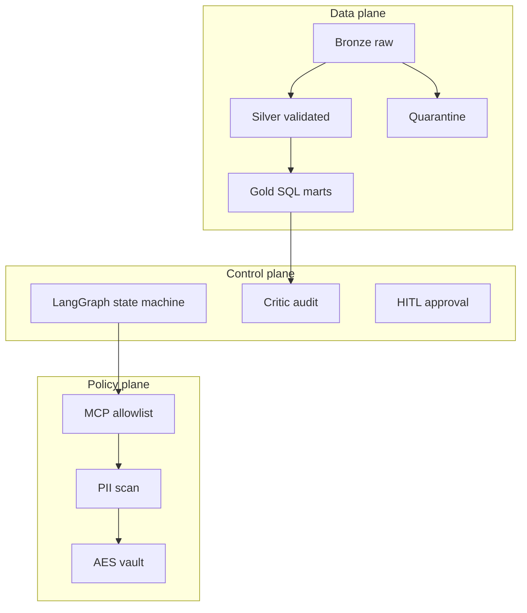

# Operator ETL

Agentic data intake for FOIA and public comments — a locally proven MVP with a
deterministic Medallion warehouse, LangGraph orchestration, Model Context Protocol
(MCP) allowlist, and a fail-closed PII policy plane.

[](https://github.com/khaosans/operator-etl/actions/workflows/ci.yml)
[](https://github.com/khaosans/operator-etl/actions/workflows/security.yml)
[](https://github.com/khaosans/operator-etl/actions/workflows/secret-scan.yml)
[](https://github.com/khaosans/operator-etl/actions/workflows/codeql.yml)
[](https://github.com/khaosans/operator-etl/releases)
[](https://khaosans.github.io/operator-etl/)
[](https://www.python.org/)
[](LICENSE)

> Python and SQL decide what data exists. Agents orchestrate within typed boundaries.
> The Critic proves numeric claims.

## Contents

- [Status](#status)
- [Features](#features)
- [Architecture](#architecture)
- [Quickstart](#quickstart)
- [Configuration](#configuration)
- [Repository layout](#repository-layout)
- [Testing](#testing)
- [Docker and packages](#docker-and-packages)
- [Documentation](#documentation)
- [Contributing](#contributing)
- [Security](#security)
- [Support](#support)
- [License](#license)

## Status

| Area | State |
|---|---|
| Local FOIA MVP (`./scripts/verify.sh`) | **IMPLEMENTED** |
| Medallion + LangGraph + MCP + critic | **IMPLEMENTED** |
| Observability (sanitized OTel) + A2A task surface | **IMPLEMENTED** |
| Multi-cloud Terraform (GCP / AWS / Azure) | Staging stacks present |
| Live GCP / BigQuery E2E | **PARTIAL** |
| Presidio PII engine | Optional (`--extra presidio`); default is regex |

Honest inventory: [docs/FINAL-REVIEW.md](docs/FINAL-REVIEW.md) ·
[okf/models/implementation-status.md](okf/models/implementation-status.md).

**Who this is for:** agencies and regulated teams exploring agentic FOIA / public-comment
intake with proof gates, not a turnkey production FOIA deployment.

**What we do not claim:** FedRAMP / ATO, live cloud E2E as proven, or that `verify.sh`
green means production-ready FOIA software. See [docs/PUBLIC-READINESS.md](docs/PUBLIC-READINESS.md).

## Features

- **Medallion warehouse** — bronze → silver + quarantine → gold SQL marts (DuckDB local)
- **Fail-closed PII** — scan before insight; encrypted vault (`0600`); no vault decrypt via MCP
- **Critic faithfulness** — insight numbers must appear in gold metrics
- **MCP allowlist** — three tools only; no raw SQL
- **Observability** — OpenTelemetry / OpenInference metadata without raw PII in spans
- **A2A** — JSON-RPC task surface with bearer auth and sanitized artifacts
- **Proof gate** — `./scripts/verify.sh` runs OKF validate, pytest, and the FOIA demo

## Architecture

Three planes keep generative intelligence away from raw operational data:



| Layer | Stack | Invariant |
|---|---|---|
| Data | Python 3.12+, DuckDB, SQL, Pydantic 2 | Deterministic transforms; quarantine preserves bad rows |
| Control | LangGraph, MCP, SQLite / Postgres checkpoints | Resumable runs; critic gate |
| Policy | Cryptography (Fernet), regex PII (Presidio optional) | No raw PII in insights, MCP, or OTel |
| Packaging | uv, Docker (GHCR), GitHub Actions, MkDocs | Frozen lockfile; CI SAST/SCA/secrets/IaC |

## Quickstart

### Prerequisites

- Python 3.12+ (or [uv](https://docs.astral.sh/uv/))

### Verify in one command

```bash
git clone https://github.com/khaosans/operator-etl.git
cd operator-etl
./scripts/verify.sh
```

Installs `uv` if needed, syncs frozen deps, validates the OKF bundle, runs pytest, and
executes the FOIA demo on a fresh warehouse. Success ends with `OPERATOR_ETL_VERIFY=PASS`.

Expected demo metrics on sample data: `status=complete`, `silver=10`, `quarantined=2`.

Full guide: [docs/QUICKSTART.md](docs/QUICKSTART.md).

### Run the FOIA graph

```bash
uv run etl-graph --source public_comments --pipeline public_comments
```

```text
status=complete  run_id=...
rows_in=12  silver=10  quarantined=2
pii_findings=3  critic_passed=True
```

`pii_findings=3` is scanner groups (EMAIL, PHONE, US_SSN). Dashboard **PII flagged ≥ 4**
counts silver comments with PII — both are expected on the synthetic sample.

### Dashboard (optional)

```bash
export OPERATOR_ETL_WAREHOUSE=".tmp/mvp-demo/operator.duckdb"
export OPERATOR_ETL_PIPELINE_NAME=public_comments
export OPERATOR_ETL_DOMAIN=gov
uv run streamlit run dashboard/app.py
```

Screenshots: [docs/TOUR.md](docs/TOUR.md).

## Configuration

Copy [`.env.example`](.env.example) for local DuckDB runs. Common variables:

| Variable | Purpose |
|---|---|
| `OPERATOR_ETL_WAREHOUSE` | DuckDB path (default `warehouse/operator.duckdb`) |
| `OPERATOR_ETL_PIPELINE_NAME` | Pipeline id (e.g. `public_comments`) |
| `OPERATOR_ETL_DOMAIN` | `gov` or commercial demo domain |
| `OPERATOR_ETL_BACKEND` | `duckdb` locally |
| `OPERATOR_ETL_A2A_BEARER_TOKEN` | Optional A2A auth |
| `OTEL_*` | Optional observability export |

Cloud secrets (`PII_VAULT_KEY`, API keys) live in
[`infra/env.example`](infra/env.example) / Terraform examples — never commit `.env` or
`terraform.tfvars`.

## Repository layout

```text
src/operator_etl/            Data plane
src/operator_etl_graph/      LangGraph control plane
src/operator_etl_policy/     PII + vault
src/operator_etl_mcp/        MCP server
src/operator_etl_{gcp,aws,azure}/  Cloud adapters
src/a2a/                     A2A JSON-RPC surface
src/telemetry/               Sanitized OTel
pipelines/  sql/  samples/   Registry, gold SQL, synthetic data
infra/{gcp,aws,azure}/       Terraform staging stacks
tests/  harness/  scripts/   Proof gate
okf/  skills/  docs/         Knowledge bundle, agent skills, wiki
```

## Testing

```bash
make test        # pytest
make e2e         # OKF + pytest + FOIA demo
make lint        # ruff
make security    # bandit + pip-audit
```

Every architectural invariant has automated coverage (ingest idempotency, quarantine, PII,
critic, MCP deny, telemetry, A2A). Map: [docs/TESTING.md](docs/TESTING.md) ·
proof citations: [docs/FOUNDATIONS.md](docs/FOUNDATIONS.md).

## Docker and packages

```bash
# Tagged release (see GitHub Releases for current version)
docker pull ghcr.io/khaosans/operator-etl:0.6.0
docker run --rm -it ghcr.io/khaosans/operator-etl:0.6.0 etl-graph --help

# Or :latest for the newest non-prerelease tag
docker pull ghcr.io/khaosans/operator-etl:latest
```

```bash
pip install operator-etl --index-url https://pypi.pkg.github.com/khaosans/simple/
```

Release SBOMs (CycloneDX) attach to GitHub Releases. Process: [docs/RELEASING.md](docs/RELEASING.md).

## Documentation

**Wiki:** [https://khaosans.github.io/operator-etl/](https://khaosans.github.io/operator-etl/)

| Document | Description |
|---|---|
| [QUICKSTART.md](docs/QUICKSTART.md) | One-command verify |
| [WALKTHROUGH.md](docs/WALKTHROUGH.md) | Local operational tour |
| [SECURITY-HARDENING.md](docs/SECURITY-HARDENING.md) | HTTP guards, vault, CI SAST/SCA |
| [HOW-IT-WORKS.md](docs/HOW-IT-WORKS.md) | Runtime and cloud architecture |
| [A2A.md](docs/A2A.md) | Agent task API contract |
| [Operator-ETL-White-Paper.md](docs/Operator-ETL-White-Paper.md) | Full engineering spec ([PDF](docs/Operator-ETL-White-Paper.pdf)) |

## Contributing

See [CONTRIBUTING.md](CONTRIBUTING.md) and [CODE_OF_CONDUCT.md](CODE_OF_CONDUCT.md).

```bash
make e2e && make lint && make security
uv run pre-commit install   # optional local hooks
```

CI must be green before merge (e2e, docker, terraform, gitleaks, bandit, pip-audit, CodeQL,
Trivy, Checkov). Ruleset setup: [docs/PUBLIC-READINESS.md](docs/PUBLIC-READINESS.md).

## Security

Report vulnerabilities per [SECURITY.md](SECURITY.md). Do not open public issues for
sensitive disclosures.

Agent checklist: [skills/operator-security/SKILL.md](skills/operator-security/SKILL.md).

## Support

- Docs wiki and [docs/index.md](docs/index.md)
- [GitHub Issues](https://github.com/khaosans/operator-etl/issues) for bugs and questions
- Changelog: [CHANGELOG.md](CHANGELOG.md) · Versioning: [docs/VERSIONING.md](docs/VERSIONING.md)

All sample intake records are **synthetic**.

## License

Licensed under the [Apache License 2.0](LICENSE).
