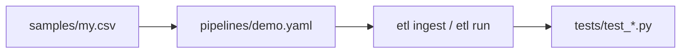

# Add a source

**When to read:** Verify is green and you want a **new CSV (or HTTP file)** in the registry without rewriting the pipeline runner.

**Why / what to keep:** The three planes and critic stay. You change schema, gold SQL, and tests — [APPLY.md](APPLY.md). This page is the **how-to**.

Agent playbook (same steps, denser): [extend-new-source](https://github.com/khaosans/operator-etl/blob/master/okf/playbooks/extend-new-source.md)

---

## Pattern

Sources are **named entries** in `pipelines/*.yaml`. The runner looks up `kind` + path/URL. No new Python required for a standard CSV.



---

## Worked example (orders-style CSV)

1. Add `samples/my_orders.csv` (same columns as [`samples/orders.csv`](https://github.com/khaosans/operator-etl/blob/master/samples/orders.csv) if you stay on the orders transform).

2. Edit [`pipelines/demo.yaml`](https://github.com/khaosans/operator-etl/blob/master/pipelines/demo.yaml):

```yaml
sources:
  my_orders:
    kind: csv
    path: samples/my_orders.csv
```

3. Ingest or run:

```bash
uv run etl ingest --source my_orders
uv run etl run --source my_orders
```

4. Add a test next to [`tests/test_pipeline.py`](https://github.com/khaosans/operator-etl/blob/master/tests/test_pipeline.py): assert `rows_in`, silver/quarantine, and that a second ingest skips the hash.

5. Run `make e2e` (or at least `uv run pytest`) before a PR.

---

## Source kinds

| `kind` | Config | Notes |
|---|---|---|
| `csv` | `path:` relative to repo root | Demo and FOIA samples |
| `csv_dir` | `path:` directory | Inbox drops (`drops/inbox`) |
| `http` | `url:` (`file:` or `https:`) | See `http` in demo.yaml |
| `gcs` | `path:` prefix | Needs `OPERATOR_ETL_GCS_INBOX_BUCKET`; GCP |

FOIA comments live in [`pipelines/public_comments.yaml`](https://github.com/khaosans/operator-etl/blob/master/pipelines/public_comments.yaml) (`domain: gov`). New comment CSVs need the **comment** schema (docket, agency, body, …) and gov transform — not the orders schema.

---

## Domain switch

| Domain | Pipeline | Transform / gold |
|---|---|---|
| `orders` | `demo` | `silver_orders`, `gold_kpis` |
| `gov` | `public_comments` | `silver_comments`, `sql/marts/gov/` |

Set `OPERATOR_ETL_DOMAIN` and `OPERATOR_ETL_PIPELINE_NAME` to match. Mixing gov env into an orders pytest session causes confusing failures — [TROUBLESHOOTING](TROUBLESHOOTING.md).

---

## See also

- [CLI.md](CLI.md)
- [APPLY.md](APPLY.md) — pattern for other domains
- [TESTING.md](TESTING.md)
- [repo-map](https://github.com/khaosans/operator-etl/blob/master/okf/references/repo-map.md)
