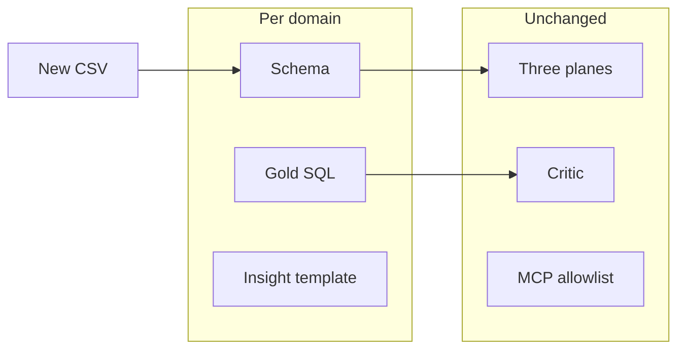

# Apply the pattern to other data

**When to read:** You understand the FOIA demo and want the **same architecture** on a different feed — 311, grants, inspections, case notes, or another CSV. Operational YAML steps: [ADD-A-SOURCE.md](ADD-A-SOURCE.md).

Operator ETL is a **FOIA-shaped demonstration** of a domain-agnostic pattern: deterministic medallion ETL, a policy plane before any model, bounded agents, and a critic on every number. Public comments are the *story*. The *system* is the three planes.

---

## Why this is useful beyond FOIA

Any intake that must survive audit has the same three failures as a warehouse chatbot: **sensitive fields in prompts**, **invented counts in memos**, and **runs you cannot replay**. If those matter — oversight, legal discovery, regulated release, or just “do not lie to leadership” — the pattern pays for itself even when the domain is not FOIA.

What you keep (do not rip out):

| Keep | Why |
|---|---|
| Bronze / silver / quarantine / gold | Replay and “why was this row rejected?” |
| PII (or other sensitive) scan **before** insight | Models never see raw bodies |
| Fail-closed quality gate | Bad intake does not become a KPI |
| Critic on insight digits | Hallucinated `999` cannot persist |
| MCP allowlist, no vault tool | Agents cannot exfiltrate rows |
| Humans publish | [Agents never auto-publish](https://github.com/khaosans/operator-etl/blob/master/okf/decisions/agents-never-publish-prod.md) |

What you change (this is the work):

| Change | Example |
|---|---|
| Sample + schema | New columns, new Pydantic model |
| Pipeline YAML | `kind: csv` / `http` / `gcs` entry |
| Transform + gold SQL | Marts that match *your* questions |
| Domain env | `OPERATOR_ETL_DOMAIN` + `OPERATOR_ETL_PIPELINE_NAME` |
| Insight template | Wording that cites **your** gold keys |
| Tests | `rows_in`, silver/quarantine, idempotent second ingest |

---

## Proof it already transfers: two domains in this repo

The same runner, critic, and PII policy serve **two** shipped demos. That is the evidence the pattern is not a one-off FOIA script.

| Domain | Pipeline | Typical verify-shaped outcome | Gold answers |
|---|---|---|---|
| **gov** (FOIA comments) | `public_comments` | 12 in → 10 silver, 2 quarantined | comment / docket / agency counts, PII rate |
| **orders** | `demo` | 21 in → 17 silver, 4 quarantined | order KPIs on the Orders dashboard tab |

Screenshots: [TOUR.md](TOUR.md). Mixing gov env into an orders pytest session fails in confusing ways — [TROUBLESHOOTING](TROUBLESHOOTING.md).

---

## Source kinds already in the runner

You do not write a new ingest engine for a normal file drop.

| `kind` | Use for |
|---|---|
| `csv` | One file in `samples/` |
| `csv_dir` | Inbox folder (`drops/inbox`) |
| `http` | `file:` or `https:` URL in YAML |
| `gcs` | Prefix in a bucket (GCP; `OPERATOR_ETL_GCS_INBOX_BUCKET`) |

Live **Regulations.gov** pull is SPECIFIED, not built. HTTP file fetch is not a full API adapter.

---

## Sketches (not implemented)

These are **pattern applications**. They are not pipelines in this repo. Each still needs schema, gold marts, tests, and a decision about which fields are sensitive.

| Intake | What gold might cite | Extra caution |
|---|---|---|
| **311 / service requests** | Open vs closed, median age, ward | Addresses and phone in description text |
| **Grant applications** | Count by program, incomplete packets | SSNs, bank details in attachments — do not send bodies to a model |
| **Inspections** | Pass/fail rate, repeat sites | Inspector notes may contain names |
| **Case / ticket comments** | Volume, PII-flag rate | Same as FOIA: treat free text as hostile to the model |
| **Orders** (already here) | Line counts, quarantine rate | Commercial PII still belongs in the vault, not in prompts |

Rule of thumb: if a human would redact it before a public memo, it does not go to the insight node. Gold stays **aggregates**.

---

## What you must not do when extending

- Do not point an LLM at bronze or comment/ticket **bodies** “just this once.”
- Do not skip the critic because the new template “looks right.”
- Do not loosen digit checks so a small model can pass.
- Do not mix two domains in one warehouse without a clear `OPERATOR_ETL_*` split (Gov vs Orders tabs already use two files).
- Do not claim a new source is proven until `make e2e` (or new tests you added) is green.

Residual risks that remain after a clean port: [RISKS.md](RISKS.md).

---

## How-to

1. Copy the closest schema (comments vs orders).
2. Register the source — [ADD-A-SOURCE.md](ADD-A-SOURCE.md).
3. Add gold SQL under `sql/marts/…` for the questions leadership will ask.
4. Update the insight **template** to name those keys; keep the LLM on numeric JSON only.
5. Tests first, then optional Ollama — [LLM.md](LLM.md).

Playbook for agents: [extend-new-source](https://github.com/khaosans/operator-etl/blob/master/okf/playbooks/extend-new-source.md).
