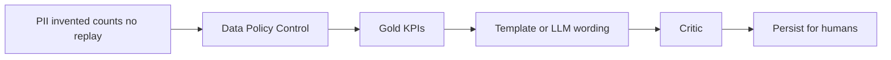

# Concepts — what we built and why it matters

**When to read:** After (or instead of) a first `./scripts/verify.sh`. This is the learning tour: problem, implementation, usefulness, then where to go next.

Operator ETL is a **reference architecture**: bounded agents on a **medallion** warehouse (three trust layers: raw drop → valid rows → KPIs — [PATTERNS](PATTERNS.md)). Python and SQL decide what data exists. Agents only orchestrate. Tests prove the invariants. The default path needs **no API key**.

Wiki home: [index.md](index.md). Pitch with diagrams: [WHY.md](WHY.md). Runtime: [HOW-IT-WORKS.md](HOW-IT-WORKS.md).

---

## The problem

A FOIA officer (or anyone intaking public comments, tickets, or case notes) needs three things a “chat with the warehouse” demo usually fails to give:

1. **An audit trail** — which file arrived, when, and what happened to each row.
2. **Sensitive text out of the model** — emails and phones in free-text bodies must not ride in a prompt.
3. **Numbers they can defend** — if a summary says “10 comments,” that 10 must live in a table.

Give a model SQL on raw tables and the failures are predictable: bodies (and PII inside them) land in context; the model invents a count; nobody can replay the run. Real-world consequence: an indefensible memo, a premature disclosure, or an oversight finding.

The sample drop is **twelve synthetic comments**. Ten pass validation. Two go to quarantine on purpose (empty body, bad timestamp). That 12 → 10 + 2 split is the point: bad rows are kept with a **reason**, not dropped on the floor.

---

## What we implemented

Not a chatbot. Three **planes** that must not collapse into one process:

| Plane | Job | Where it lives |
|---|---|---|
| **Data** | Ingest, validate, aggregate. “10 comments” is *computed*. | `src/operator_etl/` · DuckDB (BigQuery adapter PARTIAL) |
| **Policy** | PII scan, encrypted vault, fail-closed quality gate. Agents never decrypt. | `src/operator_etl_policy/` |
| **Control** | LangGraph orchestration, three MCP tools, **critic** on every digit in an insight. | `src/operator_etl_graph/`, `src/operator_etl_mcp/` |

**Medallion** (three-layer warehouse: raw → valid → KPIs): bronze = hashed drop kept forever; silver = schema-valid rows; quarantine = failures with error text; gold = trusted aggregates — the **only** numbers an insight may cite. Full lesson: [PATTERNS.md](PATTERNS.md).

**Graph (FOIA path):** ingest → PII → validate → quality → gold → insight → critic → persist. Insight default is a **template** filled from gold. Optional LLM rewrites *wording* from numeric gold JSON only. Persist only after critic pass. LLM failure falls back to the template.

**Two domains ship in-tree** so the pattern is not a one-off: **gov** (public comments) and **orders**. Same critic and policy; different schema and gold SQL. Applying that to *your* CSV: [APPLY.md](APPLY.md).

**HITL:** status `needs_human` is not success. Agents never auto-publish FOIA bundles or emails ([decision](https://github.com/khaosans/operator-etl/blob/master/okf/decisions/agents-never-publish-prod.md)).

**Proof:** `./scripts/verify.sh` → 78 pytest + FOIA demo `silver=10` `quarantined=2` `status=complete`. CI repeats that gate. Optional LLM is mocked in CI ([MODELS.md](MODELS.md), [LLM.md](LLM.md)).

---

## Why it is useful

- **Defensible summaries.** Leadership can ask “where is the 10?” and you point at gold, not at a chat log.
- **Replay.** Bronze + content hash answers “what file, which run.”
- **Fail-closed.** Too much quarantine withholds KPIs instead of warning-and-showing a pretty lie.
- **Bounded agency.** The model is not the warehouse administrator. MCP cannot decrypt the vault or run ad-hoc SQL.
- **Portable pattern.** Orders vs FOIA in one repo shows the same control plane on a second schema — [APPLY.md](APPLY.md).
- **Honest default.** CI and first clone need no vendor key. You opt into Ollama or OpenAI after verify.

It is **not** production FOIA software, FedRAMP, or an officer product UI. Residual risks: [RISKS.md](RISKS.md). Standards language: [NIST.md](NIST.md).

---

## Learning path

1. Prove the clone — [QUICKSTART](QUICKSTART.md)
2. **This page** and screenshots — [TOUR](TOUR.md)
3. What medallion, critic, planes mean — [PATTERNS](PATTERNS.md)
4. Other feeds and what you must not strip out — [APPLY](APPLY.md)
5. What can still go wrong — [RISKS](RISKS.md)
6. NIST alignment (not certification) — [NIST](NIST.md)
7. Optional models — [MODELS](MODELS.md) → [LLM](LLM.md)
8. Citations and tests — [FOUNDATIONS](FOUNDATIONS.md)

Deep spec: [white paper](Operator-ETL-White-Paper.md). Glossary: [GLOSSARY](GLOSSARY.md).
