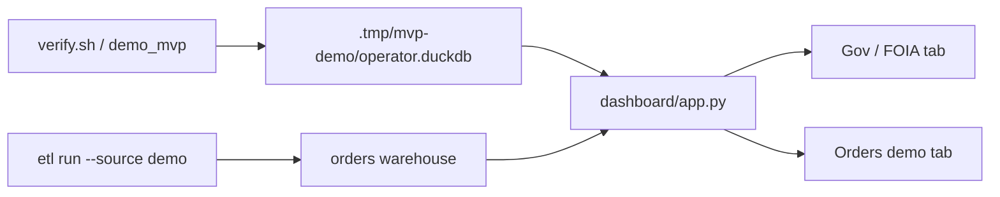

# Dashboard (Streamlit)

**When to read:** After a green verify or FOIA demo — you want to **see** KPIs, quarantine, and the insight. Screenshots: [TOUR.md](TOUR.md). Install path: [GETTING-STARTED](GETTING-STARTED.md) §6.

---

## Start

Gov and Orders can use **different** warehouses in one session:

```bash
export OPERATOR_ETL_WAREHOUSE=".tmp/mvp-demo/operator.duckdb"          # FOIA (after demo_mvp / etl-graph)
export OPERATOR_ETL_ORDERS_WAREHOUSE=".tmp/orders-demo/operator.duckdb"  # after: uv run etl run --source demo
export OPERATOR_ETL_PIPELINE_NAME=public_comments
export OPERATOR_ETL_DOMAIN=gov
uv run streamlit run dashboard/app.py
```

Or: `uv run etl dashboard` (same env). Open the URL Streamlit prints (usually `http://localhost:8501`).




---

## Gov / FOIA tab (what “good” looks like)

After a successful FOIA run:

| Widget | Expected |
|---|---|
| Bronze / silver / quarantined | 12 / 10 / 2 |
| Gate | **PASS** |
| Comments / dockets / PII flagged | 10 / 2 / ≥4 |
| PII rate | 0.4 (40%) |
| Comments by agency | EPA and FCC rows |
| Quarantine expander | 2 rows with validation errors |
| Latest insight | Template or local-Ollama summary; critic-passed numbers only |
| Pipeline runs | At least one `ok` / complete run |


If you see “No gov warehouse yet”, the env warehouse path is wrong or you have not run the demo. Recapture: `uv run python scripts/capture_screenshots.py` (Playwright, not CI).

---

## Orders demo tab

Uses a separate **orders** warehouse (`OPERATOR_ETL_ORDERS_WAREHOUSE`, default `warehouse/operator.duckdb`) so the Gov tab can stay on the FOIA demo file. Run first:

```bash
OPERATOR_ETL_WAREHOUSE=".tmp/orders-demo/operator.duckdb" \
uv run etl run --source demo
uv run etl dashboard   # with OPERATOR_ETL_ORDERS_WAREHOUSE pointing at that file
```

Expect 17 silver orders, 4 quarantined, quality PASS at the default 35% quarantine cap.


---

## Fail-closed behavior

If the quality gate **blocks**, the UI shows **BLOCKED** and reasons (high quarantine or stale data). Insights/KPIs are withheld — that is intentional. [GLOSSARY](GLOSSARY.md) · fail-closed.

---

## See also

- [TOUR.md](TOUR.md) — screenshots
- `make walkthrough` (`scripts/walkthrough.sh`)
- [FOIA-Public-Comments-Guide.md](FOIA-Public-Comments-Guide.md)
