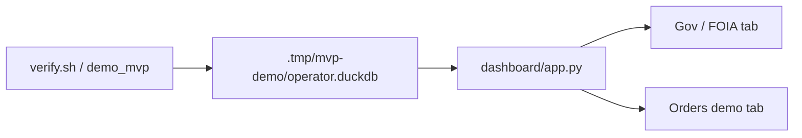

# Dashboard (Streamlit)

**When to read:** After a green verify or FOIA demo — you want to **see** KPIs, quarantine, and the insight. Install path: [GETTING-STARTED](GETTING-STARTED.md) §6.

---

## Start

Point Streamlit at the **demo warehouse** created by verify (`scripts/demo_mvp.sh` writes `.tmp/mvp-demo/operator.duckdb`):

```bash
export OPERATOR_ETL_WAREHOUSE=".tmp/mvp-demo/operator.duckdb"
export OPERATOR_ETL_PIPELINE_NAME=public_comments
export OPERATOR_ETL_DOMAIN=gov
uv run streamlit run dashboard/app.py
```

Or: `uv run etl dashboard` after the same exports (uses `OPERATOR_ETL_WAREHOUSE` from settings).

Open the URL Streamlit prints (usually `http://localhost:8501`).



---

## Gov / FOIA tab (what “good” looks like)

After a successful FOIA run:

| Widget | Expected |
|---|---|
| Bronze / silver / quarantined | 12 / 10 / 2 |
| Gate | **PASS** |
| Comments / dockets / PII flagged | 10 / 2 / ≥4 |
| PII rate | 0.4 (40%) |
| Comments by agency | EPA and FCC rows |
| Quarantine expander | 2 rows with validation errors |
| Latest insight | Template summary; critic-passed numbers only |
| Pipeline runs | At least one `ok` / complete run |

If you see “No gov warehouse yet”, the env warehouse path is wrong or you have not run the demo.

---

## Orders demo tab

Uses the default **orders** pipeline warehouse (`warehouse/operator.duckdb` unless you override). Run first:

```bash
uv run etl run --source demo
uv run etl dashboard
```

Expect 17 silver orders, 4 quarantined, quality PASS at the default 35% quarantine cap.

---

## Fail-closed behavior

If the quality gate **blocks**, the UI shows **BLOCKED** and reasons (high quarantine or stale data). Insights/KPIs are withheld — that is intentional. [GLOSSARY](GLOSSARY.md) · fail-closed.

---

## See also

- [WALKTHROUGH.md](WALKTHROUGH.md) — SQL inspection without Streamlit
- `make walkthrough` (`scripts/walkthrough.sh`)
- [FOIA-Public-Comments-Guide.md](FOIA-Public-Comments-Guide.md)
