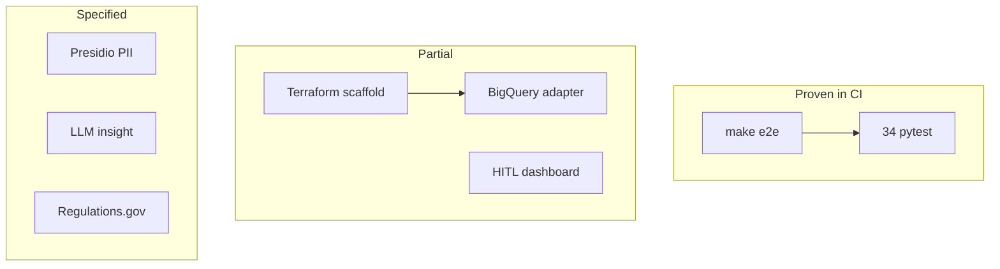

# Final review — proof, scale, security, trade-offs

Honest audit of Operator ETL as of the latest `make e2e` gate. Use this before sharing externally or claiming production readiness.

**When to read:** Before share, scale, or any production-readiness claim.

**Prove it:** `make e2e` · **Walkthrough:** [WALKTHROUGH.md](WALKTHROUGH.md) · **Why:** [FOUNDATIONS.md](FOUNDATIONS.md) · **Start here:** [README.md](../README.md)

---

## Executive summary

Operator ETL **proves locally** that a FOIA public-comment pipeline can ingest CSV, scan PII, quarantine bad rows, build gold KPIs, run a LangGraph orchestration, and produce a critic-verified insight — all without an LLM API key. **34 pytest tests** plus a fresh-warehouse demo run on every push in GitHub Actions.

What is **not** proven in CI: live GCP deploy, BigQuery gold marts end-to-end, Presidio PII, or LLM-generated insights. Those are documented as PARTIAL or SPECIFIED with explicit scale steps.

---

## Proof inventory

| Capability | Status | How to verify |
|---|---|---|
| FOIA end-to-end (DuckDB) | **Proven** | `make e2e`, `tests/test_gov_graph.py` |
| Medallion + idempotency + quarantine | **Proven** | `tests/test_pipeline.py`, `test_gov_ingest_is_idempotent` |
| Quarantine preserves error reasons | **Proven** | `test_quarantine_preserves_bad_rows_with_errors` |
| Quality gate fail-closed | **Proven** | `tests/test_quality.py`, `test_graph_needs_human_when_quality_fails` |
| PII scan + redact | **Proven** | `tests/test_pii.py` |
| Insight output has no PII leak | **Proven** | `test_graph_insight_contains_no_pii` |
| Insight numbers grounded in gold | **Proven** | `test_graph_insight_numbers_match_gold_metrics` |
| Insight persisted to warehouse | **Proven** | `test_graph_persists_insight_row` |
| Critic rejects hallucinated numbers | **Proven** | `tests/test_critic.py` |
| Critic exhausted → HITL | **Proven** | `test_critic_exhausted_routes_needs_human` |
| MCP allowlist permit/deny | **Proven** | `tests/test_mcp_tools.py` |
| MCP gold KPI read | **Proven** | `test_get_gold_metrics_returns_expected_kpis` |
| No vault/decrypt in MCP surface | **Proven** | `test_allowlist_has_no_vault_tools` |
| GCP adapter (unit, no live cloud) | **Proven** | `tests/test_infra.py` |
| PII ambiguous gray-zone HITL | **Partial** | Regex confidences 0.90–0.95 only; Presidio SPECIFIED — `test_ambiguous_confidence_flags_needs_human` |
| BigQuery backend | **Partial** | SQL rewrite tested; staging deploy manual — [SCALING.md](SCALING.md) L3 |
| Cloud Run live path | **Partial** | Terraform scaffold; post-deploy checklist — [infra/README.md](../infra/README.md) |
| HITL officer dashboard | **Partial** | Gov Streamlit tab; no approval workflow test |
| Presidio PII | **Specified** | `--extra presidio` |
| LLM insight nodes | **Specified** | Templates used in MVP |
| Regulations.gov adapter | **Specified** | — |

---

## Scaling path

Full ladder: [SCALING.md](SCALING.md)

| Stage | What changes | Prerequisite |
|---|---|---|
| **L0 — Local MVP** | DuckDB, `etl-graph` CLI | `make e2e` green |
| **L1 — File inbox** | `drops/inbox/` or GCS source | L0 |
| **L2 — GCP infra** | `terraform apply` | L0 + reviewed `terraform plan` |
| **L3 — BigQuery lift** | `OPERATOR_ETL_BACKEND=bigquery` | L2 + BQ mart dialect port |
| **L4 — Production HITL** | Officer approval, Presidio, Regulations.gov | L3 + manual staging proof |

**What stays the same when scaling:** graph topology, PII policy intent, critic logic, MCP allowlist (transport changes stdio → HTTP).

**What changes:** warehouse (DuckDB → BigQuery), trigger (CLI → GCS/Pub/Sub), checkpoints (SQLite → Postgres), secrets (local file → Secret Manager).

---

## Privacy and security

Full policy: [SECURITY.md](../SECURITY.md)

| Control | Implementation | Verified by |
|---|---|---|
| PII scan before insight | `operator_etl_policy/pii.py` | `tests/test_pii.py` |
| No raw PII in insight text | Template from gold counts only | `test_graph_insight_contains_no_pii` |
| Encrypted vault (local) | `warehouse/pii_vault.json` gitignored | policy + SECURITY.md |
| MCP deny raw SQL / vault | Allowlist YAML, 3 tools only | `tests/test_mcp_tools.py` |
| No auto-publish | `agents-never-publish-prod` decision | policy + `persist` requires critic |
| Secrets not in git | `.env`, vault, tfvars gitignored | SECURITY.md |
| IAM least privilege (GCP) | Separate SAs per workload | Terraform |

### Not production-ready without additional work

- **Regex-only PII** — misses names, addresses, international formats; no real gray-zone HITL until Presidio
- **No live GCP proof in CI** — staging upload + `/run` must be validated manually
- **Synthetic sample data only** in repo — never commit production FOIA records

---

## Best practices

Curated sources mapped to tests: [FOUNDATIONS.md](FOUNDATIONS.md#proof-matrix)

Standards index: [STANDARDS.md](STANDARDS.md)

---

## Trade-offs

| Choice | Benefit | Cost |
|---|---|---|
| DuckDB local MVP | Zero infra; fast proof | Not multi-tenant; manual scale path |
| Regex PII | Simple, no ML deps | Misses entity types; gray-zone HITL needs Presidio |
| Template insight | Deterministic, no API key | Less flexible narrative |
| Rule-based critic | Fast, auditable | Won't catch semantic hallucinations |
| MCP allowlist (3 tools) | Minimal attack surface | Agents can't ad-hoc explore data |
| Fail-closed quality gate | Trustworthy KPIs | Blocks insights until upstream fixed |
| Private repo + PDF share | Control FOIA narrative | No public issue tracker |

---

## Pre-scale checklist

Before promoting to GCP staging or external production claims:

- [ ] `make e2e` green locally
- [ ] CI green on `master`
- [ ] Review [FOUNDATIONS.md](FOUNDATIONS.md) proof matrix — no "Proven" claims without tests
- [ ] Terraform `plan` reviewed; secrets in Secret Manager (not git)
- [ ] Upload `samples/public_comments.csv` to GCS inbox; verify `status=complete`
- [ ] Confirm MCP IAM reads gold only
- [ ] Officer HITL workflow documented for your agency
- [ ] Regenerate share PDFs: `make share`

---

## Related docs

- [HOW-IT-WORKS.md](HOW-IT-WORKS.md) — usage model
- [WALKTHROUGH.md](WALKTHROUGH.md) — step-by-step verification
- [SCALING.md](SCALING.md) — local → GCP ladder
- [FOUNDATIONS.md](FOUNDATIONS.md) — authoritative sources + proof matrix
- [okf/models/implementation-status.md](../okf/models/implementation-status.md) — IMPLEMENTED vs SPECIFIED

## See also

- [README.md](../README.md) — problem, design, quick start
- [docs/share/README.md](share/README.md) — external PDF share pack
- [SECURITY.md](../SECURITY.md) — production readiness controls
