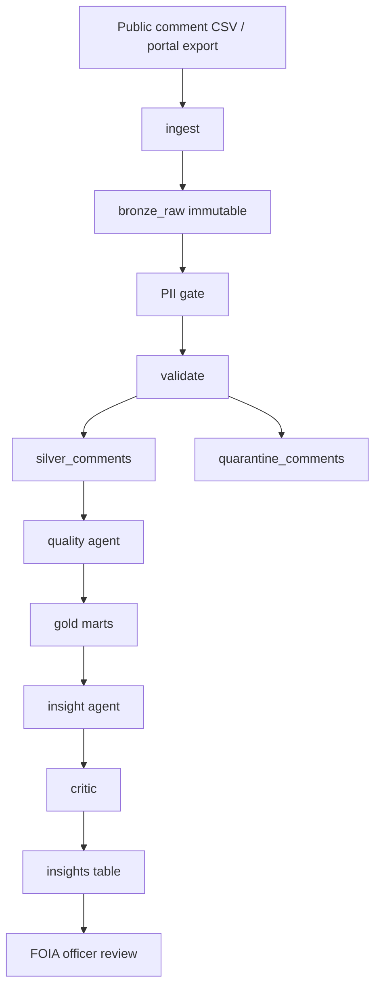

# FOIA and Public Comments — Implementation Guide

How a government agency (or regulated body) uses **Operator ETL** to intake public comments, prepare FOIA releases, and produce auditable insights — without leaking PII to AI systems.

**When to read:** You run FOIA / public comment intake and need the agency workflow and data model.

**Start here:** [README.md](../README.md) · **See it work:** [WALKTHROUGH.md](WALKTHROUGH.md) dashboard step

---

## The problem agencies face

Regulatory agencies receive **public comments** on proposed rules (EPA, FCC, etc.). FOIA officers must:

1. **Intake** comments from portals, CSV exports, email dumps, and FOIA request logs
2. **Detect PII** (emails, phones, SSNs) before any public release
3. **Validate** structure (docket ID, agency, timestamps)
4. **Quarantine** malformed submissions without losing audit trail
5. **Summarize** volume by docket/agency for program staff — with numbers that can be defended in court

A chatbot with database access fails on PII, hallucinated counts, and non-replayable runs. Operator ETL separates **deterministic ETL** from **agentic orchestration**.

---

## Architecture for this use case

Full usage model: [HOW-IT-WORKS.md](HOW-IT-WORKS.md)



---

## Data model

### Silver comment (`SilverComment`)

| Field | Purpose |
|---|---|
| `comment_id` | Unique submission ID |
| `docket_id` | Regulatory docket (e.g. `EPA-HQ-OAR-2026-001`) |
| `agency` | EPA, FCC, etc. |
| `submitted_at` | ISO timestamp |
| `commenter_type` | individual, organization, anonymous |
| `subject` | Optional subject line |
| `body` | Comment text — may contain PII |
| `foia_status` | `pending_review`, `redacted`, `releasable` |
| `pii_detected` | Upstream flag + scanner confirmation |

### Gold marts (FOIA officer view)

| Mart | Metrics |
|---|---|
| `gold_comment_kpis` | Total comments, dockets, agencies, PII-flagged count, PII rate |
| `gold_comments_by_agency` | Volume + PII counts per agency |
| `gold_comments_by_docket` | Volume + PII counts per docket |
| `gold_comment_quality` | Quarantine rate, freshness |

---

## Running the pipeline

### 1. Install

```bash
cd operator-etl
uv sync --extra dev
```

### 2. Run the agentic graph (public comments)

```bash
uv run etl-graph --source public_comments --pipeline public_comments
```

Expected on sample data (`samples/public_comments.csv`):

- **12** bronze rows
- **10** silver comments
- **2** quarantined (empty body, invalid date)
- **4+** flagged with PII in body
- Status: `complete` with critic-approved insight

### 3. Run deterministic ETL only (no graph)

Use the orders demo for commerce-style data, or extend gov runner similarly.

### 4. MCP tools (for Cursor agents)

Register in `.cursor/mcp.json`:

```json
{
  "mcpServers": {
    "operator-etl": {
      "command": "uv",
      "args": ["run", "operator-etl-mcp"],
      "cwd": "/path/to/operator-etl"
    }
  }
}
```

Tools: `get_gold_metrics`, `run_quality_sql`, `get_run_status`. No vault decrypt. No raw SQL.

---

## FOIA workflow mapping

| Agency step | Operator ETL component |
|---|---|
| Receive comment export | `ingest` → bronze |
| PII review before release | `pii_gate` + vault + redaction |
| Reject malformed rows | `quarantine_comments` with error reason |
| Program summary for leadership | `insight` from gold only |
| Defensible numbers in memo | `critic` faithfulness check |
| Audit "what ran when" | `pipeline_runs` + LangGraph checkpoints |
| Human sign-off on ambiguous PII | `needs_human` interrupt |

---

## PII handling

1. **Scan** `body` and `subject` for email, phone, SSN patterns
2. **Tokenize** into encrypted vault (`warehouse/pii_vault.json` — gitignored)
3. **Never** pass raw PII to insight agent or MCP responses
4. **Flag** `pii_detected=true` on silver rows for FOIA redaction queue

Gray-zone confidence → `needs_human` (fail closed).

---

## Evaluations (quality gates)

| Eval | Command | Pass condition |
|---|---|---|
| Unit + integration | `uv run pytest` | 29/29 pass |
| PII redaction | `tests/test_pii.py` | No email/phone in redacted text |
| Critic faithfulness | `tests/test_critic.py` | Hallucinated 999 rejected |
| Gov graph E2E | `tests/test_gov_graph.py` | status=complete, critic_passed |

---

## Extending for production FOIA

1. **Sources:** Add S3/GCS inbox, email parser, Regulations.gov API adapter to `pipelines/public_comments.yaml`
2. **Warehouse:** Lift DuckDB → BigQuery (`etl_bronze`, `etl_silver`, `etl_gold`)
3. **Graph:** Deploy `graph-runner` on Cloud Run with Cloud SQL checkpoints
4. **HITL dashboard:** Streamlit page for `needs_human` runs — officer approves PII classification
5. **Release package:** Export redacted silver rows + insight memo for FOIA response bundle

See [`Operator-ETL-White-Paper.md`](Operator-ETL-White-Paper.md) for full GCP, IAM, and MCP specification.

---

## Sample insight output

> Public comment intake summary: 10 comments across 2 dockets and 2 agencies. 4 comments flagged for FOIA redaction review (PII rate 0.4). FOIA officers should prioritize redaction queue before release.

Every number in this text is verified against `gold_comment_kpis` by the critic node before persist.

## See also

- [HOW-IT-WORKS.md](HOW-IT-WORKS.md) — lifecycle and three planes
- [WALKTHROUGH.md](WALKTHROUGH.md) — dashboard and SQL proof steps
- [Operator-ETL-White-Paper.md](Operator-ETL-White-Paper.md) — full GCP and MCP spec
