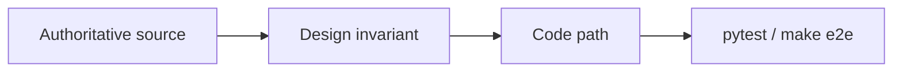

# Foundations — why this design is simple and provable

Operator ETL keeps the hard parts deterministic: Python and SQL decide what data exists. Agents orchestrate within typed boundaries. Every important invariant has a test you can run locally with `make e2e`.

**When to read:** You need citations, the proof matrix, or bibliography backing design choices.

**Usage:** [HOW-IT-WORKS.md](HOW-IT-WORKS.md) · **See it work:** [WALKTHROUGH.md](WALKTHROUGH.md) · **Start here:** [README.md](../README.md)

---

## Thesis

Government FOIA workflows need an audit trail, PII protection before release, and numbers leadership can defend. The simplest architecture that satisfies all three: **medallion warehouse** (deterministic ETL) + **bounded agents** (LangGraph + MCP allowlist) + **rule-based critic** (every insight number must exist in gold).

---

## Proof matrix

Each row links an invariant to an authoritative source, where it lives in code, and how to verify it.

| Invariant | Source | Why it matters here | Where in code | How to verify |
|---|---|---|---|---|
| Immutable intake, validated silver, trusted gold | [1] Medallion architecture | FOIA audit trail; quarantine without data loss | `operator_etl/` bronze/silver/gold/quarantine | `tests/test_pipeline.py`, `make e2e` |
| Safe replay on duplicate drops | [2] Idempotent consumers (DDIA) | GCS/Pub/Sub delivery is at-least-once | `ingest_files` content hash | `tests/test_pipeline.py` |
| Explicit orchestration, resumable runs | [3] LangGraph | Replace ad-hoc agent loops; HITL interrupts | `operator_etl_graph/` | `tests/test_gov_graph.py` |
| Least-privilege agent data access | [4] MCP spec | Agents get typed tools, not the warehouse | `operator_etl_mcp/`, `sql/allowlist.yaml` | `tests/test_mcp_tools.py` |
| No PII in agent context | [5] NIST SP 800-122 | FOIA redaction before release | `operator_etl_policy/pii.py` | `tests/test_pii.py` |
| Withhold bad KPIs, don't warn-and-show | [6] Goodhart's Law | Metrics that become targets get gamed | `quality_gate` in insights | `tests/test_quality.py` |
| Insight numbers must match warehouse | [7] Grounded generation (RAG) — simplified to deterministic critic | Defensible memos for leadership | `operator_etl_graph/critic.py` | `tests/test_critic.py` |
| Human sign-off on release | [8] NIST AI RMF | Agents orchestrate, humans publish | `okf/decisions/agents-never-publish-prod.md`, graph `needs_human` | `tests/test_gov_graph.py` (quality fail), `test_critic_exhausted_routes_needs_human`; PII gray-zone HITL needs Presidio |
| Public release workflow | [9] FOIA statute | Domain framing for gov tab and marts | FOIA guide, `sql/marts/gov/` | `scripts/demo_mvp.sh` |
| Limit LLM agency | [10] OWASP LLM Top 10 | Excessive agency → allowlist + no vault MCP | MCP deny paths | `tests/test_mcp_tools.py` |

Full standards index: [STANDARDS.md](STANDARDS.md)

---

## What we deliberately kept simple

- **DuckDB local** — zero-infra proof on a laptop; same graph and SQL marts lift to BigQuery later
- **Template insight + rule-based critic** — no LLM API key required for MVP; critic rejects hallucinated numbers deterministically
- **Regex PII scanner** — covers email, phone, SSN patterns; Presidio optional upgrade (SPECIFIED)
- **Three MCP tools only** — `get_gold_metrics`, `run_quality_sql`, `get_run_status`
- **One command proof** — `make e2e` runs OKF validate, 34 pytest tests, and FOIA demo assertions

---

## References

1. Databricks. (2020). Medallion Architecture. https://www.databricks.com/glossary/medallion-architecture
2. Kleppmann, M. (2017). *Designing Data-Intensive Applications*. O'Reilly. Ch. 11 — stream processing and idempotent consumers.
3. LangChain. LangGraph documentation. https://langchain-ai.github.io/langgraph/
4. Anthropic. Model Context Protocol specification. https://modelcontextprotocol.io/
5. NIST. (2010). SP 800-122 — Guide to Protecting the Confidentiality of Personally Identifiable Information. https://csrc.nist.gov/publications/detail/sp/800-122/final
6. Goodhart, C. A. E. (1975). Problems of Monetary Management: The U.K. Experience. In *Papers in Monetary Economics*. Reserve Bank of Australia. See also Strathern: "When a measure becomes a target, it ceases to be a good measure."
7. Lewis, P. et al. (2020). Retrieval-Augmented Generation for Knowledge-Intensive NLP Tasks. *NeurIPS*. https://arxiv.org/abs/2005.11401 — Operator ETL applies the grounding principle via deterministic critic, not retrieval.
8. NIST. (2023). AI Risk Management Framework (AI RMF 1.0). https://www.nist.gov/itl/ai-risk-management-framework — Govern and Map functions; human oversight before production release.
9. U.S. Congress. 5 U.S.C. § 552 — Freedom of Information Act. https://www.foia.gov/ — public disclosure workflow framing.
10. OWASP. Top 10 for Large Language Model Applications. https://owasp.org/www-project-top-10-for-large-language-model-applications/ — LLM06 excessive agency mitigated by MCP allowlist.

## See also

- [FINAL-REVIEW.md](FINAL-REVIEW.md) — honest proven/partial/specified audit
- [HOW-IT-WORKS.md](HOW-IT-WORKS.md) — runtime model and planes
- [Operator-ETL-White-Paper.md](Operator-ETL-White-Paper.md) — deep engineering spec
