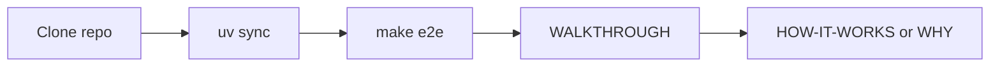
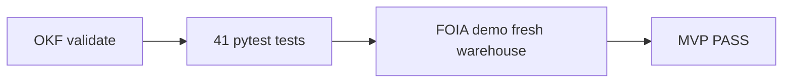

# Getting started with Operator ETL

Complete setup guide for developers, operators, and reviewers.

**When to read:** After [README.md](../README.md) quick start — you need install steps, MCP, env vars, or troubleshooting.

**Repository:** https://github.com/khaosans/operator-etl (Apache-2.0)

---

## Learning path



| Step | Doc | Time |
|---|---|---|
| Understand the problem | [WHY.md](WHY.md) · [CONCEPTS.md](CONCEPTS.md) | ~10 min |
| Install and verify | This guide §1–3 | ~10 min |
| See the test case work | [WALKTHROUGH.md](WALKTHROUGH.md) | ~15 min |
| Runtime model | [HOW-IT-WORKS.md](HOW-IT-WORKS.md) | ~10 min |
| Optional LLM | [MODELS.md](MODELS.md) then [LLM.md](LLM.md) | after verify |

---

## 1. Clone

```bash
git clone https://github.com/khaosans/operator-etl.git
cd operator-etl
```

Forks welcome — run `make e2e` before opening a PR. See [CONTRIBUTING.md](../CONTRIBUTING.md).

---

## 2. Install toolchain

### Python 3.12+

```bash
python3 --version   # must be 3.12 or newer
```

### uv (recommended)

Install from [https://docs.astral.sh/uv/](https://docs.astral.sh/uv/):

```bash
curl -LsSf https://astral.sh/uv/install.sh | sh
```

### Install project dependencies

**Local MVP (FOIA demo, tests, dashboard):**

```bash
uv sync --extra dev
```

**GCP / Cloud Run work (adds BigQuery, FastAPI, Postgres checkpoints):**

```bash
uv sync --extra dev --extra gcp
```

---

## 3. Verify installation

Run the full proof gate (recommended first run):

```bash
./scripts/verify.sh
```

Or if uv is already installed: `make e2e`



Step-by-step walkthrough with SQL and dashboard checks: **[WALKTHROUGH.md](WALKTHROUGH.md)**

This runs three steps in order:

| Step | What it does |
|---|---|
| OKF validate | Checks `okf/` frontmatter and structure |
| pytest | 34 unit and integration tests |
| FOIA demo | Fresh warehouse, graph pipeline, output assertions |

**Expected FOIA demo output:**

```
status=complete  run_id=...
rows_in=12  silver=10  quarantined=2
pii_findings=3

Public comment intake summary: 10 comments across 2 dockets and 2 agencies. ...
```

Quick demo without OKF validate: `make demo`

**CI:** Green badge on [README.md](../README.md) = same gate on GitHub Actions (Ubuntu runner + Docker build).

Detailed steps, SQL, dashboard, and test mapping: **[WALKTHROUGH.md](WALKTHROUGH.md)**

---

## 4. Run the FOIA pipeline manually

Use a **fresh warehouse** to avoid stale counts from prior runs:

```bash
export OPERATOR_ETL_WAREHOUSE=".tmp/mvp-demo/operator.duckdb"
export OPERATOR_ETL_PIPELINE_NAME=public_comments
export OPERATOR_ETL_DOMAIN=gov

uv run etl-graph --source public_comments --pipeline public_comments
```

Or use the scripted demo: `./scripts/demo_mvp.sh`

Expected numbers: [okf/models/mvp-demo.md](../okf/models/mvp-demo.md)

---

## 5. Run the orders demo

Commerce pipeline (deterministic ETL, no graph):

```bash
uv run etl run --source demo
```

See [okf/playbooks/run-orders-demo.md](../okf/playbooks/run-orders-demo.md).

---

## 6. Dashboard (Streamlit)

After running the FOIA demo (so a gov warehouse exists):

```bash
export OPERATOR_ETL_WAREHOUSE=".tmp/mvp-demo/operator.duckdb"
export OPERATOR_ETL_ORDERS_WAREHOUSE=".tmp/orders-demo/operator.duckdb"
export OPERATOR_ETL_PIPELINE_NAME=public_comments
export OPERATOR_ETL_DOMAIN=gov
uv run streamlit run dashboard/app.py
```

Open the **Gov / FOIA** tab for comment KPIs, quarantine, and insights. Seed orders first (`OPERATOR_ETL_WAREHOUSE=.tmp/orders-demo/operator.duckdb uv run etl run --source demo`) so the **Orders demo** tab is not empty. Screenshots: [TOUR.md](TOUR.md).

---

## 7. MCP setup (Cursor)

Copy the example config and set your repo path:

```bash
cp .cursor/mcp.json.example .cursor/mcp.json
```

Edit `.cursor/mcp.json` — set `cwd` to your clone path:

```json
{
  "mcpServers": {
    "operator-etl": {
      "command": "uv",
      "args": ["run", "operator-etl-mcp"],
      "cwd": "/path/to/operator-etl"
    }
  }
}
```

Restart Cursor. Available tools: `get_gold_metrics`, `run_quality_sql`, `get_run_status`.

Policy: [okf/decisions/mcp-allowlist-only.md](../okf/decisions/mcp-allowlist-only.md)

---

## Environment variables

All settings use prefix `OPERATOR_ETL_` (see [src/operator_etl/config.py](../src/operator_etl/config.py)).

### Local (DuckDB)

Copy [.env.example](../.env.example) to `.env` and adjust paths. All variables use prefix `OPERATOR_ETL_`.

| Variable | Default | Description |
|---|---|---|
| `OPERATOR_ETL_WAREHOUSE` | `warehouse/operator.duckdb` | DuckDB file path |
| `OPERATOR_ETL_PIPELINE_NAME` | `demo` | Pipeline YAML (`demo`, `public_comments`) |
| `OPERATOR_ETL_DOMAIN` | `orders` | `orders` or `gov` |
| `OPERATOR_ETL_MAX_QUARANTINE_RATE` | `0.35` | Quality gate threshold |
| `OPERATOR_ETL_MAX_FRESHNESS_HOURS` | `168` | Staleness threshold |
| `OPERATOR_ETL_INSIGHT_BACKEND` | `template` | `template` or `llm` — [LLM.md](LLM.md) · [MODELS.md](MODELS.md) |
| `OPERATOR_ETL_LLM_MODEL` | `gpt-4o-mini` | Chat model id when backend is `llm` (`llama3.2:3b` for Ollama) |
| `OPERATOR_ETL_LLM_BASE_URL` | — | OpenAI-compatible base URL (`http://127.0.0.1:11434/v1` for Ollama) |
| `OPERATOR_ETL_MAX_LLM_CALLS` | `12` | Per-run LLM budget |
| `OPERATOR_ETL_ORDERS_WAREHOUSE` | `warehouse/operator.duckdb` | Streamlit Orders tab warehouse |

### Checkpoints (LangGraph)

| Variable | Default | Description |
|---|---|---|
| `OPERATOR_ETL_CHECKPOINT_BACKEND` | `sqlite` | `sqlite` or `postgres` |
| `OPERATOR_ETL_CHECKPOINT_DATABASE_URL` | — | Postgres URL (GCP) |

### GCP (BigQuery backend)

| Variable | Description |
|---|---|
| `OPERATOR_ETL_BACKEND` | Set to `bigquery` |
| `OPERATOR_ETL_GCP_PROJECT` | GCP project ID |
| `OPERATOR_ETL_GCS_INBOX_BUCKET` | GCS inbox bucket |
| `OPERATOR_ETL_BQ_DATASET_*` | Bronze/silver/quarantine/gold datasets |

Full GCP example: [infra/env.example](../infra/env.example)

---

## Troubleshooting

Common failures (uv, stale warehouse, pytest env, quality gate, dashboard): **[TROUBLESHOOTING.md](TROUBLESHOOTING.md)**.

### Stale row counts from `etl-graph`

The default warehouse accumulates data across runs. Use a fresh path:

```bash
./scripts/demo_mvp.sh
```

### pytest fails after exporting gov env vars

Gov env vars (`OPERATOR_ETL_PIPELINE_NAME=public_comments`) affect global settings. Either:

- Run pytest in a clean shell without those exports, or
- Use `make e2e` which scopes gov env to the demo step only

### `make docker-build` fails

Docker daemon must be running locally. CI builds the image on GitHub Actions if local Docker is unavailable.

### Quality gate blocks KPIs

Quarantine rate exceeded 35% or data is stale. Inspect quarantine table and [okf/playbooks/agency-foia-workflow.md](../okf/playbooks/agency-foia-workflow.md).

---

## Next steps

| Goal | Link |
|---|---|
| Understand the system | [HOW-IT-WORKS.md](HOW-IT-WORKS.md) |
| See test case work | [WALKTHROUGH.md](WALKTHROUGH.md) |
| Scale to GCP | [SCALING.md](SCALING.md) |
| Extend with new data source | [okf/playbooks/extend-new-source.md](../okf/playbooks/extend-new-source.md) |
| Agency FOIA workflow | [docs/FOIA-Public-Comments-Guide.md](FOIA-Public-Comments-Guide.md) |
| Deploy to GCP | [okf/playbooks/deploy-gcp-staging.md](../okf/playbooks/deploy-gcp-staging.md) |
| Standards we follow | [docs/STANDARDS.md](STANDARDS.md) |
| Share PDFs externally | [docs/share/README.md](share/README.md) |

## See also

- [README.md](../README.md) — problem, design, quick start
- [WALKTHROUGH.md](WALKTHROUGH.md) — step-by-step proof after install
- [docs/README.md](README.md) — full index and reading paths
