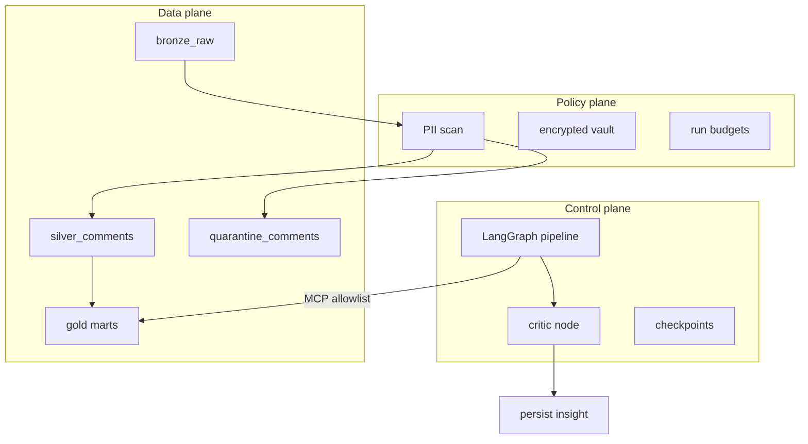
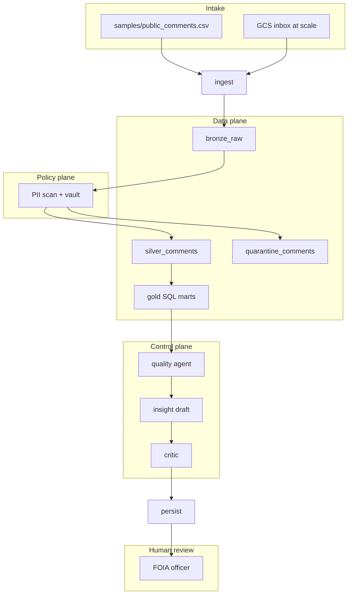

# How Operator ETL works

End-to-end usage model for FOIA / public comment intake — local MVP and scaled GCP deployment.

**See it work:** [WALKTHROUGH.md](WALKTHROUGH.md) · **Scale out:** [SCALING.md](SCALING.md)

---

## Who uses it

| Role | What they do | Entry point |
|---|---|---|
| **FOIA officer** | Review PII flags, approve releases | Dashboard Gov tab, `insights` table |
| **Data engineer** | Add sources, run pipelines, deploy infra | [GETTING-STARTED.md](GETTING-STARTED.md), [SCALING.md](SCALING.md) |
| **AI agent (MCP)** | Query gold KPIs, run allowlisted quality SQL | `operator-etl-mcp` |
| **Reviewer / adopter** | Prove the build works | `make e2e` → [WALKTHROUGH.md](WALKTHROUGH.md) |

---

## Three planes

Agents orchestrate. Python and SQL execute. PII never reaches unconstrained tools.



Details: [okf/models/three-planes.md](../okf/models/three-planes.md)

---

## FOIA comment lifecycle



Agency mapping: [FOIA-Public-Comments-Guide.md](FOIA-Public-Comments-Guide.md)

---

## What runs where

| Component | Local MVP | GCP (scaled) |
|---|---|---|
| **Trigger** | `make e2e` / `etl-graph` CLI | GCS upload → Pub/Sub → Cloud Run |
| **Warehouse** | DuckDB (`warehouse/operator.duckdb`) | BigQuery (`etl_*` datasets) |
| **Graph runner** | `operator_etl_graph` on laptop | Cloud Run `graph-runner` |
| **Checkpoints** | SQLite | Cloud SQL PostgreSQL |
| **MCP** | stdio (`operator-etl-mcp`) | HTTP on Cloud Run |
| **PII vault** | Local encrypted file | Secret Manager + env |

Same graph nodes, PII policy, critic, and MCP allowlist in both environments.

---

## What agents may and may not do

**Allowed (MCP tools):**

- `get_gold_metrics` — aggregate KPIs only
- `run_quality_sql` — allowlisted query IDs only
- `get_run_status` — audit row for a run

**Denied:**

- Raw SQL on bronze/silver
- `vault_decrypt` or row-level PII export
- Auto-publish to external systems

Policy: [okf/decisions/mcp-allowlist-only.md](../okf/decisions/mcp-allowlist-only.md)

---

## Why this design

Operator ETL separates **deterministic ETL** (medallion warehouse, SQL marts) from **bounded agents** (LangGraph orchestration, MCP allowlist). PII never reaches unconstrained tools; the critic rejects insight numbers that do not exist in gold. Each invariant maps to an authoritative source and a pytest — see [FOUNDATIONS.md](FOUNDATIONS.md).

---

## Proof before trust

Before claiming the system works or scaling to staging:

```bash
make e2e
```

This runs OKF validation, 24 pytest tests, and a fresh-warehouse FOIA demo with output assertions.

**CI:** Every push to `master` runs the same gate on GitHub Actions — see the CI badge in [README.md](../README.md).

Step-by-step: [WALKTHROUGH.md](WALKTHROUGH.md)
