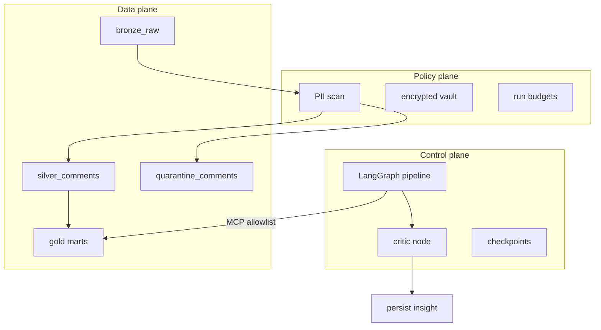
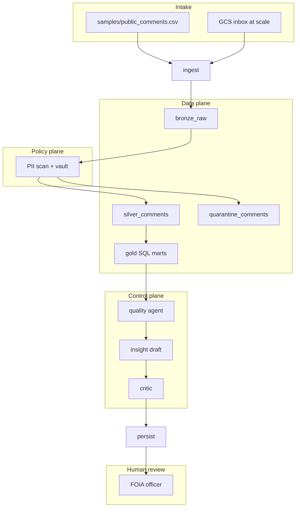
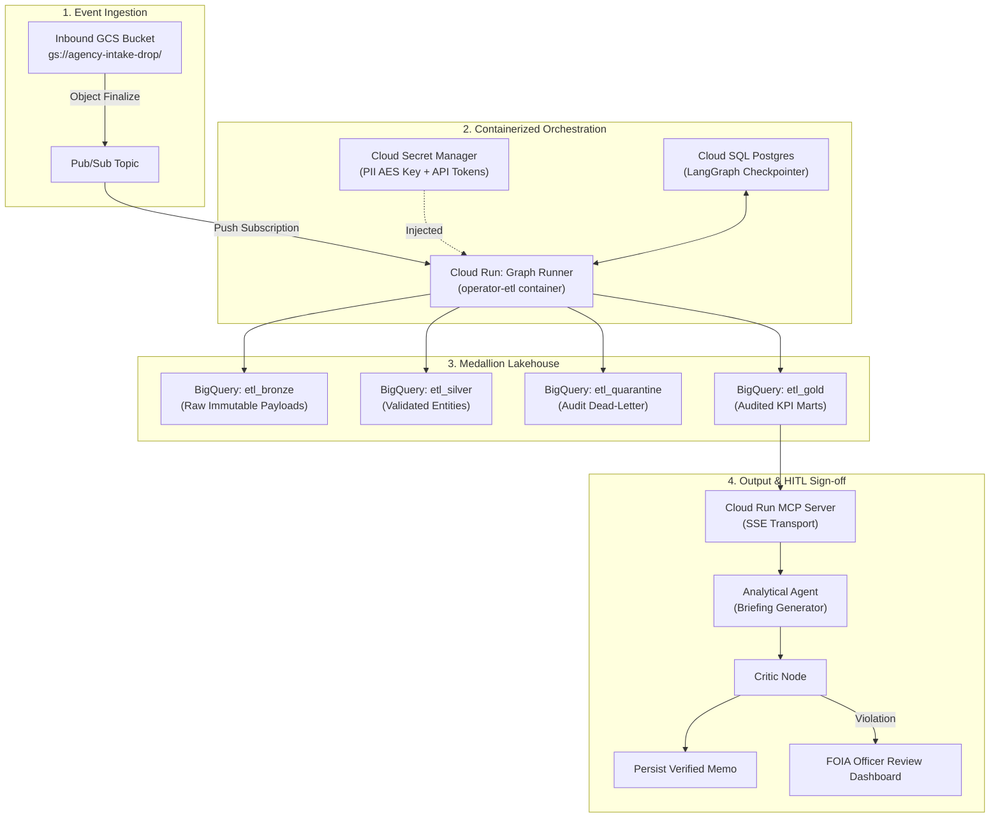
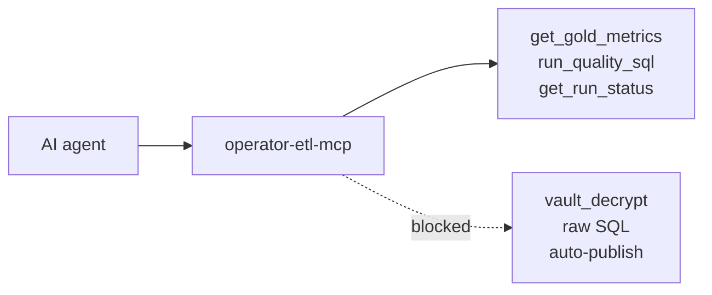
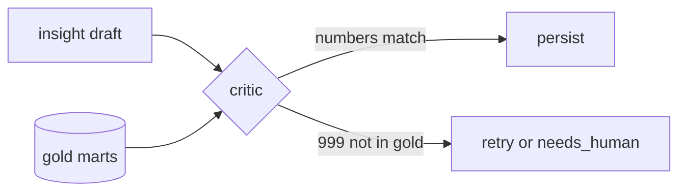

# How Operator ETL works

End-to-end usage model for FOIA / public comment intake — local MVP and scaled GCP deployment.

**When to read:** You need the runtime flow, three planes, lifecycle, or MCP policy. If you do not know what medallion means: [PATTERNS.md](PATTERNS.md).

**See it work:** [TOUR.md](TOUR.md) · [WALKTHROUGH.md](WALKTHROUGH.md) · **Scale out:** [SCALING.md](SCALING.md) · **Start here:** [README.md](../README.md)

---

## Who uses it

Named composites: [PERSONAS.md](PERSONAS.md).

| Role | What they do | Entry point |
|---|---|---|
| **FOIA officer (Priya)** | Review PII flags, quarantine, critic-checked insight | Dashboard Gov tab |
| **Data engineer (Riley)** | Add sources, run pipelines, optional local Ollama | [GETTING-STARTED.md](GETTING-STARTED.md), [LLM.md](LLM.md), [MODELS.md](MODELS.md) |
| **New engineer (Sam)** | Prove the clone | `./scripts/verify.sh` |
| **Reviewer (Jordan)** | Honest scope | [FINAL-REVIEW.md](FINAL-REVIEW.md) |
| **AI agent (MCP)** | Query gold KPIs, allowlisted SQL | `operator-etl-mcp` |

---

## Three planes

Agents orchestrate. Python and SQL execute. PII never reaches unconstrained tools.



Details: [okf/models/three-planes.md](../okf/models/three-planes.md)

---

## FOIA comment lifecycle



Agency mapping: [FOIA-Public-Comments-Guide.md](FOIA-Public-Comments-Guide.md)

---

## What runs where

| Component | Local MVP | GCP (scaled) | Enterprise Invariant |
|---|---|---|---|
| **Trigger** | `make e2e` / `etl-graph` CLI | GCS upload → Pub/Sub → Cloud Run | At-least-once event delivery |
| **Warehouse** | DuckDB (`warehouse/operator.duckdb`) | BigQuery (`etl_*` datasets) | Bit-identical SQL aggregation |
| **Graph runner** | `operator_etl_graph` on laptop | Cloud Run `graph-runner` | Deterministic LangGraph state machine |
| **Checkpoints** | SQLite | Cloud SQL PostgreSQL | Resumable HITL interruption |
| **MCP** | stdio (`operator-etl-mcp`) | HTTP/SSE on Cloud Run | Strict query allowlist enforcement |
| **PII vault** | Local encrypted file | Secret Manager + Cloud KMS | Zero raw PII in model context |

Same graph nodes, PII policy, critic, and MCP allowlist in both environments.

---

## Real-world Production Deployment Blueprint

When graduating from local development to production agency infrastructure:



---

## What agents may and may not do

**Allowed (MCP tools):**

- `get_gold_metrics` — aggregate KPIs only
- `run_quality_sql` — allowlisted query IDs only
- `get_run_status` — audit row for a run

**Denied:**

- Raw SQL on bronze/silver
- `vault_decrypt` or row-level PII export
- Auto-publish to external systems

Policy: [okf/decisions/mcp-allowlist-only.md](../okf/decisions/mcp-allowlist-only.md)



---

## Why this design

Operator ETL separates **deterministic ETL** (medallion warehouse, SQL marts) from **bounded agents** (LangGraph orchestration, MCP allowlist). PII never reaches unconstrained tools; the critic rejects insight numbers that do not exist in gold.



Each invariant maps to an authoritative source and a pytest — see [FOUNDATIONS.md](FOUNDATIONS.md).

---

## Proof before trust

Before claiming the system works or scaling to staging:

```bash
make e2e
```

This runs OKF validation, 51 pytest tests, and a fresh-warehouse FOIA demo with output assertions.

**CI:** Every push to `master` runs the same gate on GitHub Actions — see the CI badge in [README.md](../README.md).

Step-by-step: [WALKTHROUGH.md](WALKTHROUGH.md)

## See also

- [CONCEPTS.md](CONCEPTS.md) — what we built
- [APPLY.md](APPLY.md) — other data sources
- [RISKS.md](RISKS.md) — residual risks
- [FOUNDATIONS.md](FOUNDATIONS.md) — why this design; proof matrix
- [GETTING-STARTED.md](GETTING-STARTED.md) — install and env vars
- [FINAL-REVIEW.md](FINAL-REVIEW.md) — proven vs specified audit
