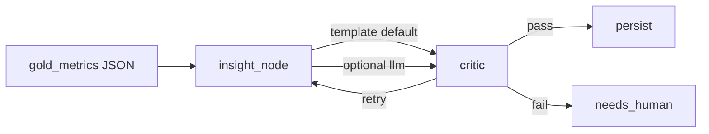

# Optional LLM insights

**When to read:** Verify is green on the **template** path and you want a model to draft the insight narrative. Default remains template — no API key required for `./scripts/verify.sh`.

---

## What this is (and is not)

The graph is still **gold metrics → insight → critic → persist**. The optional LLM replaces only the insight *wording*. It receives **gold KPI JSON only** — never bronze rows, comment bodies, or vault PII. The critic still rejects any number that is not in gold.

This path is **PARTIAL**: unit-tested with a mocked client in CI. A maintainer laptop run against local Ollama (`llama3.2:3b`) produced a critic-passing draft. That is **not** a CI proof. Do not call it production FOIA software.



---

## Localhost

Install the extra, then opt in:

```bash
uv sync --extra llm --extra dev
export OPERATOR_ETL_INSIGHT_BACKEND=llm
export OPENAI_API_KEY=sk-...
export OPERATOR_ETL_LLM_MODEL=gpt-4o-mini   # optional
uv run etl-graph --source public_comments --pipeline public_comments
```

Use a **fresh warehouse** (same as the FOIA demo) so counts stay expected.

### Ollama on this laptop

Ollama’s OpenAI-compatible API is `http://127.0.0.1:11434/v1`. Maintainer-laptop check: `llama3.2:3b`, critic **passed** (`status=complete`, gold numbers only in the payload). **Not** proven in CI.

```bash
uv sync --extra llm --extra dev
export OPERATOR_ETL_INSIGHT_BACKEND=llm
export OPERATOR_ETL_LLM_BASE_URL=http://127.0.0.1:11434/v1
export OPERATOR_ETL_LLM_MODEL=llama3.2:3b
# OPENAI_API_KEY not required when base URL is set
OPERATOR_ETL_WAREHOUSE=.tmp/mvp-demo-ollama/operator.duckdb \
OPERATOR_ETL_PIPELINE_NAME=public_comments OPERATOR_ETL_DOMAIN=gov \
  uv run etl-graph --source public_comments --pipeline public_comments
```


The critic checks **digits**, not whether the sentence used the rate correctly. Small models may still misread `pii_rate` 0.4. If the critic fails (`needs_human`), try `mistral:latest` or keep the template. Do not loosen the critic. Do not send bronze/PII to Ollama.

### Other OpenAI-compatible servers

Any server that speaks the OpenAI `/v1` API (LM Studio, vLLM, a local proxy):

```bash
export OPERATOR_ETL_INSIGHT_BACKEND=llm
export OPERATOR_ETL_LLM_BASE_URL=http://127.0.0.1:1234/v1
export OPERATOR_ETL_LLM_MODEL=your-local-model
```

If the extra is missing, the key is unset (and no base URL), or the call fails, the node **falls back to the template** and records a short note in `errors`. The critic still runs. Staging with a placeholder Secret Manager value will complete instead of 401-looping.

---

## Cloud (Cloud Run)

The graph-runner image installs `--extra llm`. Terraform already mounts `OPENAI_API_KEY` from Secret Manager and sets:

| Variable | Default in Terraform |
|---|---|
| `OPERATOR_ETL_INSIGHT_BACKEND` | `template` |
| `OPERATOR_ETL_LLM_MODEL` | `gpt-4o-mini` |

After you replace the `REPLACE_ME` OpenAI secret:

```bash
gcloud secrets versions add operator-etl-staging-openai-api-key --data-file=-
# then set Cloud Run env OPERATOR_ETL_INSIGHT_BACKEND=llm on graph-runner
```

Do not flip the backend to `llm` while the secret is still the placeholder. Details: [infra/README.md](https://github.com/khaosans/operator-etl/blob/master/infra/README.md).

---

## Environment

| Variable | Default | Meaning |
|---|---|---|
| `OPERATOR_ETL_INSIGHT_BACKEND` | `template` | `template` or `llm` |
| `OPERATOR_ETL_LLM_MODEL` | `gpt-4o-mini` | Chat model id |
| `OPERATOR_ETL_LLM_BASE_URL` | — | OpenAI-compatible base URL (localhost) |
| `OPERATOR_ETL_MAX_LLM_CALLS` | `12` | Per-run budget (critic retries count) |
| `OPENAI_API_KEY` | — | Unprefixed. Cloud Run mounts from Secret Manager |

---

## See also

- [TOUR.md](TOUR.md) — screenshots including the Ollama run
- [FAQ.md](FAQ.md) — do I need an API key?
- [CLI.md](CLI.md) — `etl-graph` flags
- [TESTING.md](TESTING.md) — mocked LLM tests; no live key in CI
- [TROUBLESHOOTING.md](TROUBLESHOOTING.md) — fallback notes
