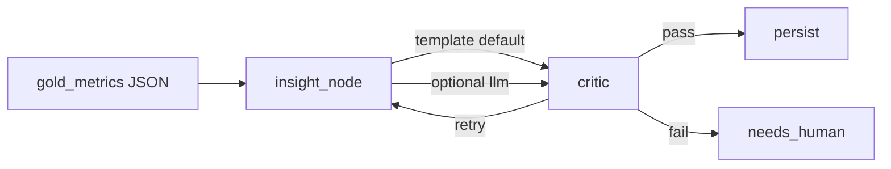

# Optional LLM insights

**When to read:** Verify is green on the **template** path and you want a model to draft the insight narrative. Which model, cards, and NIST data-boundary: [MODELS.md](MODELS.md). Risk functions: [NIST.md](NIST.md).

Default remains template — no API key required for `./scripts/verify.sh`.

---

## What this is (and is not)

The graph is still **gold metrics → insight → critic → persist**. The optional LLM replaces only the insight *wording*. It receives **gold KPI JSON only** — never bronze rows, comment bodies, or vault PII. The critic still rejects any number that is not in gold.

This path is **PARTIAL**: unit-tested with a mocked client in CI. A maintainer laptop run against local Ollama (`llama3.2:3b`) produced a critic-passing draft. That is **not** a CI proof. Do not call it production FOIA software.



---

## Local Ollama (from zero)

Ollama’s OpenAI-compatible API is `http://127.0.0.1:11434/v1`. Gold KPI JSON **stays on this machine** (NIST Map). Maintainer-laptop check: `llama3.2:3b`, critic **passed**. **Not** proven in CI.

### 1. Install the runtime

Download from [ollama.com/download](https://ollama.com/download):

| OS | Install |
|---|---|
| **macOS** | Official DMG, or `brew install --cask ollama-app` (prefer the cask / official app over a broken Homebrew *formula*) |
| **Linux** | `curl -fsSL https://ollama.com/install.sh \| sh` |
| **Windows** | Installer from the download page |

### 2. Confirm the daemon

```bash
ollama --version
curl -s http://127.0.0.1:11434/api/tags
```

If curl fails, start Ollama (menubar app, or `ollama serve`) and retry. See [TROUBLESHOOTING](TROUBLESHOOTING.md#ollama-connection-refused-on-11434).

### 3. Pull the proven tag

```bash
ollama pull llama3.2:3b
ollama list
```

Optional smoke test:

```bash
ollama run llama3.2:3b "Reply with the single word pong"
```

Why this tag, RAM, license, and model card: [MODELS.md](MODELS.md#llama-32-3b-instruct--llama323b).

### 4. Point Operator ETL at it

```bash
uv sync --extra llm --extra dev
export OPERATOR_ETL_INSIGHT_BACKEND=llm
export OPERATOR_ETL_LLM_BASE_URL=http://127.0.0.1:11434/v1
export OPERATOR_ETL_LLM_MODEL=llama3.2:3b
# OPENAI_API_KEY not required when base URL is set
```

### 5. Run on a fresh warehouse

```bash
OPERATOR_ETL_WAREHOUSE=.tmp/mvp-demo-ollama/operator.duckdb \
OPERATOR_ETL_PIPELINE_NAME=public_comments OPERATOR_ETL_DOMAIN=gov \
  uv run etl-graph --source public_comments --pipeline public_comments
```

Expect `insight_backend=llm` and `critic_passed=True`. If the critic fails (`needs_human`), try `mistral` (`ollama pull mistral` and `OPERATOR_ETL_LLM_MODEL=mistral`) or keep the template. Do not loosen the critic. Do not send bronze/PII to Ollama.


The critic checks **digits**, not whether the sentence used the rate correctly. Small models may still misread `pii_rate` 0.4.

---

## Cloud OpenAI-compatible

Gold KPI JSON **leaves the box** to the host. That is allowed only if your policy accepts numeric aggregates off-machine. Comment bodies still never go.

### OpenAI platform

```bash
uv sync --extra llm --extra dev
export OPERATOR_ETL_INSIGHT_BACKEND=llm
export OPERATOR_ETL_LLM_MODEL=gpt-4o-mini   # optional; this is the default
export OPENAI_API_KEY=sk-...
# no OPERATOR_ETL_LLM_BASE_URL → api.openai.com
uv run etl-graph --source public_comments --pipeline public_comments
```

Use a **fresh warehouse** (same as the FOIA demo) so counts stay expected. Card: [MODELS.md](MODELS.md#gpt-4o-mini--gpt-4o-mini).

### Other `/v1` hosts (untested)

Any server that speaks OpenAI Chat Completions at a `/v1` root (LM Studio, vLLM, a local proxy). Azure OpenAI only if **that endpoint** speaks the same API `ChatOpenAI` already uses — this repo does **not** ship `AzureChatOpenAI`. Label these paths **untested**.

```bash
export OPERATOR_ETL_INSIGHT_BACKEND=llm
export OPERATOR_ETL_LLM_BASE_URL=http://127.0.0.1:1234/v1
export OPERATOR_ETL_LLM_MODEL=your-local-model
```

If the extra is missing, the key is unset (and no base URL), or the call fails, the node **falls back to the template** and records a short note in `errors`. The critic still runs.

---

## Cloud Run

The graph-runner image installs `--extra llm`. Terraform already mounts `OPENAI_API_KEY` from Secret Manager and sets:

| Variable | Default in Terraform |
|---|---|
| `OPERATOR_ETL_INSIGHT_BACKEND` | `template` |
| `OPERATOR_ETL_LLM_MODEL` | `gpt-4o-mini` |

After you replace the `REPLACE_ME` OpenAI secret:

```bash
gcloud secrets versions add operator-etl-staging-openai-api-key --data-file=-
# then set Cloud Run env OPERATOR_ETL_INSIGHT_BACKEND=llm on graph-runner
```

Do not flip the backend to `llm` while the secret is still the placeholder. Details: [infra/README.md](https://github.com/khaosans/operator-etl/blob/master/infra/README.md).

---

## Environment

| Variable | Default | Meaning |
|---|---|---|
| `OPERATOR_ETL_INSIGHT_BACKEND` | `template` | `template` or `llm` |
| `OPERATOR_ETL_LLM_MODEL` | `gpt-4o-mini` | Chat model id (`llama3.2:3b` on Ollama) |
| `OPERATOR_ETL_LLM_BASE_URL` | — | OpenAI-compatible base URL (localhost / proxy) |
| `OPERATOR_ETL_MAX_LLM_CALLS` | `12` | Per-run budget (critic retries count) |
| `OPENAI_API_KEY` | — | Unprefixed. Required for api.openai.com. **Not** required when `OPERATOR_ETL_LLM_BASE_URL` is set. Cloud Run mounts from Secret Manager. |

Credentials: an API **key** *or* a **base URL** (local Ollama uses a dummy key inside the client). Both missing → template fallback.

---

## See also

- [MODELS.md](MODELS.md) — when to use which; official model cards
- [NIST.md](NIST.md) — Map (on-box vs off-box) and AI RMF
- [TOUR.md](TOUR.md) — screenshots including the Ollama run
- [FAQ.md](FAQ.md) — API key, GPU, local install
- [CLI.md](CLI.md) — `etl-graph` flags
- [TESTING.md](TESTING.md) — mocked LLM tests; no live key in CI
- [TROUBLESHOOTING.md](TROUBLESHOOTING.md) — fallback and port 11434
