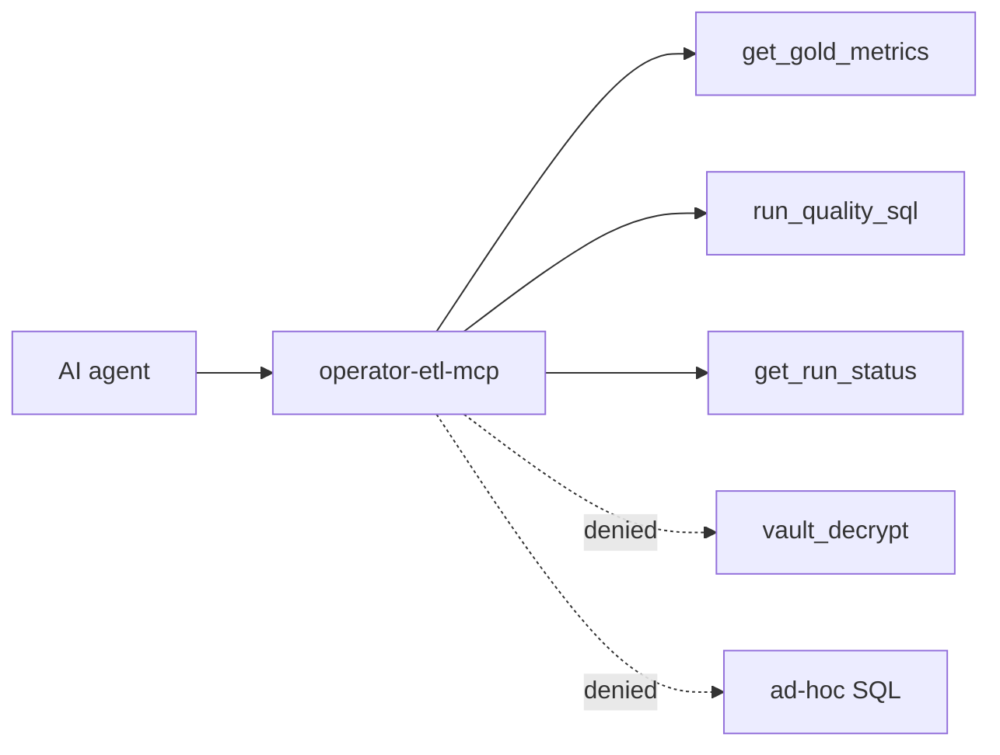

# MCP setup

**When to read:** You want Cursor (or another MCP client) to query **gold KPIs** without warehouse keys. Run [QUICKSTART](QUICKSTART.md) first so gold tables exist.

Policy: [mcp-allowlist-only](https://github.com/khaosans/operator-etl/blob/master/okf/decisions/mcp-allowlist-only.md)

---

## Configure Cursor

```bash
cp .cursor/mcp.json.example .cursor/mcp.json
```

Set `cwd` to your **clone path** (machine-specific — `.cursor/mcp.json` is gitignored):

```json
{
  "mcpServers": {
    "operator-etl": {
      "command": "uv",
      "args": ["run", "operator-etl-mcp"],
      "cwd": "/path/to/operator-etl"
    }
  }
}
```

Restart Cursor. Point the server at a warehouse that already has gold (after `./scripts/verify.sh`):

```bash
export OPERATOR_ETL_WAREHOUSE=".tmp/mvp-demo/operator.duckdb"
export OPERATOR_ETL_DOMAIN=gov
```

Or put those in `.env` (never commit `.env`).

---

## Allowed tools



| Tool | Does |
|---|---|
| `get_gold_metrics` | Aggregate KPIs (`gold_comment_kpis` when `domain=gov`) |
| `run_quality_sql` | Runs an **allowlisted** query ID from [`sql/allowlist.yaml`](https://github.com/khaosans/operator-etl/blob/master/sql/allowlist.yaml) |
| `get_run_status` | Audit row for a pipeline run |

Allowlisted IDs today: `quarantine_summary`, `comment_quality`, `pii_by_agency`, `docket_volume`.

---

## Denied

- Raw SQL on bronze/silver
- `vault_decrypt` / row-level PII export
- Auto-publish to external systems

Tests: `tests/test_mcp_tools.py` (unknown ID denied, no vault in allowlist, gold KPIs match pipeline).

---

## Smoke check

After the FOIA demo, call `get_gold_metrics` with `domain: gov`. Expect `comment_count` **10** and `pii_flagged_count` ≥ 4 — same as [WALKTHROUGH](WALKTHROUGH.md).

---

## See also

- [CLI.md](CLI.md) — `uv run operator-etl-mcp`
- [HOW-IT-WORKS.md](HOW-IT-WORKS.md) — planes and MCP policy
- [TESTING.md](TESTING.md)
