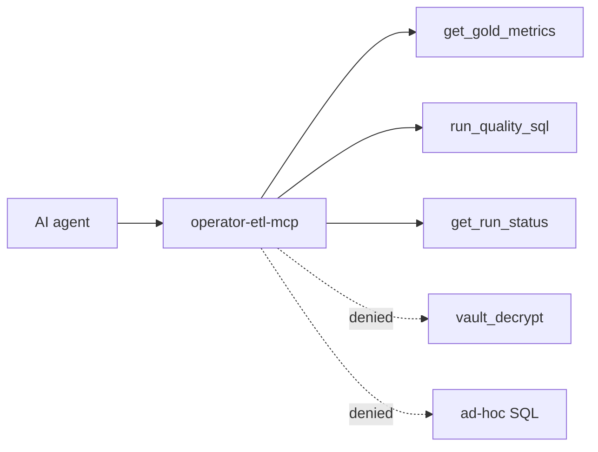

# MCP setup

**When to read:** You want Cursor (or another MCP client) to query **gold KPIs** without warehouse keys. Run [QUICKSTART](QUICKSTART.md) first so gold tables exist.

Policy: [mcp-allowlist-only](https://github.com/khaosans/operator-etl/blob/master/okf/decisions/mcp-allowlist-only.md)

---

## Configure Cursor

```bash
cp .cursor/mcp.json.example .cursor/mcp.json
```

Set `cwd` to your **clone path** (machine-specific — `.cursor/mcp.json` is gitignored):

```json
{
  "mcpServers": {
    "operator-etl": {
      "command": "uv",
      "args": ["run", "operator-etl-mcp"],
      "cwd": "/path/to/operator-etl"
    }
  }
}
```

Restart Cursor. Point the server at a warehouse that already has gold (after `./scripts/verify.sh`):

```bash
export OPERATOR_ETL_WAREHOUSE=".tmp/mvp-demo/operator.duckdb"
export OPERATOR_ETL_DOMAIN=gov
```

Or put those in `.env` (never commit `.env`).

---

## Allowed tools



| Tool | Does |
|---|---|
| `get_gold_metrics` | Aggregate KPIs (`gold_comment_kpis` when `domain=gov`) |
| `run_quality_sql` | Runs an **allowlisted** query ID from [`sql/allowlist.yaml`](https://github.com/khaosans/operator-etl/blob/master/sql/allowlist.yaml) |
| `get_run_status` | Audit row for a pipeline run |

Allowlisted IDs today: `quarantine_summary`, `comment_quality`, `pii_by_agency`, `docket_volume`.

### Tool annotations

Every tool declares all four MCP hints explicitly (required by OpenAI MCP directory and registry scanners):

| Tool | readOnlyHint | destructiveHint | idempotentHint | openWorldHint |
|---|---|---|---|---|
| `get_gold_metrics` | true | false | true | false |
| `run_quality_sql` | true | false | true | false |
| `get_run_status` | true | false | true | false |

All tools are read-only against the local warehouse; none mutate data or reach external networks.

### Environment variables

| Variable | Required for MCP? | Purpose |
|---|---|---|
| `OPERATOR_ETL_WAREHOUSE` | Yes (via Settings / `.env`) | DuckDB file path with gold marts |
| `OPERATOR_ETL_DOMAIN` | Recommended (`gov` for FOIA demo) | Selects gov vs orders gold tables |
| `OPENAI_API_KEY` | **No** | Optional — only for LLM insight backend in LangGraph (`etl-graph`), not the MCP stdio server |

The default MCP path uses template insights and gold aggregates only; no API key is needed.

---

## A2A boundary

Operator ETL now exposes a separate task-oriented A2A HTTP surface for external agents:

- Discovery: `GET /.well-known/agent-card.json`
- Tasks: `POST /a2a/v1/tasks`
- Events: `GET /a2a/v1/tasks/{task_id}/events`

That interface accepts **high-level task definitions only** and returns sanitized artifacts (`gold_metrics`, critic-approved public brief, run status). It does **not** expand MCP permissions: raw SQL, bronze/silver row export, and vault decryption remain denied.

---

## Denied

- Raw SQL on bronze/silver
- `vault_decrypt` / row-level PII export
- Auto-publish to external systems

Tests: `tests/test_mcp_tools.py` — `get_gold_metrics`, `run_quality_sql`, and `get_run_status` each have dedicated tests (allowlist deny, vault exclusion, audit row lookup).

---

## Smoke check

After the FOIA demo, call `get_gold_metrics` with `domain: gov`. Expect `comment_count` **10** and `pii_flagged_count` ≥ 4 — same as [WALKTHROUGH](WALKTHROUGH.md).

---

## See also

- [CLI.md](CLI.md) — `uv run operator-etl-mcp`
- [HOW-IT-WORKS.md](HOW-IT-WORKS.md) — planes and MCP policy
- [TESTING.md](TESTING.md)
