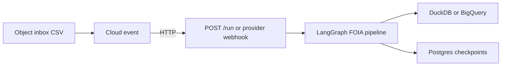

# Multi-cloud deploy (GCP / AWS / Azure)

Operator ETL runs the **same graph, PII policy, and critic** on any cloud that supplies:

1. A **container** runtime (Cloud Run / ECS Fargate / Azure Container Apps)
2. An **object-store inbox** (GCS / S3 / Blob) behind the portable `ObjectStore` protocol
3. **Postgres** for LangGraph checkpoints (optional — SQLite for laptop)
4. A **secret store** for `PII_VAULT_KEY`

Prove local first: `./scripts/verify.sh` → `OPERATOR_ETL_VERIFY=PASS`.

## Mental model

| Layer | Portable | GCP (reference) | AWS (L2) | Azure (L2) |
|---|---|---|---|---|
| Warehouse | Protocol + `load.ops` | BigQuery (L3) or DuckDB | **DuckDB** in task | **DuckDB** in app |
| Inbox | `ObjectStore` | GCS | S3 | Blob |
| Trigger | `POST /run` | Pub/Sub → `/pubsub/push` | EventBridge → `/run` | Event Grid → `/events/azure` |
| Checkpoints | sqlite \| postgres | Cloud SQL | RDS | Flexible Server |
| IaC | `infra/<provider>/` | [`infra/gcp`](https://github.com/khaosans/operator-etl/tree/master/infra/gcp) | [`infra/aws`](https://github.com/khaosans/operator-etl/tree/master/infra/aws) | [`infra/azure`](https://github.com/khaosans/operator-etl/tree/master/infra/azure) |



## Portable env contract

| Variable | Purpose |
|---|---|
| `OPERATOR_ETL_BACKEND` | `duckdb` (AWS/Azure L2, local) or `bigquery` (GCP L3) |
| `OPERATOR_ETL_OBJECT_STORE_BACKEND` | `gcs` \| `s3` \| `azure` |
| `OPERATOR_ETL_INBOX_URI` | `gs://…` / `s3://…` / `az://account/container/prefix` |
| `OPERATOR_ETL_CHECKPOINT_BACKEND` | `sqlite` \| `postgres` |
| `OPERATOR_ETL_CHECKPOINT_DATABASE_URL` | Managed Postgres URL |

Examples: [`infra/env.example`](https://github.com/khaosans/operator-etl/blob/master/infra/env.example) · [`env.aws.example`](https://github.com/khaosans/operator-etl/blob/master/infra/env.aws.example) · [`env.azure.example`](https://github.com/khaosans/operator-etl/blob/master/infra/env.azure.example)

## Container images

```bash
docker build --build-arg CLOUD_EXTRA=gcp   -t operator-etl:gcp .
docker build --build-arg CLOUD_EXTRA=aws   -t operator-etl:aws .
docker build --build-arg CLOUD_EXTRA=azure -t operator-etl:azure .
```

All images expose the same FastAPI app (`operator_etl_gcp.http.app`) with:

- `GET /health`
- `POST /run` — portable trigger (AWS EventBridge targets this)
- `POST /pubsub/push` — GCP Pub/Sub adapter
- `POST /events/azure` — Azure Event Grid validation + BlobCreated adapter

## Skills / playbooks

| Cloud | Skill | Playbook |
|---|---|---|
| Any | [operator-ship-portable](https://github.com/khaosans/operator-etl/blob/master/skills/operator-ship-portable/SKILL.md) | [deploy-container-any-cloud](https://github.com/khaosans/operator-etl/blob/master/okf/playbooks/deploy-container-any-cloud.md) |
| GCP | [operator-ship-gcp](https://github.com/khaosans/operator-etl/blob/master/skills/operator-ship-gcp/SKILL.md) | [deploy-gcp-staging](https://github.com/khaosans/operator-etl/blob/master/okf/playbooks/deploy-gcp-staging.md) |
| AWS | [operator-ship-aws](https://github.com/khaosans/operator-etl/blob/master/skills/operator-ship-aws/SKILL.md) | [deploy-aws-staging](https://github.com/khaosans/operator-etl/blob/master/okf/playbooks/deploy-aws-staging.md) |
| Azure | [operator-ship-azure](https://github.com/khaosans/operator-etl/blob/master/skills/operator-ship-azure/SKILL.md) | [deploy-azure-staging](https://github.com/khaosans/operator-etl/blob/master/okf/playbooks/deploy-azure-staging.md) |

## Efficient LLM defaults

Cloud stacks keep `OPERATOR_ETL_INSIGHT_BACKEND=template` so staging burns **zero** model tokens. When you opt into `llm`:

- `OPERATOR_ETL_MAX_LLM_CALLS=2` (draft + retry)
- `OPERATOR_ETL_LLM_MAX_TOKENS=256`
- Gold payload = five KPI keys only

Details: [MODELS.md](MODELS.md#efficient-defaults-cost--tokens).

| Claim | Status |
|---|---|
| Local MVP + pytest | **Proven** in CI (`./scripts/verify.sh`) |
| Terraform `validate` for gcp/aws/azure | **Proven** in CI |
| Live `terraform apply` + end-to-end cloud ingest | **Manual** (your account) — same honesty as GCP today |
| BigQuery gold dialect / AWS Redshift / Azure Synapse | **Not** in this ladder yet |

Scale ladder detail: [SCALING.md](SCALING.md) · ADR: [cloud-portable-adapters](https://github.com/khaosans/operator-etl/blob/master/okf/decisions/cloud-portable-adapters.md)
