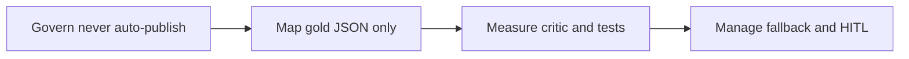

# NIST alignment — what we follow, what we do not claim

**When to read:** You need to know how Operator ETL relates to NIST guidance (AI risk, generative AI, PII). Start with [CONCEPTS.md](CONCEPTS.md) if the project is new.

**Status:** We **align** selected practices from the documents below. This repository is **not** NIST-certified, not FedRAMP authorized, and not an Authority to Operate (ATO) package. Do not treat the demo as a completed control overlay.

Proof of what *is* implemented: [FOUNDATIONS.md](FOUNDATIONS.md) · [FINAL-REVIEW.md](FINAL-REVIEW.md).

---

## Publications we cite

Summaries only. Authoritative text is on NIST’s site.

| Document | Why it belongs here |
|---|---|
| [NIST AI RMF 1.0 (AI 100-1)](https://www.nist.gov/itl/ai-risk-management-framework) | Four functions — Govern, Map, Measure, Manage — and human oversight before release. |
| [NIST AI 600-1 Generative AI Profile](https://doi.org/10.6028/NIST.AI.600-1) (July 2024) | Companion for generative AI. We map **only** the risks this KPI-summary demo actually addresses. |
| [NIST SP 800-122](https://csrc.nist.gov/publications/detail/sp/800-122/final) | PII confidentiality: minimize exposure, scan before use, vault originals, keep PII out of agent context. |
| [NIST Privacy Framework 1.0](https://www.nist.gov/privacy-framework) | Identify and protect PII in the comment pipeline (light touch — we are not a full privacy program). |
| [NIST SP 800-53 Rev. 5](https://csrc.nist.gov/publications/detail/sp/800-53/rev-5/final) | **Analogies**, not a catalog: AU (bronze audit), AC (MCP least privilege), SC (encrypted vault), SI (quality gate). **Not an ATO overlay.** |

Index of other patterns (medallion, MCP, OKF): [STANDARDS.md](STANDARDS.md).

---

## AI RMF core → this demo

NIST groups AI risk work into four functions. Here is how this repo uses that language.

| Function | What NIST is asking (plain) | What Operator ETL does |
|---|---|---|
| **Govern** | Policies and accountability so AI does not run unowned. | Agents never auto-publish. Default insight is a **template** so CI needs no model. Secrets stay out of git. |
| **Map** | Know context, data, and who is affected. | The model input is **numeric gold KPI JSON only**. Ollama keeps that JSON on the machine. Cloud OpenAI sends it off-box — a FOIA-relevant boundary, not a performance footnote. [MODELS.md](MODELS.md) |
| **Measure** | Test trustworthiness with evidence. | 41 pytest, critic on every insight, fail-closed quality gate, `./scripts/verify.sh`. |
| **Manage** | Respond when things go wrong. | LLM failure **falls back to the template**. Critic retries then `needs_human`. We do not loosen the critic to “make the model pass.” |

---

## Generative AI Profile (AI 600-1) — risks we actually mitigate

NIST AI 600-1 lists risks unique to or worsened by generative AI. This demo is a **short KPI summary**, not a general chatbot. We only claim the rows below.

| Risk (NIST language, shortened) | What we do | Honest gap |
|---|---|---|
| Confabulation / information integrity | Deterministic **critic**: every number in the draft must exist in gold. | Critic checks **digits**, not whether the sentence used `pii_rate` 0.4 correctly. |
| Data privacy / sensitive data | Regex PII scan, encrypted vault, never send bronze or comment bodies to a model. | Scanner is regex, not Presidio (SPECIFIED). Sample PII is synthetic. |
| Human–AI configuration / oversight | HITL; `needs_human` is not success; [agents never publish prod](https://github.com/khaosans/operator-etl/blob/master/okf/decisions/agents-never-publish-prod.md). | Officer **approval UI** is PARTIAL / SPECIFIED — see [PRODUCT-UX.md](PRODUCT-UX.md). |
| Excessive agency | MCP **allowlist** (three tools). No vault tool. No ad-hoc SQL. Also [OWASP LLM Top 10](https://owasp.org/www-project-top-10-for-large-language-model-applications/) LLM06 in FOUNDATIONS. | Tools are still a demo surface, not a production IAM design. |

CBRN, CSAM, environmental impact, and a full fairness/bias evaluation are **out of scope** for this KPI-summary demo. We do not map them.

---

## SP 800-122 — PII in this pipeline

SP 800-122 is a guide to protecting the confidentiality of PII. In this repo that means: detect patterns **before** insight, store originals in a vault agents cannot call, redact agent-facing text, and keep gold metrics numeric so a cloud model still does not receive emails or phones.

Minimize: the LLM payload strips timestamps and non-numeric fields. That is Map (what leaves the box) as much as privacy.

---

## SP 800-53 families (analogies only)

If you already speak 800-53, these families are the closest *story*, not a control-by-control mapping and not an ATO:

- **AU** — bronze is immutable, hashed intake; pipeline runs are recorded.
- **AC** — MCP allowlist is least privilege for agents.
- **SC** — vault encryption; no vault over MCP.
- **SI** — fail-closed quality gate withholds bad KPIs.

Do not copy this table into a System Security Plan as if the demo satisfied the family.

---

## See also

- [CONCEPTS.md](CONCEPTS.md) — narrative tour
- [MODELS.md](MODELS.md) — local vs cloud data boundary
- [FOUNDATIONS.md](FOUNDATIONS.md) — proof matrix and bibliography
- [FAQ.md](FAQ.md) — “Are you NIST certified?”
