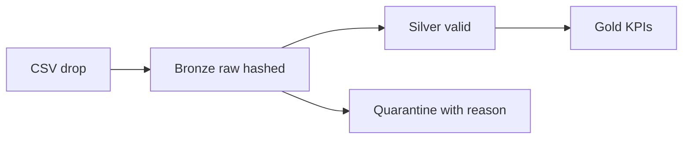

# Patterns and components — what the words mean

**If you do not know what medallion means, start here.**

**When to read:** You hit jargon (medallion, planes, critic, fail-closed, HITL) and want English first, then the pattern name, then one reputable source. This is explanation, not a how-to.

Proof matrix (invariant → code → test): [FOUNDATIONS.md](FOUNDATIONS.md). Runtime: [HOW-IT-WORKS.md](HOW-IT-WORKS.md).

We cite sources only when they explain *why we chose this*. The critic is **not** an LLM judging another LLM — it is a deterministic digit check.

---

## Medallion (bronze / silver / gold)

**Plain English.** A warehouse with **three trust layers**, named after medals — not chemistry. You keep the raw drop forever, you keep only rows that passed the schema, and you publish only **aggregates** (counts and rates) that leadership may cite. We add a fourth bin, **quarantine**, for invalid rows kept with an error reason instead of deleted.

**In this repo.** Twelve synthetic comments land in bronze. Ten pass schema → silver. Two fail (empty body, bad timestamp) → quarantine. Gold then says “10 comments” — that number is computed from silver, not guessed.

**Pattern.** Medallion architecture (lakehouse layers).

**Citation.** [Databricks, Medallion Architecture](https://www.databricks.com/glossary/medallion-architecture). Lakehouse context: Armbrust, Ghodsi, Xin, Zaharia, *Lakehouse: A New Generation of Open Platforms…*, CIDR 2021.

**Code / test.** `src/operator_etl/` · `tests/test_pipeline.py` · `make e2e`

---

## Idempotent ingest

**Plain English.** Dropping the **same file twice** must not create a second copy of history. We hash the file contents; a repeat skip bronze.

**In this repo.** Re-running ingest on `samples/public_comments.csv` reports `rows_in=0` the second time.

**Pattern.** Idempotent consumer (safe at-least-once delivery).

**Citation.** Kleppmann, *Designing Data-Intensive Applications* (2017), ch. 11.

**Code / test.** `ingest_files` content hash · `tests/test_pipeline.py` (gov ingest idempotent)

---

## Three planes

**Plain English.** Do not collapse “compute the number,” “protect the PII,” and “run the agent” into one chatbot. **Data** computes. **Policy** constrains (scan, vault, withhold). **Control** orchestrates (graph, tools, critic). Same idea as a network’s data plane vs control plane: forwarding is not routing policy.

**In this repo.** Python/SQL fill gold. Policy redacts before any model. LangGraph never gets a warehouse admin key.

**Pattern.** Separation of data / policy / control; least privilege on the agent surface.

**Citation.** Saltzer & Schroeder (1975), *The Protection of Information in Computer Systems* — least privilege and fail-safe defaults. Planes as an operating model: [okf/models/three-planes.md](https://github.com/khaosans/operator-etl/blob/master/okf/models/three-planes.md).

**Code / test.** packages `operator_etl`, `operator_etl_policy`, `operator_etl_graph` + `operator_etl_mcp`

---

## Fail-closed quality

**Plain English.** If too many rows are junk, **do not show** a pretty KPI with a warning. Withhold the numbers.

**In this repo.** `OPERATOR_ETL_MAX_QUARANTINE_RATE` exceeded → quality fail → graph `needs_human`, no leadership-ready insight.

**Pattern.** Fail-safe defaults (deny when unsure).

**Citation.** Saltzer & Schroeder (1975), fail-safe defaults. Why not “warn and show anyway”: Goodhart (1975) — a metric that becomes a target stops being a good measure.

**Code / test.** `quality_gate` · `tests/test_quality.py`

---

## Quarantine (dead letter)

**Plain English.** Invalid rows are **kept**, with a reason, so audit can see what was rejected. They are not silently dropped.

**In this repo.** Two of twelve comments: empty `body`, timestamp `not-a-date`.

**Pattern.** Dead Letter Channel.

**Citation.** Hohpe & Woolf, *Enterprise Integration Patterns* (2003) — Dead Letter Channel.

**Code / test.** `quarantine_comments` · `test_quarantine_preserves_bad_rows_with_errors`

---

## MCP allowlist

**Plain English.** Agents call **three named tools**, not “run any SQL.” Vault decrypt is not a tool.

**In this repo.** `get_gold_metrics`, `run_quality_sql` (IDs in `sql/allowlist.yaml` only), `get_run_status`.

**Pattern.** Allowlisted tools / least privilege for agents.

**Citation.** [Model Context Protocol](https://modelcontextprotocol.io/) specification. Excessive agency: [OWASP LLM Top 10](https://owasp.org/www-project-top-10-for-large-language-model-applications/) LLM06.

**Code / test.** `src/operator_etl_mcp/` · `tests/test_mcp_tools.py`

---

## Critic (faithfulness)

**Plain English.** Every **digit** in the insight sentence must already exist in gold. A hallucinated `999` fails. This is **not** another model scoring the first model. It does not check that “0.4” was used as a rate rather than “40 comments.”

**In this repo.** Template (and optional LLM wording) must match gold `comment_count` 10, etc.

**Pattern.** Grounded / faithful generation — implemented as a **rule**, not retrieval.

**Citation.** Lewis et al. (2020), RAG, *NeurIPS* — grounding principle. Confabulation as a GAI risk: [NIST AI 600-1](https://doi.org/10.6028/NIST.AI.600-1). Alignment map: [NIST.md](NIST.md).

**Code / test.** `src/operator_etl_graph/critic.py` · `tests/test_critic.py`

---

## HITL (human in the loop)

**Plain English.** Status `needs_human` means **stop treating the run as success**. An officer still decides what to publish. The graph does not email the public.

**In this repo.** Quality fail or exhausted critic retries → `needs_human`. Streamlit is an inspector, not an approval product.

**Pattern.** Human oversight / levels of automation — humans retain the publish decision.

**Citation.** [NIST AI RMF 1.0](https://www.nist.gov/itl/ai-risk-management-framework) (Govern; human oversight). Parasuraman, Sheridan & Wickens (2000), *IEEE Trans. SMC* — types and levels of automation (we sit at “computer suggests / human decides to release”).

**Code / test.** `tests/test_gov_graph.py`, `test_critic_exhausted_routes_needs_human` · [agents-never-publish-prod](https://github.com/khaosans/operator-etl/blob/master/okf/decisions/agents-never-publish-prod.md)

---

## PII vault / minimize

**Plain English.** Find emails/phones **before** insight. Store originals encrypted. Models and MCP see numbers and redacted text, not the vault.

**In this repo.** Regex scanner (Presidio SPECIFIED). Sample PII is synthetic.

**Pattern.** Minimize PII in processing; confidentiality of PII.

**Citation.** [NIST SP 800-122](https://csrc.nist.gov/publications/detail/sp/800-122/final).

**Code / test.** `src/operator_etl_policy/pii.py` · `tests/test_pii.py`

---

## Defense in depth

**Plain English.** PII policy and the critic are not enough once you expose HTTP. Put **independent** guards at intake (path traversal, body size), transport (rate limit, sanitized 500s), storage (vault `0600`), and CI (bandit, pip-audit, gitleaks). Losing one layer must not dump PII or run arbitrary files.

**In this repo.** Graph-runner middleware + `_local_path()` + Security workflow. In-process rate limit is single-instance only.

**Pattern.** Defense in depth / fail-safe defaults at the HTTP edge.

**Citation.** Saltzer & Schroeder (1975) — fail-safe defaults. OWASP input validation. CI SAST/SCA as a merge gate.

**Code / test.** `src/operator_etl_gcp/http/app.py` · `tests/test_http.py` · [SECURITY-HARDENING.md](SECURITY-HARDENING.md)

---

## Template vs LLM wording

**Plain English.** Default: fill gold numbers into a fixed sentence (what `verify.sh` prints). Optional model: rewrite **wording** from numeric gold JSON only. [MODELS.md](MODELS.md) · [LLM.md](LLM.md).

**Pattern.** Deterministic default; generative layer is optional and critic-gated.

No extra paper.

---

## DuckDB (local warehouse)

**Plain English.** An embedded analytical database in a file so the laptop demo needs no cluster.

**Citation.** Raasveldt & Mühleisen (2019), DuckDB, *SIGMOD*.

**Code.** `warehouse/operator.duckdb` (gitignored) · BigQuery adapter PARTIAL — [SCALING.md](SCALING.md)

---

## See also

- [GLOSSARY.md](GLOSSARY.md) — one-line terms
- [CONCEPTS.md](CONCEPTS.md) — what we built
- [FOUNDATIONS.md](FOUNDATIONS.md) — citations + tests
- [STANDARDS.md](STANDARDS.md) — index
- [RISKS.md](RISKS.md) — what these patterns do *not* buy you
- [SECURITY-HARDENING.md](SECURITY-HARDENING.md) — HTTP guards and CI gates
