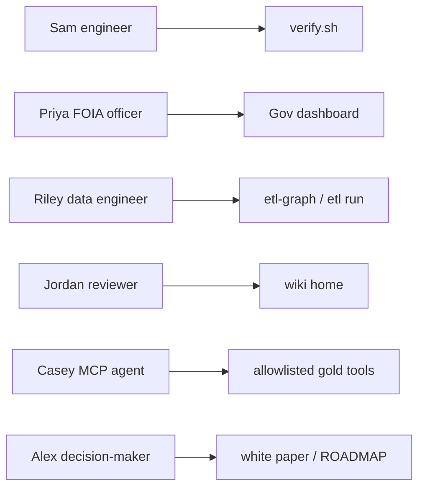

# Personas

**When to read:** You want to know *who* this repo is for before picking a doc. Visual tour: [TOUR.md](TOUR.md).

This page is the **canonical** audience model. Wiki “who this is for” tables elsewhere are short pointers back here. Named composites are not real people.

---

## What this product is for

Operator ETL is a **reference architecture** and **local proof** for audited intake (FOIA / public comments and similar CSVs): medallion warehouse, PII policy, LangGraph orchestration, critic-gated insights, MCP allowlist.

It is **not** a production FOIA product today. The Streamlit Gov tab is a run inspector (PARTIAL HITL), not an officer approval product. Production officer UX is **SPECIFIED** in [PRODUCT-UX.md](PRODUCT-UX.md).

---

## Terms (do not conflate)

| Term | Means here |
|---|---|
| **Adopter** | Someone proving the demo locally (`./scripts/verify.sh`) — usually Sam or Riley. Not “agency buyer.” |
| **Officer** | Priya-class reviewer: quarantine, PII flags, critic-checked insight. Today = inspector; later = PRODUCT-UX. |
| **Buyer / decision-maker** | Alex: budget, ATO, roadmap honesty — white paper audience, not a day-to-day repo user. |
| **Data subject** | Citizen commenters in the sample — not product users. |

---

## At a glance

| Persona | Role | Job to be done | Start here |
|---|---|---|---|
| **Sam** | New engineer | Clone, prove the demo, then look around | [QUICKSTART](QUICKSTART.md) → [TOUR](TOUR.md) |
| **Priya** | FOIA / program officer | See intake volume, quarantine, PII flags, a critic-checked insight | [FOIA guide](FOIA-Public-Comments-Guide.md) → [DASHBOARD](DASHBOARD.md) |
| **Riley** | Data engineer | Run pipelines, add a CSV, optional local Ollama wording | [CLI](CLI.md) → [ADD-A-SOURCE](ADD-A-SOURCE.md) → [LLM](LLM.md) |
| **Jordan** | Architect / reviewer | Honest scope, proof gate, scale path | [WHY](WHY.md) → [FINAL-REVIEW](FINAL-REVIEW.md) |
| **Casey** *(secondary)* | AI agent / MCP client | Query allowlisted gold KPIs; never vault or raw SQL | [AGENTS.md](https://github.com/khaosans/operator-etl/blob/master/AGENTS.md) → [operator-verify](https://github.com/khaosans/operator-etl/blob/master/skills/operator-verify/SKILL.md) |
| **Alex** *(secondary)* | Decision-maker / FOIA director / CDO | Trust claims, budget/ATO framing, what is proven vs specified | [WHY](WHY.md) → [white paper](Operator-ETL-White-Paper.md) → [ROADMAP](ROADMAP.md) |

---

## Primary personas (builders and operators of the demo)

### Sam — new engineer

**Context:** Joining the repo or evaluating it in a clone-and-run session. No agency FOIA duty yet.

**Job to be done:** Prove the invariant on a laptop without API keys or cloud spend.

| | |
|---|---|
| **Today** | `./scripts/verify.sh` → `OPERATOR_ETL_VERIFY=PASS`, 76 pytest, FOIA demo `silver=10` / `quarantined=2`. Template insights; no Ollama required. |
| **Later** | Optional local Ollama wording ([LLM.md](LLM.md)); not required for CI. |
| **Start here** | [QUICKSTART](QUICKSTART.md) → [TOUR](TOUR.md) → [CONCEPTS](CONCEPTS.md) |
| **Do not expect** | An API key, live GCP, or Presidio. Template insights are the CI path. |

### Priya — FOIA / program officer

**Context:** Program or FOIA staff who must see what arrived, what was rejected, and what a critic-checked summary claims — before any public release.

**Job to be done:** Inspect intake volume, quarantine reasons, PII flags, and a grounded insight.

| | |
|---|---|
| **Today** | Streamlit **Gov** tab after a local FOIA run: KPI cards, quarantine expander, latest insight. HITL is **PARTIAL** (`needs_human` is not success; no approve/reject queue). |
| **Later** | Production officer UI — responsive queue, streaming progress, approve/reject + audit (**SPECIFIED**, [PRODUCT-UX.md](PRODUCT-UX.md)). ROADMAP L4 Track B. |
| **Start here** | [FOIA guide](FOIA-Public-Comments-Guide.md) → [DASHBOARD](DASHBOARD.md) → [TOUR](TOUR.md) |
| **Do not expect** | A production approval UI or auto-publish. Agents never publish FOIA releases. |

### Riley — data engineer

**Context:** Owns pipelines, schemas, and new feeds (FOIA CSV today; 311 / grants / orders via [APPLY](APPLY.md)).

**Job to be done:** Run graphs, add sources, optionally improve insight *wording* without inventing numbers.

| | |
|---|---|
| **Today** | CLI / graph runs, [ADD-A-SOURCE](ADD-A-SOURCE.md), optional Ollama; critic still rejects uncited digits. |
| **Later** | File inbox (L1), container staging (L2), BigQuery (L3), Presidio / Reg.gov adapter (L4) — see [ROADMAP](ROADMAP.md). |
| **Start here** | [CLI](CLI.md) → [ADD-A-SOURCE](ADD-A-SOURCE.md) → [LLM](LLM.md) · extend: [APPLY](APPLY.md) |
| **Do not expect** | That optional LLM bypasses the critic, or that regex PII equals Presidio. |

### Jordan — architect / reviewer

**Context:** Design review, hiring loop, or scope honesty before claiming production readiness. Includes skeptical “show me proof” readers.

**Job to be done:** Separate proven / partial / specified; know the scale ladder and residual risk.

| | |
|---|---|
| **Today** | Wiki + [FINAL-REVIEW](FINAL-REVIEW.md) + [RISKS](RISKS.md) + [NIST](NIST.md) + proof matrix in [FOUNDATIONS](FOUNDATIONS.md). Local e2e is the gate. |
| **Later** | Staging / ATO evidence as L2–L4 exit criteria land — still not FedRAMP from this demo alone. |
| **Start here** | [WHY](WHY.md) → [CONCEPTS](CONCEPTS.md) → [FINAL-REVIEW](FINAL-REVIEW.md) |
| **Do not expect** | Live GCP or Presidio from a green local verify. Do not overclaim. |

---

## Secondary audiences

Not day-to-day operators of this git repo, but they show up in docs and share packs.

### Casey — AI agent / MCP client

**Job:** Call allowlisted tools (`get_gold_metrics`, etc.). No vault access, no raw SQL, no PII in prompts beyond gold KPI JSON policy.

**Start here:** [AGENTS.md](https://github.com/khaosans/operator-etl/blob/master/AGENTS.md) → [operator-verify](https://github.com/khaosans/operator-etl/blob/master/skills/operator-verify/SKILL.md) · runtime: [HOW-IT-WORKS](HOW-IT-WORKS.md) MCP section.

**Do not expect:** Unconstrained warehouse chat or publish rights.

### Alex — decision-maker / FOIA director / CDO

**Job:** Decide whether the pattern is worth budget, staging, or ATO conversation. Needs honest proven-vs-specified language.

**Start here:** [WHY](WHY.md) → [Operator-ETL-White-Paper](Operator-ETL-White-Paper.md) → [ROADMAP](ROADMAP.md) → [share pack](share/README.md).

**Security / ATO reviewer (same reading path):** [NIST](NIST.md) · [RISKS](RISKS.md) · [SECURITY-HARDENING](SECURITY-HARDENING.md) — alignment language, not certification.

---

## Not product users

| Who | Why |
|---|---|
| **Citizen commenters** | Data subjects in synthetic samples; not interactive users of this software. |
| **Leadership reading a released memo** | Downstream of officer review. Agents never auto-publish ([decision](https://github.com/khaosans/operator-etl/blob/master/okf/decisions/agents-never-publish-prod.md)). |

---

## What each persona should *not* expect (summary)

- **Priya** does **not** get a production officer-approval UI today. The Gov tab is a run inspector (PARTIAL HITL).
- **Sam** does **not** need an API key or Ollama. Template insights are the CI path.
- **Riley’s** local Ollama path is optional. The critic still rejects invented numbers.
- **Jordan** should not claim live GCP or Presidio from this demo.
- **Casey** never sees the PII vault or arbitrary SQL.
- **Alex** should not treat the local MVP as FedRAMP or agency-ready HITL.

---

## See also

- [TOUR.md](TOUR.md) — screenshots of the running app (Sam / Priya / Riley / Jordan)
- [index.md](index.md) — wiki home
- [PRODUCT-UX.md](PRODUCT-UX.md) — Priya’s later officer product (SPECIFIED)
- [ROADMAP.md](ROADMAP.md) — stages tagged by primary persona
- [Operator-ETL-White-Paper.md](Operator-ETL-White-Paper.md) — Alex / buyer audience
