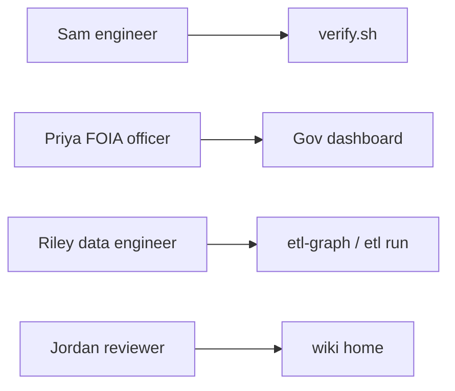

# Personas

**When to read:** You want to know *who* this repo is for before picking a doc. Visual tour: [TOUR.md](TOUR.md).

These four composites match the wiki “who this is for” table. They are not real people.

| Persona | Role | Job to be done | Start here |
|---|---|---|---|
| **Sam** | New engineer | Clone, prove the demo, then look around | [QUICKSTART](QUICKSTART.md) → [TOUR](TOUR.md) |
| **Priya** | FOIA / program officer | See intake volume, quarantine, PII flags, a critic-checked insight | [FOIA guide](FOIA-Public-Comments-Guide.md) → [DASHBOARD](DASHBOARD.md) |
| **Riley** | Data engineer | Run pipelines, add a CSV, optional local Ollama wording | [CLI](CLI.md) → [ADD-A-SOURCE](ADD-A-SOURCE.md) → [LLM](LLM.md) |
| **Jordan** | Architect / reviewer | Honest scope, proof gate, scale path | [WHY](WHY.md) → [FINAL-REVIEW](FINAL-REVIEW.md) |

## What each persona should *not* expect

- Priya does **not** get a production officer-approval UI. The Gov tab is a run inspector (PARTIAL HITL).
- Sam does **not** need an API key or Ollama. Template insights are the CI path.
- Riley’s local Ollama path is optional. The critic still rejects invented numbers.
- Jordan should not claim live GCP or Presidio from this demo.

## See also

- [TOUR.md](TOUR.md) — screenshots of the running app
- [index.md](index.md) — wiki home
