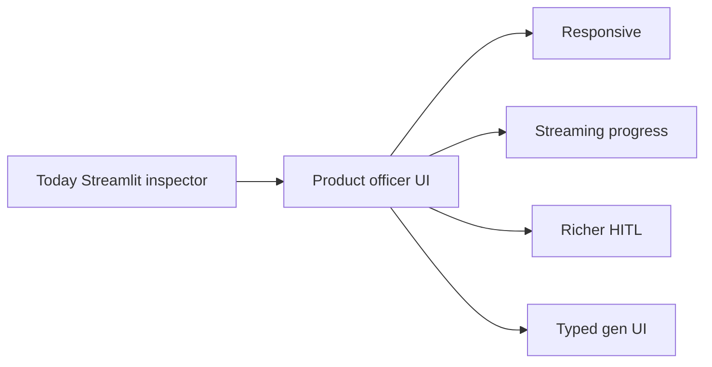

# Product UX — when we go to product

**When to read:** You are planning a **production officer UI**. This demo’s Streamlit app is a laptop run inspector, not that product.

**Status:** **SPECIFIED.** Do not treat the current dashboard as the production UX. Demo: [DASHBOARD.md](DASHBOARD.md) · Screenshots: [TOUR.md](TOUR.md).

---

## What ships today

The Gov / Orders tabs in `dashboard/app.py` are a **Streamlit run inspector**: KPI cards, quarantine expander, latest insight, pipeline runs. Layout is desktop-width. Reloads are full-page. HITL is **PARTIAL** (status `needs_human`; no officer approval queue).

That is enough to **prove** the medallion + critic path locally. It is not a FOIA officer product.

---

## Product backlog (do this when you go to product)

Do **not** implement these in the MVP demo. Keep Python/SQL as the source of truth; agents stay inside typed bounds; the critic still gates persist.

| Theme | What “good” looks like |
|---|---|
| **Responsive** | Officer review on phone/tablet: quarantine queue and insight first; dense tables collapse or paginate. |
| **Streaming** | Graph progress (ingest → PII → gold → insight → critic) as events. Optional token stream for LLM wording — **persist only after critic pass**. |
| **More information** | Run timeline, quarantine *reasons* first-class, HITL approve/reject, gold KPIs beside the insight, PII counts without raw PII. |
| **Generative UI** | Typed components (cards, tables, alerts) from gold metrics — **not** free-form HTML/JS from the model. No PII in generated chrome. |
| **UX practice** | Accessible labels/contrast, empty vs blocked vs error states, progressive disclosure, no silent KPI hide without a reason. |

---

## What must not change

- Critic still rejects uncited numbers.
- Bronze / comment bodies / vault PII never go to a model or into generated UI.
- Agents never auto-publish FOIA releases.

Scale path (infra): [SCALING.md](SCALING.md). Status matrix: [implementation-status](https://github.com/khaosans/operator-etl/blob/master/okf/models/implementation-status.md).

## See also

- [DASHBOARD.md](DASHBOARD.md) — current Streamlit
- [FINAL-REVIEW.md](FINAL-REVIEW.md) — honest audit
- [PERSONAS.md](PERSONAS.md) — Priya is the officer this UI would serve
