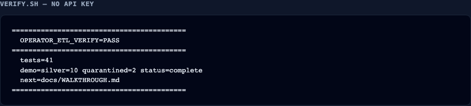

# Quickstart — verify in one command

Clone the repo, run one script, confirm `OPERATOR_ETL_VERIFY=PASS`. No API keys. No GCP.

**Repository:** https://github.com/khaosans/operator-etl

---

## One command

```bash
git clone https://github.com/khaosans/operator-etl.git
cd operator-etl
./scripts/verify.sh
```

Or: `make verify`

The script checks Python 3.12+, installs [uv](https://docs.astral.sh/uv/) if missing, syncs dependencies, and runs the full proof gate (same as CI).

---

## Expected success output

You should see pytest pass, then the FOIA demo:

```
status=complete  run_id=...
rows_in=12  silver=10  quarantined=2
pii_findings=3

Public comment intake summary: 10 comments across 2 dockets and 2 agencies. ...
```

Final banner:

```
==========================================
  OPERATOR_ETL_VERIFY=PASS
==========================================
  tests=41
  demo=silver=10 quarantined=2 status=complete
  next=docs/WALKTHROUGH.md
==========================================
```



Screenshots of Streamlit and CLI: [TOUR.md](TOUR.md).

**Machine-readable (agents):**

```bash
./scripts/verify.sh --json
# {"verify":"PASS","tests":34,"demo":{"status":"complete","silver":10,"quarantined":2},"next":"docs/WALKTHROUGH.md"}
```

---

## Success checklist

After `./scripts/verify.sh`, confirm:

- [ ] Exit code `0`
- [ ] Output contains `OPERATOR_ETL_VERIFY=PASS`
- [ ] `34 passed` (or current test count in banner)
- [ ] Demo shows `status=complete`, `silver=10`, `quarantined=2`
- [ ] Insight text mentions comments (no raw email/phone in output)

---

## If it fails

| Symptom | Fix |
|---|---|
| `Python 3.12+ required` | Install Python 3.12+ (`python3 --version`) |
| `uv not on PATH` (with `--skip-uv-install`) | Rerun without flag, or install uv manually |
| curl / uv install blocked | Install uv from [docs.astral.sh/uv](https://docs.astral.sh/uv/); then `uv sync --extra dev && make e2e` |
| pytest failures | Read failing test name; see [TESTING.md](TESTING.md) |
| demo missing `status=complete` | Run in clean shell; avoid stale `OPERATOR_ETL_*` exports — see [GETTING-STARTED.md](GETTING-STARTED.md#troubleshooting) |
| `duckdb` errors in walkthrough | Use `./scripts/walkthrough.sh` (Python duckdb, no CLI needed) |

---

## Next steps

| Goal | Doc |
|---|---|
| Inspect warehouse SQL + dashboard | [WALKTHROUGH.md](WALKTHROUGH.md) · `./scripts/walkthrough.sh` |
| Learn the project | [CONCEPTS.md](CONCEPTS.md) |
| Other data sources | [APPLY.md](APPLY.md) |
| Residual risks | [RISKS.md](RISKS.md) |
| Understand the design | [WHY.md](WHY.md) · [NIST.md](NIST.md) |
| Optional local/cloud model | [MODELS.md](MODELS.md) · [LLM.md](LLM.md) |
| MCP, env vars, Streamlit | [GETTING-STARTED.md](GETTING-STARTED.md) |
| What each test proves | [TESTING.md](TESTING.md) |

---

## Agent prompt (copy-paste)

```text
You are in the operator-etl repository. Your only setup task:

1. Run: ./scripts/verify.sh
2. If exit code 0 and output contains OPERATOR_ETL_VERIFY=PASS, report:
   - test count
   - demo metrics (silver, quarantined, status)
3. If fail, report the first error block and suggest fixes from docs/QUICKSTART.md
4. Do not load OKF or other skills until verify passes.

Optional JSON: ./scripts/verify.sh --json
```

See also [AGENTS.md](../AGENTS.md) and [skills/operator-verify/SKILL.md](../skills/operator-verify/SKILL.md).

---

## See also

- [README.md](../README.md) — overview and architecture
- [CONTRIBUTING.md](../CONTRIBUTING.md) — PR workflow after verify
