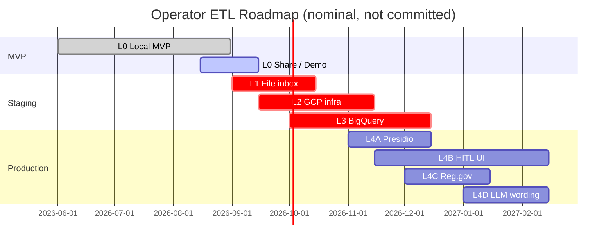

# Operator ETL — Strategic Roadmap

**Last updated:** 2026-09-03 · **Status:** MVP proven locally · **Gate:** `make e2e` (76 pytest)

---

## Executive summary

Operator ETL **proves** that a deterministic FOIA intake pipeline can ingest CSV, detect PII, validate rows, build gold KPIs, orchestrate via LangGraph, and produce critic-verified insights — all locally on a laptop with zero LLM API keys and zero GCP spend.

This roadmap reflects honest assessment of what works today (IMPLEMENTED), what is partial (ready for staging), and what is specified but not yet coded (production hardening). It prioritizes **trustworthiness over feature velocity** and **local proof before cloud deploy**.

**Why this doc exists:** Decision-makers (**Alex**), engineers (**Sam** / **Riley** / **Jordan**), and officers (**Priya**) need a single source of truth for what they can rely on today, what they should plan for, and when to revisit assumptions. Audience model: [PERSONAS.md](PERSONAS.md).

---

## Current state (L0 — Local MVP)

### ✅ What works and is proven in CI

| Capability | Component | How to verify | Status |
|---|---|---|---|
| **End-to-end FOIA pipeline** | CSV → bronze/silver/gold | `make e2e` + [WALKTHROUGH.md](WALKTHROUGH.md) | **PROVEN** |
| **Medallion warehouse layers** | Bronze (raw) → silver (validated) → gold (marts) + quarantine | `tests/test_pipeline.py` | **PROVEN** |
| **Idempotent ingestion** | Same file hash twice = 0 new rows | `test_pipeline.py::test_gov_ingest_is_idempotent` | **PROVEN** |
| **Quality gates fail-closed** | Bad rows quarantined with reasons; insights block until fixed | `tests/test_quality.py` | **PROVEN** |
| **PII scan + redaction** | Regex scanner finds and masks email/phone | `tests/test_pii.py` | **PROVEN** |
| **PII vault encryption** | Found PII stored encrypted; never exposed via MCP | `SECURITY.md` + tests | **PROVEN** |
| **LangGraph orchestration** | Multi-node pipeline (ingest → PII → qualify → insight → critic) | `src/operator_etl_graph/` | **PROVEN** |
| **Critic faithfulness** | Rejects hallucinated numbers; all insight KPIs grounded in gold | `tests/test_critic.py` | **PROVEN** |
| **Critic exhausted → HITL** | When rules can't decide, route to human; `needs_human=true` | `test_critic.py` | **PROVEN** |
| **MCP allowlist + deny** | 3 tools; no raw SQL; no vault access | `tests/test_mcp_tools.py` | **PROVEN** |
| **Gold KPI read via MCP** | Agent can fetch `get_gold_metrics` for insights | `test_mcp_tools.py` | **PROVEN** |
| **Streamlit dashboard** | Gov / Orders tabs; Streamlit run inspector | `uv run etl dashboard` | **PROVEN** |
| **Public GitHub + OSS** | Apache-2.0 license; GH Pages wiki; CI badge | https://github.com/khaosans/operator-etl | **PROVEN** |

### ⚠️ Partial (ready for staging/manual testing)

| Capability | What's done | What's pending | Priority |
|---|---|---|---|
| **BigQuery adapter** | SQL rewrite, bronze load, connection pool | Gold mart dialect lift; end-to-end staging test | **STAGING** |
| **Cloud Run HTTP entry** | Terraform scaffold, env config, auth guards | Live `/run` and `/mcp` endpoints in staging | **STAGING** |
| **GCP Terraform scaffold** | Service accounts, IAM, GCS bucket, Pub/Sub, Cloud SQL | `terraform apply` integration test; monitoring | **STAGING** |
| **LLM insight generation** | Optional backend switcher; mocked in CI; local Ollama compatible | Live OpenAI/compatible API; streaming token support | **OPTIONAL** |
| **HITL officer dashboard** | Gov tab quarantine expander + latest insight | Approval workflow (accept/reject); audit trail | **PRODUCTION** |
| **Regulations.gov adapter** | Source registry pattern ready | HTTP intake + comment transform | **PRODUCTION** |

### 📋 Specified but not coded (production hardening)

| Capability | Use case | Why not now | When to tackle |
|---|---|---|---|
| **Presidio PII** | Real entity names, addresses, international formats | Regex MVP sufficient for demo; adds `presidio` dep | **L4: Production** |
| **Product officer UX** | Responsive, streaming, gen UI for FOIA workflow | Streamlit satisfies proof; mobile/real officer needs different design | **L4: Production** |
| **Regulations.gov API** | Pull live dockets for commenting | No public test data; staging only | **L4: Production** |
| **Streaming graph progress** | Officer sees ingest → PII → gold → insight in real-time | HTTP transport required first; IMPLEMENTED → HTTP events | **L4: Production** |
| **Approval workflow + audit** | HITL officer approves/rejects before publish | Critic routing works; HITL store needs design | **L4: Production** |

---

## Strategic priorities (quality-first ladder)

Operator ETL climbs one ladder, not many at once. Each stage proves the prior stage and adds one constraint.

### Stage L0 — Local MVP (current)
**Goal:** Prove the invariant: *deterministic ETL enforces data quality; agents orchestrate; critic gates publish.*

**Primary persona:** **Sam** (prove) · **Jordan** (scope honesty)

**Exit criteria:**
- ✅ `make e2e` passes locally (76 pytest + FOIA demo)
- ✅ All PII found, redacted, never in insight
- ✅ Quality gate rejects bad rows
- ✅ Critic rejects hallucinated numbers
- ✅ Proof matrix [docs/FOUNDATIONS.md](FOUNDATIONS.md) complete

**What happens next:** Code samples, PDF share pack, talk submissions.

---

### Stage L1 — File inbox (2–4 weeks)
**Goal:** Ingest from persistent storage (GCS or local drops) without changing graph logic.

**Primary persona:** **Riley**

**What changes:**
- New source type: `comment_inbox` (drops/inbox/) or `gcs_inbox` / `object_store` (bucket)
- File watcher or cloud event → HTTP trigger
- Checkpoint resumption across runs
- Portable object-store Protocol (GCS reference; S3/Azure adapters additive)

**What stays the same:**
- Graph nodes, PII policy, critic, quality gate
- Data types and schema contracts
- MCP allowlist

**Exit criteria:**
- [ ] Agency can drop CSV in S3/GCS inbox; graph runs automatically
- [ ] Graph resumes from checkpoint on retry
- [ ] Same audit trail + PII vault per run

**Owner:** Data engineer. **Playbook:** [okf/playbooks/extend-new-source.md](../okf/playbooks/extend-new-source.md) · [deploy-container-any-cloud](../okf/playbooks/deploy-container-any-cloud.md)

---

### Stage L2 — Container staging + GCP reference IaC (4–8 weeks)
**Goal:** Run the portable Docker image in staging. GCP Terraform is the full reference path; other clouds use the same env contract.

**Primary persona:** **Riley** · **Jordan** (staging honesty for **Alex**)

**What changes:**
- Object-store inbox (GCS on GCP; S3/Blob via future adapters) + event → HTTP
- Container graph-runner (Cloud Run / ECS / ACA / K8s)
- Managed Postgres checkpoints (replaces SQLite)
- Cloud secret store (replaces `.env` file)
- Scheduler / cron nightly trigger

**What stays the same:**
- DuckDB warehouse until L3 (or ephemeral DuckDB in container)
- LangGraph topology
- PII vault policy
- Critic logic
- Warehouse / object-store protocols in core

**Exit criteria:**
- [ ] Container deploys with portable env contract
- [ ] Agency uploads CSV to inbox; graph completes
- [ ] Postgres checkpoints resume on retry
- [ ] MCP server read-only access to gold verified
- [ ] (GCP) `terraform apply` provisions reference resources

**Owner:** Cloud architect + DevOps. **Docs:** [infra/README.md](../infra/README.md) · [SCALING.md](SCALING.md) · [deploy-container-any-cloud](../okf/playbooks/deploy-container-any-cloud.md)

**Pre-flight checklist:**
- [ ] Terraform plan reviewed for IAM + networking (GCP path)
- [ ] `.env` secrets moved to cloud secret store
- [ ] Inbox service account has list/read only
- [ ] Runtime service account has warehouse write only as needed (L3)

---

### Stage L3 — BigQuery backend (6–12 weeks)
**Goal:** Production-grade warehouse + cost controls.

**Primary persona:** **Riley**

**What changes:**
- 🗄️ `OPERATOR_ETL_BACKEND=bigquery` activates BQ adapter
- 🗄️ Datasets: `etl_bronze`, `etl_silver`, `etl_gold`, `etl_quarantine`
- 🗄️ Gold mart SQL dialect lifted from DuckDB
- 🗄️ Streaming inserts (bronze) + batch (gold)
- 🗄️ Table schemas + partitioning by run_id + date

**What stays the same:**
- Medallion semantics (bronze raw, silver validated, gold marts)
- Row-level PII policy
- Critic faithfulness checks
- MCP allowlist

**Exit criteria:**
- [ ] All DuckDB SQL ported to BigQuery dialect
- [ ] Bronze/silver/gold load end-to-end in staging
- [ ] Query costs < $10/month for demo volume
- [ ] Gold marts queryable by MCP + officer UX

**Known gaps:**
- Gold mart SQL dialect port in progress; partner SQL engineer
- Streaming gold inserts need tune (batch sufficient for MVP)
- BigQuery cost monitoring + alerting (Cloud Monitoring)

**Owner:** Data engineer + data warehouse architect. **Docs:** [SCALING.md](SCALING.md) · [okf/playbooks/deploy-gcp-staging.md](../okf/playbooks/deploy-gcp-staging.md)

**Risk:** BigQuery SQL dialect differences (e.g., SAFE, ARRAY, FORMAT). Mitigate with early port of `sql/marts/gov/*.sql`.

---

### Stage L4 — Production hardening (ongoing)
**Goal:** Agency-ready HITL workflow, real PII detection, compliance audit trail.

**Primary persona:** **Priya** (HITL / PRODUCT-UX) · **Riley** (Presidio, Reg.gov) · **Alex** (ATO / budget readiness)

**Four tracks (parallel after L3):**

#### Track A: PII at scale (Presidio)
- **Goal:** Catch names, addresses, international formats
- **Primary persona:** **Riley** (+ **Alex** for compliance bar)
- **Effort:** Add `presidio` extra dependency; replace regex confidence thresholds
- **Exit:** Real FOIA data scanned; zero false negatives in agency review
- **Owner:** Policy + DevOps

#### Track B: HITL officer workflow
- **Goal:** Officer UI for quarantine + approval before publish
- **Primary persona:** **Priya**
- **What's needed:**
  - Quarantine queue with **reasons** (not just counts)
  - HITL "approve/reject/edit" for ambiguous PII + insights
  - Audit log (who approved, when, changes)
  - Email / Slack notification on HITL escalation
- **Effort:** 4–8 weeks (product design, React/TypeScript FE, backend audit tables)
- **Exit:** Officer can review + approve a run in under 5 minutes
- **Docs:** [PRODUCT-UX.md](PRODUCT-UX.md)
- **Owner:** Product + FE engineer

#### Track C: Regulations.gov adapter
- **Goal:** Pull dockets from Regulations.gov API; transform comments
- **Primary persona:** **Riley**
- **What's needed:**
  - HTTP intake service (inbound + RPC)
  - Comment deduplication
  - Docket-to-agency mapping
  - Schema alignment with core pipeline
- **Effort:** 2–4 weeks
- **Exit:** Can ingest live Regulations.gov dockets into gold
- **Owner:** Data engineer

#### Track D: Real LLM insights (optional)
- **Goal:** Optional `insight_backend=llm` for narrative text
- **Primary persona:** **Riley** · **Priya** (consumes wording in officer UI)
- **What's needed:**
  - Prompt engineering for agency tone
  - Token streaming to officer UI
  - Critic still gates publish (no auto-release)
  - Cost budgeting per run
- **Effort:** 2–4 weeks
- **Exit:** Officer can toggle between template and GPT4 insights
- **Docs:** [LLM.md](LLM.md)
- **Owner:** ML engineer + product

---

## Execution timeline

**Key assumptions:**
- Single data engineer + cloud architect (L0–L3)
- Product + FE join for L4B (Track B)
- Optional: ML engineer for L4D (Track D)
- All stages gate-keepered by `make e2e` (local) or staging e2e before promote

---

## Not doing (out of scope)

| Idea | Why not | When to revisit |
|---|---|---|
| **Ad-hoc agent SQL exploration** | Violates MCP allowlist policy; regex PII would leak | Only with Presidio + HITL gray-zone routing |
| **Streaming BigQuery loads** | Batch sufficient for daily FOIA volume | When intra-day latency needed (not in MVP) |
| **Mobile-first officer UX** | Desktop Streamlit proves concept; responsive UX comes L4 | When real officers use at scale |
| **Automated publish to Regulations.gov** | Violates `agents-never-publish-prod` policy | Only with manual HITL approval + audit log |
| **Multi-tenant SaaS** | DuckDB not multi-tenant; BigQuery needs dataset isolation | After L3; partner with cloud architect |
| **Real-time docket sync** | Regulations.gov no webhook; polling overhead | Post-production, if demand high |

---

## Success metrics (per stage)

### L0 (shipped)
- [x] Exit code 0 from `make e2e`
- [x] 76 pytest passing
- [x] FOIA demo: `silver=10, quarantined=2, status=complete`
- [x] CI green on every commit (GitHub Actions)
- [x] Zero PII in insight text
- [x] Critic rejects hallucinated numbers

### L1
- [ ] Agency can drop CSV, graph auto-runs without CLI
- [ ] Checkpoint resumption works (simulate failure + retry)
- [ ] Same audit trail per run

### L2
- [ ] `terraform apply` provisions GCS + Pub/Sub + Cloud Run + Cloud SQL
- [ ] Agency uploads CSV; graph completes in under 2 min
- [ ] Cloud SQL checkpoint query returns correct run state
- [ ] MCP server IAM verified (read gold only)

### L3
- [ ] DuckDB → BigQuery dialect port 100% (all `sql/mars/gov/*.sql` migrated)
- [ ] Bronze/silver/gold inserts pass validation
- [ ] Gold mart queries match expected KPIs (within 0.1%)
- [ ] Monthly cost < $20 (demo volume)

### L4A (Presidio)
- [ ] Real FOIA sample scanned; zero false negatives
- [ ] Presidio confidence thresholds tuned by agency
- [ ] Audit log captures gray-zone (0.70–0.95) escalations to HITL

### L4B (HITL)
- [ ] Officer dashboard: quarantine queue sorted by risk
- [ ] Approval workflow: accept/reject/edit in < 5 min per run
- [ ] Audit log queryable (who, what, when, result)

### L4C (Regulations.gov)
- [ ] Live dockets ingested daily
- [ ] Comment dedup working (0 duplicates across runs)
- [ ] Docket metadata queryable in gold

### L4D (LLM wording)
- [ ] Narrative text generated from gold counts
- [ ] Critic still gates publish (100% of insights vetted before persist)
- [ ] Cost per insight < $0.10

---

## Decision gates

### Before L1 (L0 → L1)
- [ ] Real agency partner confirms FOIA workflow matches [docs/FOIA-Public-Comments-Guide.md](FOIA-Public-Comments-Guide.md)
- [ ] DuckDB performance sufficient for annual volume (e.g., 1M comments/year)
- [ ] PII redaction accuracy acceptable to privacy counsel

### Before L2 (L1 → L2)
- [ ] GCP budget approved (estimate $50–100/month staging)
- [ ] Cloud architect has reviewed Terraform + IAM
- [ ] Team has GCP project + billing enabled

### Before L3 (L2 → L3)
- [ ] BigQuery SQL dialect port 80%+ complete
- [ ] Staging runs successfully for 4 weeks
- [ ] Cost model validated (< $20/month for demo)

### Before L4 (L3 → L4)
- [ ] Agency ready for HITL workflow (staffing + process)
- [ ] Presidio or Spacy PII choice finalized
- [ ] Product requirements for officer UX frozen

---

## Risks and mitigations

| Risk | Impact | Likelihood | Mitigation |
|---|---|---|---|
| **BigQuery SQL dialect mismatch** | L3 delayed | High | Port `sql/marts/gov/` early; test in staging DuckDB first |
| **Regulations.gov API changes** | L4C breaks | Medium | Fallback: CSV upload + source polling |
| **Officer UX requirements shift** | L4B cost overrun | High | Product spec locked before FE sprint; user interviews pre-design |
| **PII detector false negatives** | Compliance risk | Medium | Presidio tuning with agency counsel; manual audit of first 100 |
| **Cloud costs exceed budget** | Project pause | Medium | Set BigQuery reservation quota; alert on 80% spend |
| **MCP allowlist misses real use case** | Agent pressure to add SQL | Medium | Gather L2 agent feedback; expand carefully with policy review |

---

## Backlog (ideas for later)

- [ ] GraphQL API for officer UX (vs REST)
- [ ] Duckdb → Clickhouse comparison (cost / latency)
- [ ] MCP tools for custom PII policies per agency
- [ ] Comment sentiment analysis (gold table)
- [ ] Bulk export (CSV + redacted PDF)
- [ ] Historical docket comparison (year-over-year)
- [ ] Integration with Regulations.gov's official FOIA API (if published)

---

## Related docs

**Read first:**
- [README.md](../README.md) — problem, design, quick start
- [QUICKSTART.md](QUICKSTART.md) — one-command `make e2e`
- [FINAL-REVIEW.md](FINAL-REVIEW.md) — honest audit of what works

**Planning:**
- [okf/models/implementation-status.md](../okf/models/implementation-status.md) — IMPLEMENTED vs SPECIFIED matrix
- [SCALING.md](SCALING.md) — ladder diagram + stage details
- [PRODUCT-UX.md](PRODUCT-UX.md) — officer UX backlog

**Execution:**
- [CONTRIBUTING.md](../CONTRIBUTING.md) — PR gate + hygiene
- [okf/playbooks/extend-new-source.md](../okf/playbooks/extend-new-source.md) — new source pattern
- [okf/playbooks/deploy-gcp-staging.md](../okf/playbooks/deploy-gcp-staging.md) — Terraform + deploy
- [infra/README.md](../infra/README.md) — GCP scaffolding

**Tests + proof:**
- [TESTING.md](TESTING.md) — what each test proves
- [FOUNDATIONS.md](FOUNDATIONS.md) — citations + proof matrix
- [evals/README.md](../evals/README.md) — evaluation criteria

---

## How to use this doc

Audience model: [PERSONAS.md](PERSONAS.md).

**For Priya (FOIA / program officer) and agency adopters:**
- Read the **Strategic priorities** section
- Confirm your needs are on L0 or L1
- See [FOIA-Public-Comments-Guide.md](FOIA-Public-Comments-Guide.md) for workflow fit

**For Riley / Sam / Jordan (engineers, architects):**
- Find your stage (L0–L4)
- Review **Exit criteria** + **Owner** + **Primary persona**
- Check **Known gaps** and **Risks**
- Link to playbook for your track

**For Alex (decision-makers — budget, timeline):**
- Review **Execution timeline** + staffing needs
- Check **Decision gates** before stage promote
- Scan **Risks and mitigations**

**For maintainers:**
- Update this doc when a stage completes
- Add decision-gate evidence as PRs merge
- Sync [okf/models/implementation-status.md](../okf/models/implementation-status.md) when status changes
- Keep **Primary persona** lines aligned with [PERSONAS.md](PERSONAS.md)

---

## See also

- [AGENTS.md](../AGENTS.md) — agent use of this roadmap
- [okf/log.md](../okf/log.md) — decision log
- [CHANGELOG.md](../CHANGELOG.md) — release history

**Questions?** Open an issue or see [CONTRIBUTING.md](../CONTRIBUTING.md).
