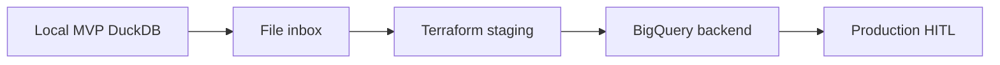
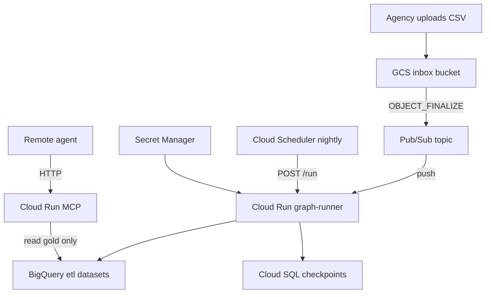

# Scaling Operator ETL

From local MVP on a laptop to GCP staging and production. **Prove local first:** `make e2e`.

**When to read:** You are ready to lift beyond DuckDB on a laptop.

**Pre-scale:** [FINAL-REVIEW.md](FINAL-REVIEW.md) pre-scale checklist · **Start here:** [README.md](../README.md)

---

## Scale ladder



---

## Stage 0 — Local MVP (you are here)

| Item | Value |
|---|---|
| **Command** | `make e2e` |
| **Warehouse** | DuckDB file |
| **Trigger** | CLI (`etl-graph`) |
| **Proof** | [WALKTHROUGH.md](WALKTHROUGH.md) |

Nothing to deploy. Validates graph, PII, critic, gold SQL, and MCP locally.

---

## Stage 1 — File inbox

Add drop-folder or bucket intake without changing the graph.

| Change | How |
|---|---|
| Local inbox | Drop CSV in `drops/inbox/` — source `comment_inbox` |
| GCS inbox | Set `OPERATOR_ETL_GCS_INBOX_BUCKET`, source `gcs_inbox` |

Playbook: [okf/playbooks/extend-new-source.md](../okf/playbooks/extend-new-source.md)

**Stays the same:** graph nodes, PII policy, critic, quality gate.

---

## Stage 2 — GCP infrastructure

Provision cloud resources with Terraform.

```bash
cd infra/terraform
cp terraform.tfvars.example terraform.tfvars
terraform init && terraform apply
```



Details: [infra/README.md](../infra/README.md)

**Prerequisite:** `make e2e` green locally.

Deploy container:

```bash
gcloud builds submit --config cloudbuild.yaml
```

---

## Stage 3 — BigQuery backend lift

Switch warehouse from DuckDB to BigQuery — same medallion layers, dialect-adjusted marts.

| Env var | Purpose |
|---|---|
| `OPERATOR_ETL_BACKEND=bigquery` | Use BQ adapter |
| `OPERATOR_ETL_GCP_PROJECT` | Project ID |
| `OPERATOR_ETL_BQ_DATASET_*` | Bronze/silver/quarantine/gold datasets |
| `OPERATOR_ETL_CHECKPOINT_BACKEND=postgres` | Cloud SQL checkpoints |
| `OPERATOR_ETL_CHECKPOINT_DATABASE_URL` | Postgres connection string |

Full example: [infra/env.example](../infra/env.example)

**Status:** BQ adapter + gov gold mart dialect are **IMPLEMENTED** in-repo (`sql/marts/gov/bq/`). Live staging E2E remains optional (`pytest -m integration` / staging workflow). See [okf/models/implementation-status.md](../okf/models/implementation-status.md).

**Stays the same:** LangGraph topology, PII fail-closed, MCP allowlist, critic logic.

---

## Stage 4 — Production hardening

| Item | Status | Notes |
|---|---|---|
| Product officer UX | SPECIFIED | Responsive, streaming, gen UI — [PRODUCT-UX.md](PRODUCT-UX.md) |
| HITL officer dashboard | IMPLEMENTED | Approve/reject audit store + Streamlit + CLI; product UX still SPECIFIED |
| Regulations.gov adapter | IMPLEMENTED | `regulations_gov` source with API + sample fallback |
| BQ gold mart dialect | IMPLEMENTED | `sql/marts/gov/bq/` COUNTIF/SAFE_DIVIDE dialect |
| Presidio PII | IMPLEMENTED | `OPERATOR_ETL_PII_SCANNER=presidio` (optional extra) |
| Real LLM insight nodes | PARTIAL | Optional `insight_backend=llm`; template default; not live in CI |

Track progress: [okf/models/implementation-status.md](../okf/models/implementation-status.md)

---

## What changes vs what stays the same

| Stays the same | Changes when scaling |
|---|---|
| Graph node sequence | Warehouse: DuckDB → BigQuery |
| PII scan + vault policy | Trigger: CLI → GCS/Pub/Sub |
| Critic faithfulness check | Checkpoints: SQLite → Postgres |
| MCP allowlist | MCP transport: stdio → HTTP |
| Quality gate thresholds | Secrets: local file → Secret Manager |
| Sample → production data | Inbox path, IAM, monitoring |

---

## Checklist before staging promote

- [ ] `make e2e` green locally
- [ ] CI green on `master`
- [ ] Terraform `plan` reviewed
- [ ] Secret Manager placeholders replaced
- [ ] Test file uploaded to GCS inbox
- [ ] Graph-runner `/run` returns `status=complete`
- [ ] MCP reads gold only (IAM verified)

---

## Related docs

- [HOW-IT-WORKS.md](HOW-IT-WORKS.md) — usage model
- [WALKTHROUGH.md](WALKTHROUGH.md) — local proof
- [okf/playbooks/deploy-gcp-staging.md](../okf/playbooks/deploy-gcp-staging.md) — deploy playbook
- [docs/STANDARDS.md](STANDARDS.md) — proof gate required before deploy claims

## See also

- [FINAL-REVIEW.md](FINAL-REVIEW.md) — pre-scale checklist
- [infra/README.md](../infra/README.md) — Terraform and GCP layout
- [FOUNDATIONS.md](FOUNDATIONS.md) — proof matrix
