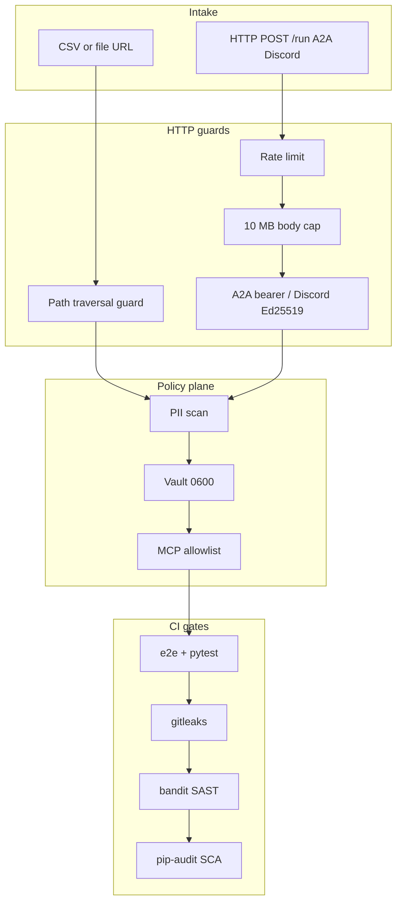
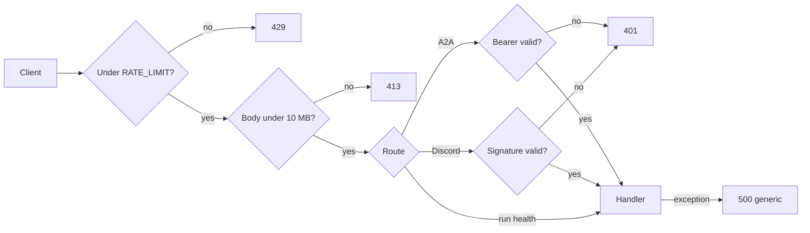
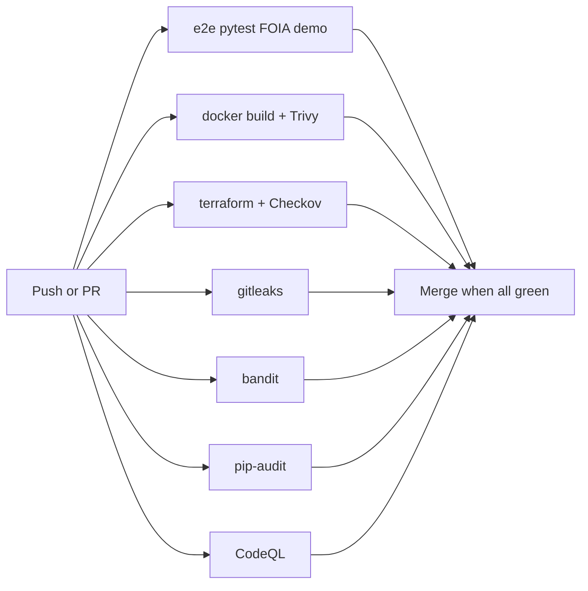

# Security hardening

Operator ETL treats security as **defense in depth**: input guards on HTTP, a fail-closed policy plane, vault file permissions, and CI that refuses to merge unverified code. This page is the human how-to for those controls. Vulnerability reporting and the production-readiness matrix live in root [SECURITY.md](../SECURITY.md). Agent checklist: [skills/operator-security](https://github.com/khaosans/operator-etl/blob/master/skills/operator-security/SKILL.md).

**When to read:** Before exposing the HTTP graph-runner, A2A, or MCP on a network; before a GCP deploy; or when reviewing a PR that touches extract, vault, secrets, or auth.

This is **not** an ATO, FedRAMP package, or System Security Plan. Honest residual risk: [RISKS.md](RISKS.md). Proof inventory: [FINAL-REVIEW.md](FINAL-REVIEW.md).

---

## Defense in depth

Eight controls, four layers. Each layer is independently useful; none replaces PII policy or the critic.



| Layer | Control | Default | Code |
|---|---|---|---|
| Input | Path traversal guard | Relative paths only; resolved under extract root | [`src/operator_etl/extract/http.py`](../src/operator_etl/extract/http.py) `_local_path()` |
| Input | Body size limit | 10 MB | [`src/operator_etl_gcp/http/app.py`](../src/operator_etl_gcp/http/app.py) |
| Input | Field constraints | `max_length` on source/pipeline/docket; `raw_records` capped at 10,000 | `app.py`, [`src/a2a/server.py`](../src/a2a/server.py) |
| Transport | Rate limiting | 60 requests / client / minute (`RATE_LIMIT_PER_MINUTE`) | `app.py` middleware |
| Transport | Discord Interactions | Ed25519 signature + timestamp skew; guild/channel allowlist | [`src/operator_etl_chat/discord/verify.py`](../src/operator_etl_chat/discord/verify.py) |
| Transport | Sanitized 500s | Exception type + message only; generic HTTP detail | `app.py` |
| Storage | Vault file perms | `0o600` on key and PII JSON; warn if existing key is looser | [`src/operator_etl_policy/vault.py`](../src/operator_etl_policy/vault.py) |
| Secrets | Terraform sensitive vars | Placeholders starting `REPLACE_ME` fail validation | [`infra/gcp/variables.tf`](../infra/gcp/variables.tf) |
| CI | SAST / SCA | bandit on `src/`; pip-audit on frozen deps | [`.github/workflows/security.yml`](../.github/workflows/security.yml) |

Existing policy-plane controls (PII scan, MCP allowlist, no auto-publish) are unchanged. See [PATTERNS.md](PATTERNS.md#defense-in-depth) and [NIST.md](NIST.md).

---

## HTTP middleware stack

The Cloud Run graph-runner ([RUNNING.md](RUNNING.md)) applies the same guards locally on `:8080`. `/health` is excluded from rate limiting so probes stay cheap.



### Rate limit

```bash
export RATE_LIMIT_PER_MINUTE=60   # default; per client IP, 60-second sliding window
uv run operator-etl-gcp
```

Exceeding the window returns HTTP **429** with body `Rate limit exceeded`. The limiter is **in-process** (one dict per process). That is enough for a single Cloud Run instance with `concurrency=1`. Multi-instance or public traffic needs Cloud Armor or an API gateway — [RISKS.md](RISKS.md).

### Body size

Requests whose `Content-Length` exceeds **10 MB** return HTTP **413**. Pair this with Pydantic `max_length` on `RunRequest` and `CreateTaskParams` so oversized fields never reach the graph.

### Sanitized errors

`logger.exception()` is not used on the request path. Failures log exception **type and message** only. HTTP 500 `detail` is a generic string — no traceback, warehouse path, or record body.

---

## Path traversal guard

File extract URLs must stay inside the configured root. `_local_path()` resolves the candidate and rejects anything that is not `is_relative_to(root)`:

- `file:../../etc/passwd` → `ValueError: Path traversal outside root directory is not allowed`
- `file:///etc/passwd` when a root is set → `ValueError: Absolute paths are not allowed when a root is specified`
- `file:data.json` under the extract root → allowed

Proven by `tests/test_http.py` (`test_local_path_rejects_traversal`, `test_local_path_rejects_absolute_with_root`, `test_local_path_allows_valid_relative`). When adding a source that reads local files, go through `_local_path()` — [ADD-A-SOURCE.md](ADD-A-SOURCE.md).

---

## Vault permissions

[`vault.py`](../src/operator_etl_policy/vault.py) creates the Fernet key with `os.open(..., 0o600)` and writes `warehouse/pii_vault.json` the same way. If an existing key is group- or world-readable, startup **restricts it and logs a warning**. Never chmod the vault to `0644` “so the dashboard can read it” — run the process as the owner instead.

---

## Terraform secrets

Do **not** put `REPLACE_ME` in `secrets.tf`. Set real values in `terraform.tfvars` (gitignored):

```hcl
pii_vault_key  = ""  # Fernet key; validation rejects REPLACE_ME*
openai_api_key = ""  # sk-...; keep insight_backend=template until this is real
```

Both variables are `sensitive = true`. Copy from [`infra/gcp/terraform.tfvars.example`](../infra/gcp/terraform.tfvars.example). After apply, Secret Manager holds the versions — [infra/README.md](../infra/README.md). Skill: [operator-ship-gcp](https://github.com/khaosans/operator-etl/blob/master/skills/operator-ship-gcp/SKILL.md).

---

## CI security pipeline

Every push and pull request against `master` / `main` runs the proof gate **and** dedicated security jobs.



| Gate | Tool | Config | What it catches |
|---|---|---|---|
| Proof | `./harness/e2e.sh` | [docs/TESTING.md](TESTING.md) | PII leak, critic, MCP, path traversal, FOIA demo |
| Docker | CI + Trivy | `.github/workflows/ci.yml` | Image builds; HIGH/CRITICAL CVEs (unfixed ignored) |
| Terraform | fmt/validate + Checkov | `.github/workflows/ci.yml` + `.checkov.yml` | IaC misconfig (Checkov soft-fail on staging stacks; promote to hard-fail for prod) |
| Secret scan | gitleaks | `.github/workflows/secret-scan.yml` | Keys, vault files, `.env` |
| SAST | bandit | `.bandit.yml` — `src/`, skip `B101`; other hits need a fix or `# nosec` | Common Python footguns |
| SCA | pip-audit | `.github/workflows/security.yml` | Known CVEs in frozen deps |
| CodeQL | codeql-action | `.github/workflows/codeql.yml` | Semantic vulnerability queries |
| Dependabot | weekly | `.github/dependabot.yml` | Stale pip, Actions, Docker, Terraform |

Bandit and pip-audit are **workflow jobs**, not pytest. A green `make e2e` does not replace them. Branch protection should require these contexts — [PUBLIC-READINESS.md](PUBLIC-READINESS.md).

Run locally:

```bash
make lint       # ruff
make security   # bandit + pip-audit
uv run pre-commit install
uv run pre-commit run --all-files
```

Exit 0 is required. New bandit findings must be **fixed** or annotated `# nosec Bxxx` with a one-line reason. Do not add global skips in `.bandit.yml` unless the rule is noise on every file (today only `B101`).

### Accepted `# nosec` annotations

| ID | Where | Why it is accepted |
|---|---|---|
| B404 / B603 | `cli.py` Streamlit launch | `subprocess.call` with `shell=False` and a fixed argv (`sys.executable -m streamlit`) |
| B608 | `insights/metrics.py` `fetch_table` | Table name is regex-validated as a SQL identifier, then quoted |
| B104 | `app.py` `host="0.0.0.0"` | Cloud Run / container must bind all interfaces on `:8080` |
| B107 | `pii.py` `token_prefix="REDACTED"` | Redaction label, not a password |

Telemetry init no longer uses `except: pass` (B110) — it logs at debug.

---

## Best practices checklist

Use this on every PR that touches extract, HTTP, vault, Terraform secrets, or MCP. Agents: same list in [operator-security](https://github.com/khaosans/operator-etl/blob/master/skills/operator-security/SKILL.md).

1. **Path safety** — file URL handlers resolve + `is_relative_to` the extract root.
2. **Input validation** — Pydantic `max_length`; body size middleware stays on.
3. **No secrets in code** — Terraform `sensitive` vars with validation; no inline placeholders.
4. **Vault permissions** — key and vault JSON `0o600`; warn on permissive existing files.
5. **Rate limiting** — all non-health endpoints sit behind the sliding window (or a gateway in production).
6. **Error sanitization** — no tracebacks or warehouse paths in HTTP responses.
7. **PII boundary** — raw PII never in insight text, MCP responses, LLM context, or OTel spans ([OBSERVABILITY.md](OBSERVABILITY.md)).
8. **MCP allowlist** — three tools; no vault decrypt; no raw SQL ([MCP.md](MCP.md)).
9. **CODEOWNERS** — `vault.py`, `pii.py`, cloud `secrets.tf` / `iam.tf` (Azure: `container_app.tf`) require review via `.github/CODEOWNERS`.

### When adding an HTTP endpoint

- It is rate-limited by default (`/health` is the only exclusion).
- Authenticate if it accepts external input (A2A already requires a bearer).
- Give the request a Pydantic model with field constraints.
- Keep 4xx/5xx bodies free of internal detail.

### When adding a data source

- Local file URLs go through `_local_path()` with a root.
- PII scan runs before silver.
- No raw PII on insight, MCP, or A2A artifact surfaces.

---

## Production gaps (honest scope)

| MVP | Production follow-up |
|---|---|
| In-process rate limit | Cloud Armor or API gateway (shared across instances) |
| Regex PII | Presidio or agency-approved scanner |
| Local vault file `0600` | Secret Manager + Cloud KMS; key rotation |
| Bandit + pip-audit + CodeQL + Trivy + Checkov on PRs | Same, plus Active ruleset required checks on `master` |
| CODEOWNERS on security paths | Expand as IAM / auth surface grows |
| CycloneDX SBOM on release | Cosign / SLSA provenance attestations |

Do not claim production FOIA software from a green `verify.sh`. [RISKS.md](RISKS.md) · [FINAL-REVIEW.md](FINAL-REVIEW.md).

---

## See also

- [SECURITY.md](../SECURITY.md) — reporting, secrets, production-readiness matrix
- [RUNNING.md](RUNNING.md) — start the graph-runner and exercise `/health` + `/run`
- [TESTING.md](TESTING.md) — path-traversal tests and CI vs pytest
- [STANDARDS.md](STANDARDS.md) — OWASP input validation, SAST, SCA
- [NIST.md](NIST.md) — SP 800-53 analogies (AC / SC / SI)
- [RISKS.md](RISKS.md) — in-process rate limit and regex PII residuals
- [A2A.md](A2A.md) — bearer-protected task surface
