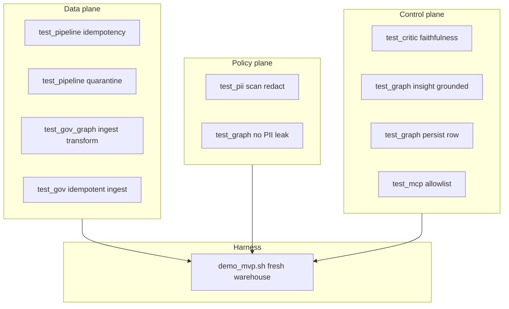

# Testing — what the suite proves

Every test maps to a claim we make publicly. Run the full gate:

```bash
./scripts/verify.sh   # first-time: installs uv, syncs, runs e2e
make e2e              # if uv already installed
```

**51 pytest** (unit + integration) · **FOIA demo** (fresh warehouse, shell assertions)

[`scripts/verify.sh`](../scripts/verify.sh) wraps [`harness/e2e.sh`](../harness/e2e.sh).

---

## Proof map



---

## By module

### `test_gov_graph.py` — FOIA path (primary demo)

| Test | Proves |
|---|---|
| `test_public_comments_ingest_and_transform` | 12 rows in → 10 silver, 2 quarantined |
| `test_gov_ingest_is_idempotent` | Re-drop same file does not duplicate bronze |
| `test_quarantine_preserves_bad_rows_with_errors` | Bad rows kept with explicit validation errors |
| `test_gov_gold_marts` | Gold KPIs + quality gate pass on happy path |
| `test_graph_pipeline_completes` | LangGraph end-to-end: complete + critic pass |
| `test_graph_insight_contains_no_pii` | Insight text has no email/phone patterns |
| `test_graph_insight_numbers_match_gold_metrics` | Every insight number exists in gold (critic rule) |
| `test_graph_persists_insight_row` | Insight written to `insights` table with `critic_passed=true` |
| `test_graph_needs_human_when_quality_fails` | Strict quarantine threshold → `needs_human`, not false OK |

### `test_pipeline.py` — Orders demo (medallion basics)

| Test | Proves |
|---|---|
| `test_ingest_is_idempotent_on_file_hash` | Content-hash dedupe |
| `test_quarantine_invalid_rows` | Pydantic validation → quarantine with reasons |
| `test_run_builds_gold_and_passes_gate` | Full CLI pipeline + gold KPIs |

### `test_critic.py` — Defensible memos

| Test | Proves |
|---|---|
| `test_critic_accepts_cited_metrics` | Valid numbers pass |
| `test_critic_rejects_hallucinated_number` | `999` rejected when not in metrics |
| `test_critic_exhausted_routes_needs_human` | Retry exhaustion → HITL route |

### `test_llm_insight.py` — Optional OpenAI-compatible insights (mocked)

| Test | Proves |
|---|---|
| `test_template_backend_uses_gold_metrics` | Default backend is still the gold template |
| `test_llm_backend_uses_mocked_grounded_draft` | LLM path gets gold JSON only; critic would pass |
| `test_llm_invented_number_fails_critic` | Invented counts still fail the critic |
| `test_llm_backend_falls_back_to_template_without_key` | No key / missing extra → template, no crash |
| `test_llm_payload_strips_timestamps` | LLM JSON is numeric KPIs only |

No live API key in CI.

### `test_release_meta.py` — Tag publish gate

| Test | Proves |
|---|---|
| `test_parse_tag_stable` / `_beta` / `_rc_and_refs_prefix` | SemVer tags map to PEP 440 and Docker tags |
| `test_parse_tag_rejects_incomplete` | `v1.2` cannot publish |
| `test_pyproject_version_pep621` / `_poetry` | Version is read from TOML, not a regex |
| `test_changelog_section_extracts_body` | Release notes come from the matching CHANGELOG heading |
| `test_changelog_missing_heading_shows_snippet` | Missing heading fails with the top of the file |

Used by [`.github/workflows/release.yml`](../.github/workflows/release.yml). Process: [VERSIONING.md](VERSIONING.md).

### `test_config.py` — Settings

| Test | Proves |
|---|---|
| `test_orders_warehouse_is_independent_of_gov` | Gov and Orders warehouses can differ |
| `test_orders_warehouse_defaults_to_repo_warehouse` | Default orders path is `warehouse/operator.duckdb` |

### `test_pii.py` — Policy plane

| Test | Proves |
|---|---|
| `test_scan_finds_email_and_phone` | Regex detector finds synthetic PII |
| `test_redact_strips_pii` | Redaction removes patterns from text |
| `test_ambiguous_confidence_flags_needs_human` | Low-confidence scan → human review |

### `test_mcp_tools.py` — Agent boundary

| Test | Proves |
|---|---|
| `test_allowlist_denies_unknown_query` | Unknown SQL IDs rejected |
| `test_allowlist_permits_comment_quality` | Allowlisted query returns quarantine_rate |
| `test_allowlist_has_no_vault_tools` | No vault/decrypt in MCP surface |
| `test_get_gold_metrics_returns_expected_kpis` | MCP gold read matches pipeline output |

### `test_quality.py` — Fail-closed KPIs

| Test | Proves |
|---|---|
| `test_quality_gate_blocks_high_quarantine` | High quarantine rate blocks quality pass |

### `test_http.py` — Source registry extensibility

| Test | Proves |
|---|---|
| HTTP/file extract + warehouse load for orders JSON source |

### `test_infra.py` — GCP adapters (no live cloud)

| Test | Proves |
|---|---|
| Pub/Sub decode, BQ SQL rewrite, table refs — unit level only |

---

## Harness assertions (`demo_mvp.sh`)

After pytest, the demo runs on a **fresh** DuckDB path and asserts:

| Assertion | Why |
|---|---|
| `status=complete` | Graph finished successfully |
| `silver=10` | Expected valid comment count |
| `quarantined=2` | Bad rows not silently dropped |
| `pii_findings=` | PII gate ran |
| insight mentions `comment` | Insight narrative produced |

This catches env pollution (stale warehouse) that isolated tests might miss when run separately.

---

## What tests do not prove

- Live GCP / BigQuery deploy
- Presidio PII or a **live** LLM API (optional path is mocked)
- Production FOIA officer HITL UI workflow

See [FINAL-REVIEW.md](FINAL-REVIEW.md).

---

## Adding tests

1. Tie each test to an invariant in [FOUNDATIONS.md](FOUNDATIONS.md) proof matrix
2. Prefer integration tests on fresh `tmp_path` warehouses over mocks for ETL paths
3. Run `make e2e` before PR — [CONTRIBUTING.md](../CONTRIBUTING.md)

## See also

- [FOUNDATIONS.md](FOUNDATIONS.md) — citations + matrix
- [WALKTHROUGH.md](WALKTHROUGH.md) — manual verification steps
