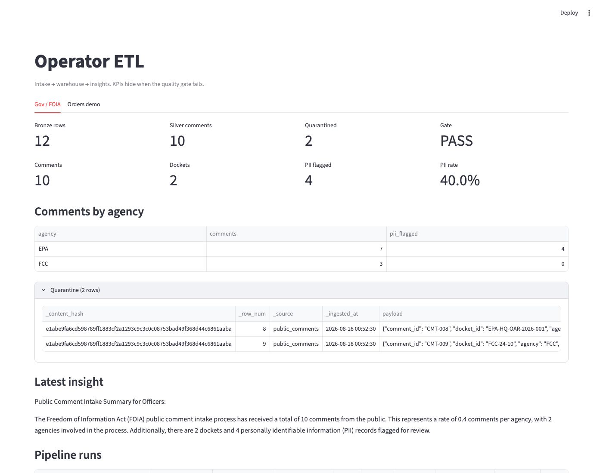
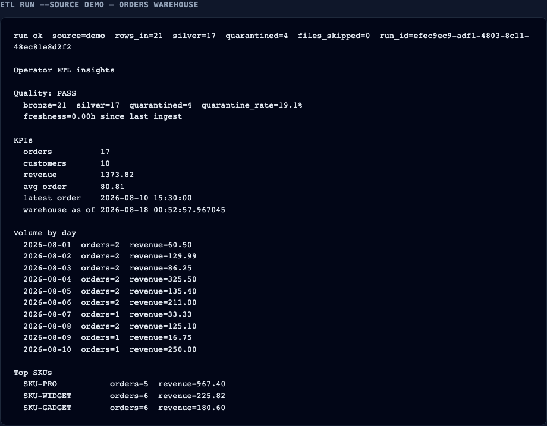
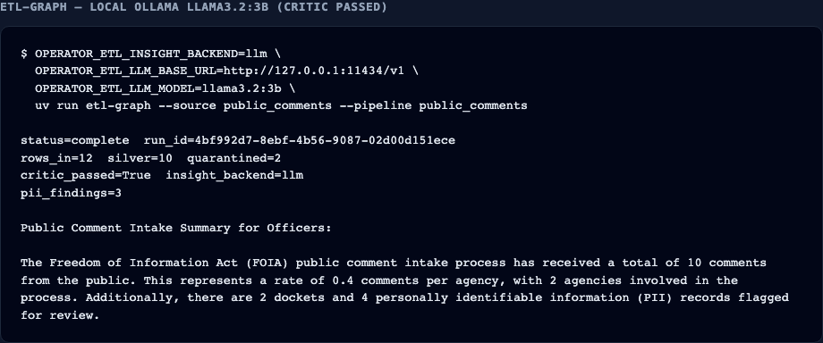
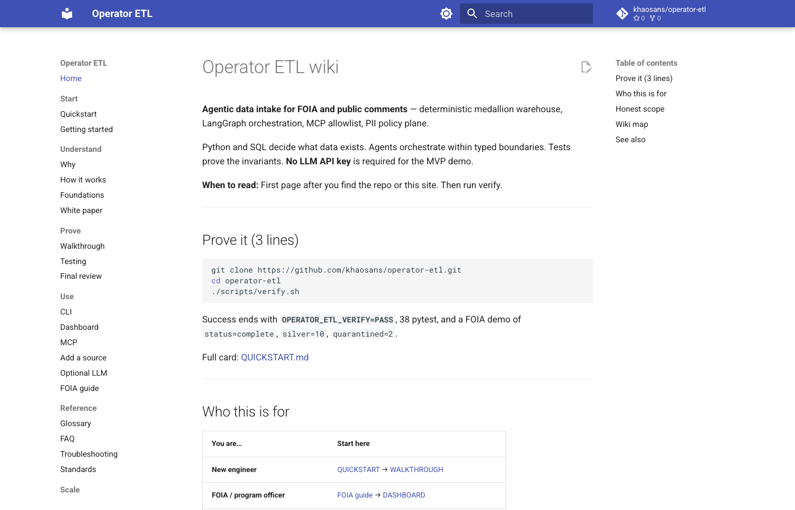

# Visual tour — see the app working

**When to read:** After (or instead of) a local run — you want **screenshots** of verify, CLI, Streamlit, and the wiki. Personas: [PERSONAS.md](PERSONAS.md).

These images were captured from a real laptop run (DuckDB + Streamlit). The FOIA LLM shot used **local Ollama** (`llama3.2:3b` on `127.0.0.1:11434`). CI still uses the **template** insight with no Ollama.

Quarantine payloads may show **synthetic** emails/phones from `samples/public_comments.csv` — not real people.

---

## Sam — prove it without an API key

```bash
./scripts/verify.sh
```


Expected: `OPERATOR_ETL_VERIFY=PASS`, 78 pytest, FOIA demo `silver=10` `quarantined=2`.


---

## Priya — FOIA officer view (Streamlit Gov tab)

After a FOIA graph run, point Streamlit at that warehouse:

```bash
export OPERATOR_ETL_WAREHOUSE=".tmp/mvp-demo/operator.duckdb"
export OPERATOR_ETL_ORDERS_WAREHOUSE=".tmp/orders-demo/operator.duckdb"
uv run streamlit run dashboard/app.py
```


What “good” looks like: Bronze **12**, Silver **10**, Quarantined **2**, Gate **PASS**, PII flagged **4**. Latest insight numbers must exist in gold (critic).



The two quarantined rows are intentional (empty body, bad timestamp). Details: [DASHBOARD.md](DASHBOARD.md).

---

## Riley — orders pipeline and local Ollama

Orders demo (fresh warehouse): **21** in → **17** silver, **4** quarantined, quality **PASS**.




Optional: same FOIA graph with local Ollama. Critic still has to pass.



Recipe: [LLM.md](LLM.md#ollama-on-this-laptop). The model may *misread* a rate (e.g. treat `0.4` as comments-per-agency); the critic only checks that **digits exist in gold**, not that the sentence is semantically perfect. Do not claim production LLM insights.

---

## Jordan — wiki as the public proof surface



Live site: [https://khaosans.github.io/operator-etl/](https://khaosans.github.io/operator-etl/). Audit: [FINAL-REVIEW.md](FINAL-REVIEW.md).

---

## Recapture screenshots

Seed warehouses, then:

```bash
uv pip install playwright
uv run python -m playwright install chromium
./scripts/demo_mvp.sh   # or etl-graph into .tmp/mvp-demo-ollama for the LLM insight
OPERATOR_ETL_WAREHOUSE=.tmp/orders-demo/operator.duckdb uv run etl run --source demo
uv run python scripts/capture_screenshots.py
```

CI does **not** run Playwright. PNGs under `docs/assets/screenshots/` are committed artifacts.

## See also

- [PERSONAS.md](PERSONAS.md)
- [WALKTHROUGH.md](WALKTHROUGH.md)
- [DASHBOARD.md](DASHBOARD.md)
- [LLM.md](LLM.md)
