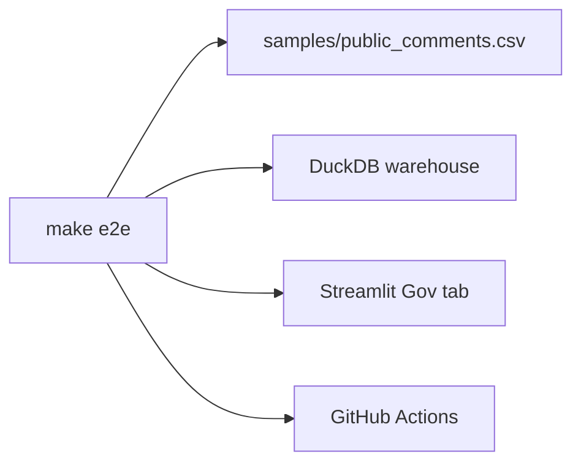
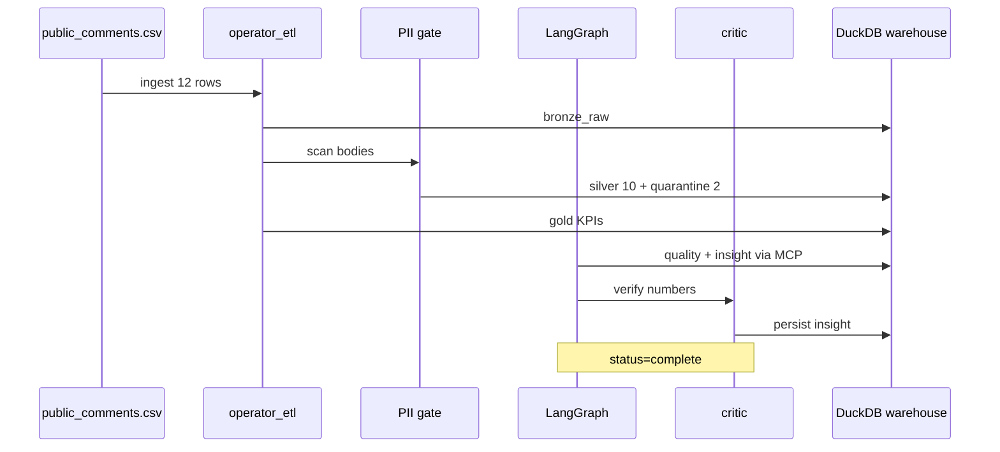

# Walkthrough — see the test case work

Step-by-step guide to verify Operator ETL on your machine after clone. Same proof CI runs on every push.

**When to read:** After install — you want to *see* the test case work (SQL, dashboard, CI).

**Prerequisites:** [GETTING-STARTED.md](GETTING-STARTED.md) §1–2 complete · **Start here:** [README.md](../README.md)

---

## Overview



Or run the helper: `./scripts/walkthrough.sh`

**What each test defends:** See the [proof matrix in FOUNDATIONS.md](FOUNDATIONS.md#proof-matrix).

### Pipeline sequence (FOIA demo)



---

## Step 1 — Run the proof gate

```bash
make e2e
```

**What runs:**

| Step | Tool | Proves |
|---|---|---|
| OKF validate | `scripts/okf_validate.py` | Documentation structure |
| pytest | 76 tests | PII, critic, graph, idempotency, MCP, HITL, mocked LLM, release-tag metadata, path traversal, cloud adapters |
| FOIA demo | `scripts/demo_mvp.sh` | End-to-end on fresh warehouse |

**Expected terminal output (FOIA demo section):**

```
status=complete  run_id=...
rows_in=12  silver=10  quarantined=2
pii_findings=3

Public comment intake summary: 10 comments across 2 dockets and 2 agencies. ...
```

`pii_findings=3` is scanner groups (EMAIL, PHONE, US_SSN). Gold / Streamlit **PII flagged ≥ 4** is comments with PII (CMT-001, 003, 006, 011).

**Expected summary:**

```
Operator ETL MVP — PASS
  Sample: 12 public comments (EPA/FCC dockets)
  Silver: 10 valid | Quarantine: 2
```

If counts look wrong, you may have a stale warehouse — run `./scripts/demo_mvp.sh` alone (uses fresh `.tmp/mvp-demo/`).

---

## Step 2 — Inspect the sample data

Open [`samples/public_comments.csv`](../samples/public_comments.csv):

- **12 data rows** (plus header)
- **2 invalid rows** quarantined: empty body, bad date
- **PII in bodies**: emails, phones (synthetic — for demo only)

Registry entry: [`pipelines/public_comments.yaml`](../pipelines/public_comments.yaml)

---

## Step 3 — Inspect the warehouse

After `make e2e`, the demo warehouse is at `.tmp/mvp-demo/operator.duckdb`.

```bash
./scripts/walkthrough.sh --inspect-only
```

Or query manually:

```bash
duckdb .tmp/mvp-demo/operator.duckdb -c "
  SELECT 'silver' AS layer, COUNT(*) AS n FROM silver_comments
  UNION ALL
  SELECT 'quarantine', COUNT(*) FROM quarantine_comments
  UNION ALL
  SELECT 'pii_flagged', COUNT(*) FROM silver_comments WHERE pii_detected;
"
```

**Expected:**

| layer | n |
|---|---|
| silver | 10 |
| quarantine | 2 |
| pii_flagged | 4+ |

Gold KPIs:

```bash
duckdb .tmp/mvp-demo/operator.duckdb -c "SELECT * FROM gold_comment_kpis;"
```

---

## Step 4 — Dashboard visual check

```bash
export OPERATOR_ETL_WAREHOUSE=".tmp/mvp-demo/operator.duckdb"
export OPERATOR_ETL_PIPELINE_NAME=public_comments
export OPERATOR_ETL_DOMAIN=gov
uv run streamlit run dashboard/app.py
```

Open **Gov / FOIA** tab — comment count, PII flagged, quarantine expander, latest insight text should match Step 1 output. Full screenshot set: [TOUR.md](TOUR.md).


---

## Step 5 — CI (remote build)

Local `make e2e` mirrors GitHub Actions:

**https://github.com/khaosans/operator-etl/actions/workflows/ci.yml**

Green CI on `master` = same OKF + pytest + FOIA demo passed on a clean Ubuntu runner, plus Docker image build.

---

## Step 6 — MCP smoke & Agent Interaction

```bash
cp .cursor/mcp.json.example .cursor/mcp.json
# edit cwd to your clone path
```

In Cursor or any MCP-compatible agent environment:
1. Call `get_gold_metrics` with `domain: gov` — the agent receives aggregate counts (`total_comments: 10`, `pii_flagged_count: 4`) without touching raw citizen records.
2. Call `run_quality_sql` with `query_id: comment_quality` — inspect quarantine rates and freshness.
3. Observe tool denials: any attempt by an agent to execute arbitrary SQL or invoke `vault_decrypt` returns a clean `TOOL_DENIED` error.

---

## Step 7 — Operational Invariant Learning Tour

For engineers, operators, and review teams looking to understand *why* the pipeline behaves this way in production:

1. **Idempotency Invariant:** Re-running `./scripts/demo_mvp.sh` on an existing database will detect identical SHA-256 byte hashes in `ingest_files` and safely skip processing (`rows_in=0`), preventing double-counting.
2. **Quarantine Invariant:** Examine `quarantine_comments` to see that corrupted submissions (`COM-004` invalid date, `COM-005` empty body) are preserved alongside explicit Pydantic validation error strings.
3. **Critic Invariant:** The Critic node deterministically parses all numeric tokens in the generated briefing and cross-checks them against `gold_comment_kpis`. If an LLM hallucinates a count (e.g. citing 12 comments instead of 10), the draft is halted and rerouted to human review (`needs_human`).

---

## Test file mapping

| Assertion | Test / script |
|---|---|
| Graph completes, critic passes | `tests/test_gov_graph.py` |
| PII not in redacted output | `tests/test_pii.py` |
| Hallucinated numbers rejected | `tests/test_critic.py` |
| MCP allowlist deny/permit | `tests/test_mcp_tools.py` |
| Idempotent ingest | `tests/test_pipeline.py` |
| Fresh warehouse E2E smoke | `scripts/demo_mvp.sh` |
| Full gate | `harness/e2e.sh` / `make e2e` |

Canonical numbers: [okf/models/mvp-demo.md](../okf/models/mvp-demo.md)

---

## Next steps

- **Understand architecture:** [HOW-IT-WORKS.md](HOW-IT-WORKS.md)
- **Scale to GCP:** [SCALING.md](SCALING.md)
- **Agency workflow:** [FOIA-Public-Comments-Guide.md](FOIA-Public-Comments-Guide.md)

## See also

- [GETTING-STARTED.md](GETTING-STARTED.md) — install, MCP, env vars
- [FOUNDATIONS.md](FOUNDATIONS.md) — proof matrix and citations
- [FINAL-REVIEW.md](FINAL-REVIEW.md) — audit before share or scale
