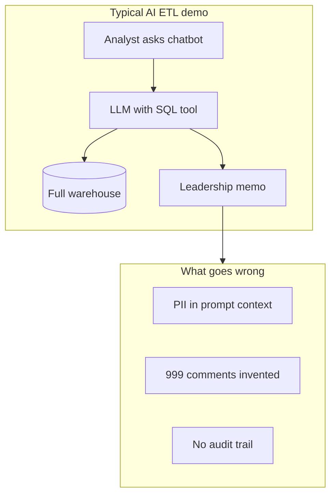
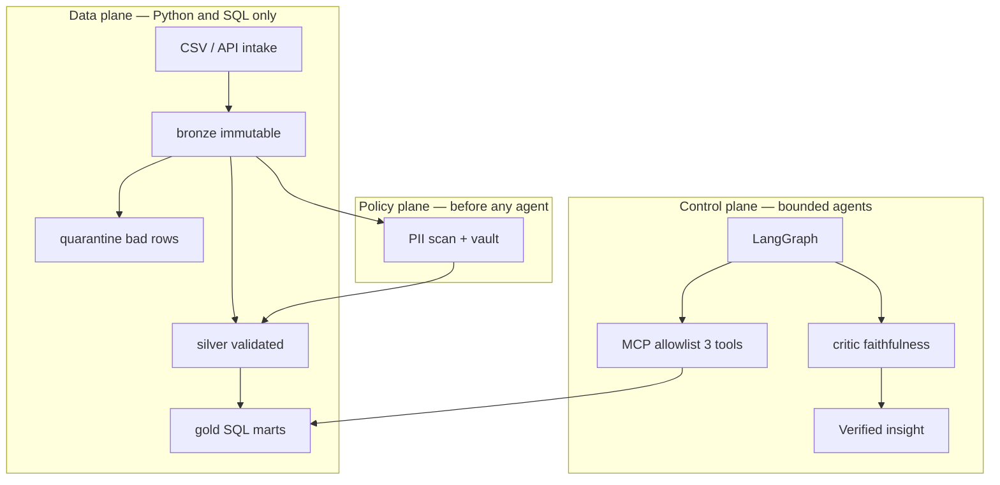
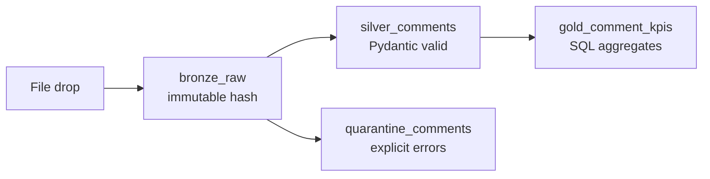
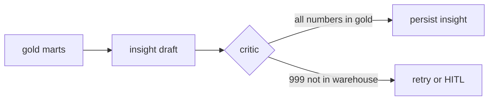
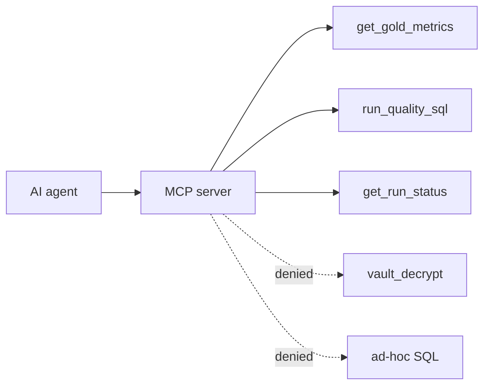

# Why Operator ETL?

**The short answer:** Most “AI + data” demos connect a chatbot to your warehouse. That fails FOIA and public-comment workflows for three predictable reasons — PII leaks, hallucinated counts, and runs you cannot replay. Operator ETL fixes each with a boundary you can test.

**Prove it yourself:** `git clone` → `make e2e` → [WALKTHROUGH.md](WALKTHROUGH.md)

---

## The chatbot trap

| Failure mode | Real-world consequence |
|---|---|
| **PII in context** | Email/phone from comment bodies reach the model before redaction review |
| **Hallucinated KPIs** | Memo says “999 comments” — number not in any table; indefensible under audit |
| **Opaque runs** | Cannot answer *what ran, when, on which file* for oversight or FOIA |

---

## The Operator ETL pattern

**Separate what must be deterministic from what may be agentic.**

| Layer | Job | Why it matters |
|---|---|---|
| **Data** | Medallion ETL, idempotent ingest, quarantine | Audit trail; bad rows never silently become KPIs |
| **Policy** | PII scan, token vault, fail-closed gates | Agents never see raw emails/phones |
| **Control** | LangGraph + MCP + critic | Orchestration without warehouse keys or invented numbers |

---

## Medallion = audit trail

FOIA officers need to show *what arrived, what was rejected, and what was released*.

- **Bronze** never changes — replay and legal discovery friendly
- **Quarantine** preserves bad rows with reasons — no silent drops
- **Gold** is SQL-only — numbers agents and dashboards cite

Source: [Databricks Medallion Architecture](https://www.databricks.com/glossary/medallion-architecture) · Proof: `tests/test_pipeline.py`

---

## Critic = defensible memos

Even template insights must not invent numbers. The **critic** extracts every integer from the draft and checks it against gold.

Example from the FOIA demo:

> *10 comments across 2 dockets… PII rate 0.4*

Every number is verified before persist. Hallucinated `999` is rejected in `tests/test_critic.py`.

---

## MCP = least privilege for agents

Agents do not get `SELECT * FROM bronze`. They get **three typed tools**:

Source: [Model Context Protocol](https://modelcontextprotocol.io/) · Proof: `tests/test_mcp_tools.py`

---

## What we prove today (and what we don't)

| Claim | Status | Verify |
|---|---|---|
| FOIA pipeline on laptop | **Proven** | `make e2e` |
| PII not in insight output | **Proven** | 41 pytest |
| Critic rejects bad numbers | **Proven** | `tests/test_critic.py` |
| Live GCP / BigQuery E2E | **Partial** | Terraform scaffold only |
| Optional LLM insights | **Partial** | Mocked in CI; template default — [LLM.md](LLM.md) |
| Presidio PII | **Specified** | Regex scanner today |

Full audit: [FINAL-REVIEW.md](FINAL-REVIEW.md)

---

## Who should care

| You are… | Start here |
|---|---|
| **FOIA / program officer** | [FOIA-Public-Comments-Guide.md](FOIA-Public-Comments-Guide.md) |
| **Engineer evaluating architecture** | [HOW-IT-WORKS.md](HOW-IT-WORKS.md) → [white paper](Operator-ETL-White-Paper.md) |
| **Skeptic who wants proof** | [WALKTHROUGH.md](WALKTHROUGH.md) |
| **Hiring manager / reviewer** | README → `make e2e` → [FOUNDATIONS.md](FOUNDATIONS.md) proof matrix |

---

## Open source

Apache License 2.0 — clone, fork, and run the proof gate. Sample data is **synthetic**; do not commit real FOIA records.

- **Repo:** https://github.com/khaosans/operator-etl
- **Contribute:** [CONTRIBUTING.md](../CONTRIBUTING.md)
- **Slides / PDFs:** [share/README.md](share/README.md)

## See also

- [README.md](../README.md) — quick start and trade-offs
- [HOW-IT-WORKS.md](HOW-IT-WORKS.md) — runtime model
- [FOUNDATIONS.md](FOUNDATIONS.md) — citations and proof matrix
