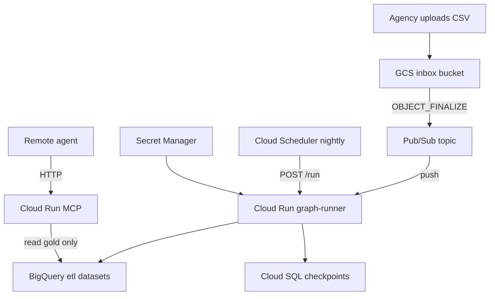

# GCP Infrastructure — Operator ETL

Terraform and CI/CD scaffolding to deploy the FOIA / public comments agentic pipeline on Google Cloud.

## Architecture

Scale ladder and local→GCP checklist: [docs/SCALING.md](../docs/SCALING.md)



## Prerequisites

- GCP project with billing enabled
- `gcloud` CLI authenticated
- Terraform >= 1.5
- APIs enabled (Terraform will not auto-enable all):

```bash
gcloud services enable \
  run.googleapis.com \
  sqladmin.googleapis.com \
  bigquery.googleapis.com \
  pubsub.googleapis.com \
  secretmanager.googleapis.com \
  artifactregistry.googleapis.com \
  cloudscheduler.googleapis.com \
  storage.googleapis.com
```

## Deploy with Terraform

```bash
cd infra/terraform
cp terraform.tfvars.example terraform.tfvars
# Edit project_id, environment
# Set pii_vault_key and openai_api_key (sensitive; REPLACE_ME* is rejected)

terraform init
terraform plan
terraform apply
```

Secrets how-to: [docs/SECURITY-HARDENING.md](../docs/SECURITY-HARDENING.md#terraform-secrets).

### What gets created

| Resource | Purpose |
|---|---|
| GCS `*-inbox-*` | FOIA comment CSV drop zone |
| Pub/Sub topic + push subscription | GCS finalize → graph-runner |
| BigQuery datasets | `etl_bronze_*`, `etl_silver_*`, `etl_quarantine_*`, `etl_gold_*` |
| Cloud SQL PostgreSQL 15 | LangGraph checkpoint store |
| Cloud Run `graph-runner` | HTTP + Pub/Sub ingest, 900s timeout, concurrency=1 |
| Cloud Run `mcp` | Gold-read MCP HTTP tools |
| Secret Manager | PII vault key, OpenAI key placeholders |
| Cloud Scheduler | Nightly freshness trigger |
| Artifact Registry | Container images |
| IAM service accounts | Least-privilege per workload |
| Cloud Monitoring alerts | Graph-runner 5xx, Pub/Sub DLQ depth, PII vault secret access burst |

## Build and push container

```bash
# From repo root
docker build -t operator-etl:local .
docker run -p 8080:8080 -e OPERATOR_ETL_BACKEND=duckdb operator-etl:local

# Or via Cloud Build (runs tests + deploy)
gcloud builds submit --config cloudbuild.yaml
```

## Post-deploy steps

1. **Set Secret Manager values** (Terraform already created the secrets; `pii_vault_key` / `openai_api_key` in `terraform.tfvars` must not be `REPLACE_ME*`):
   ```bash
   echo -n "your-pii-vault-key" | gcloud secrets versions add operator-etl-staging-pii-vault-key --data-file=-
   echo -n "sk-..." | gcloud secrets versions add operator-etl-staging-openai-api-key --data-file=-
   ```
   Graph-runner keeps `OPERATOR_ETL_INSIGHT_BACKEND=template` until you flip it to `llm`. See [docs/LLM.md](../docs/LLM.md).

2. **Upload a test comment file:**
   ```bash
   gsutil cp samples/public_comments.csv gs://BUCKET/incoming/test.csv
   ```

3. **Verify graph-runner:**
   ```bash
   curl -X POST "$GRAPH_RUNNER_URL/run" \
     -H "Authorization: Bearer $(gcloud auth print-identity-token)" \
     -H "Content-Type: application/json" \
     -d '{"source":"public_comments","pipeline":"public_comments"}'
   ```

4. **Verify MCP (gold read only):**
   ```bash
   curl -sS "$MCP_URL/health" \
     -H "Authorization: Bearer $(gcloud auth print-identity-token)"
   ```

5. **Confirm alerts:** Terraform created monitoring policies for Cloud Run 5xx, Pub/Sub DLQ depth, and vault secret access. Set `alert_email` in `terraform.tfvars` to attach an email channel.

6. **Rotate secrets:** After any suspected exposure, add a new Secret Manager version and redeploy Cloud Run (do not commit keys).

### Staging smoke checklist (synthetic data only)

- [ ] `./harness/e2e.sh` green locally before promote
- [ ] Secret Manager `pii_vault_key` / `openai_api_key` are **not** `REPLACE_ME*`
- [ ] Identity-token `POST /run` with `samples/public_comments.csv` path / source returns `status=complete` (or documented `needs_human`)
- [ ] MCP identity-token call cannot list vault tools / decrypt
- [ ] BigQuery gold tables populated (`gold_comment_kpis`, quality)
- [ ] Monitoring policies visible in Cloud Console
- [ ] Optional: `OPERATOR_ETL_BQ_INTEGRATION=1` + `pytest -m integration`
- [ ] **Never** upload real FOIA PII to staging without agency approval

Optional CI: [`.github/workflows/staging-e2e.yml`](../.github/workflows/staging-e2e.yml) (`workflow_dispatch`).

## Local vs GCP

| Component | Local | GCP |
|---|---|---|
| Warehouse | DuckDB file | BigQuery |
| Checkpoints | SQLite | Cloud SQL Postgres |
| Ingest trigger | `etl-graph` CLI | GCS + Pub/Sub or Scheduler |
| MCP | stdio (`operator-etl-mcp`) | HTTP (`operator-etl-mcp` Cloud Run) |

See [`../docs/FOIA-Public-Comments-Guide.md`](../docs/FOIA-Public-Comments-Guide.md) for the agency workflow.

## State backend (recommended for teams)

Uncomment the `backend "gcs"` block in `versions.tf` and create a dedicated tfstate bucket before `terraform init -reconfigure`.
