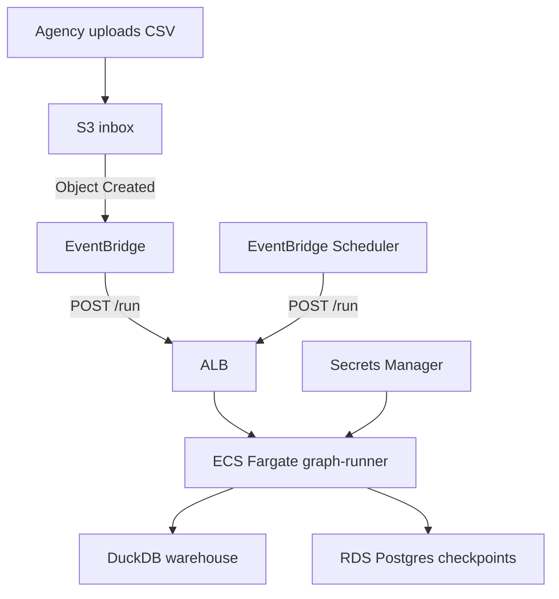

# AWS Infrastructure — Operator ETL (L2)

S3 inbox → EventBridge → ECS Fargate graph-runner, RDS Postgres checkpoints, Secrets Manager.

Parent index: [../README.md](../README.md) · Human wiki: [docs/MULTI-CLOUD.md](../../docs/MULTI-CLOUD.md)



## Deploy

```bash
cd infra/aws
cp terraform.tfvars.example terraform.tfvars
# Set pii_vault_key / openai_api_key (REPLACE_ME* rejected)

terraform init
terraform plan
terraform apply
```

Build/push image:

```bash
docker build --build-arg CLOUD_EXTRA=aws -t operator-etl:aws .
# tag/push to ECR output ecr_repository_url
```

Env contract: [../env.aws.example](../env.aws.example)

## Smoke test

```bash
aws s3 cp samples/public_comments.csv s3://$INBOX_BUCKET/incoming/test.csv
curl -X POST "$GRAPH_RUNNER_URL/run" \
  -H "Content-Type: application/json" \
  -d '{"source":"gcs_inbox","pipeline":"public_comments","trigger":"http"}'
```

Skill: [operator-ship-aws](../../skills/operator-ship-aws/SKILL.md)
