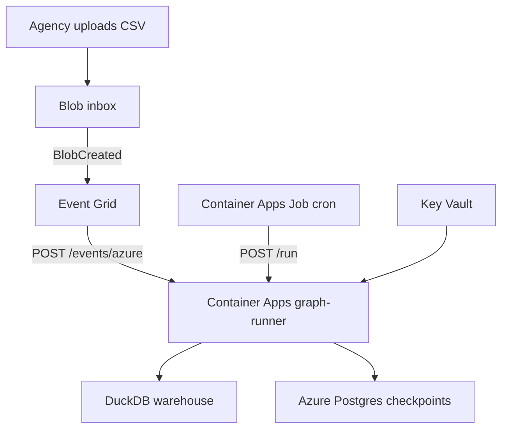

# Azure Infrastructure — Operator ETL (L2)

Blob inbox → Event Grid → Container Apps graph-runner, Azure Database for PostgreSQL, Key Vault.

Parent index: [../README.md](../README.md) · Human wiki: [docs/MULTI-CLOUD.md](../../docs/MULTI-CLOUD.md)



## Deploy

```bash
cd infra/azure
cp terraform.tfvars.example terraform.tfvars
# Set pii_vault_key / openai_api_key (REPLACE_ME* rejected)
# az login && set subscription

terraform init
terraform plan
terraform apply
```

Build/push image:

```bash
docker build --build-arg CLOUD_EXTRA=azure -t operator-etl:azure .
# tag/push to ACR output acr_login_server
```

Env contract: [../env.azure.example](../env.azure.example)

## Smoke test

```bash
az storage blob upload --account-name $ACCOUNT -c inbox \
  -f samples/public_comments.csv -n incoming/test.csv
curl -X POST "$GRAPH_RUNNER_URL/run" \
  -H "Content-Type: application/json" \
  -d '{"source":"gcs_inbox","pipeline":"public_comments","trigger":"http"}'
```

Skill: [operator-ship-azure](../../skills/operator-ship-azure/SKILL.md)
