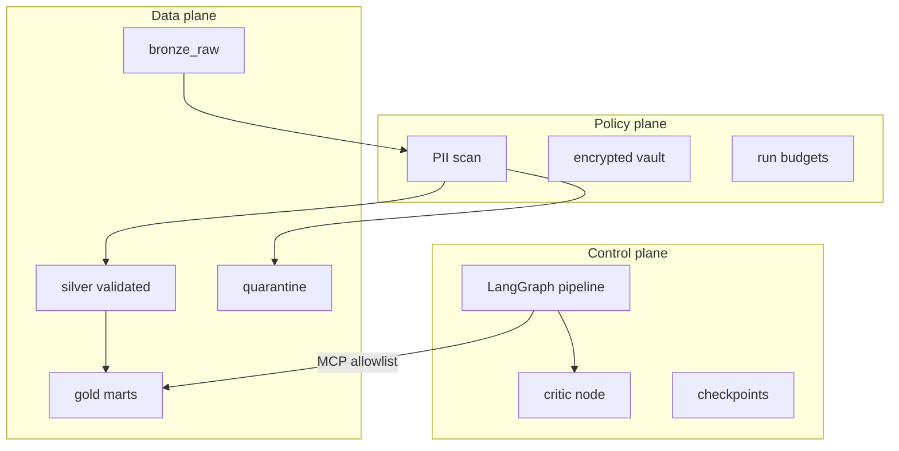

# Three planes

**Rule:** LLMs decide *whether* to phrase an insight. Python and SQL decide *what data exists*.

Usage narrative: [docs/HOW-IT-WORKS.md](../../docs/HOW-IT-WORKS.md)

| Plane | Package | MCP access |
|---|---|---|
| Control | `operator_etl_graph/` | Orchestrates nodes |
| Policy | `operator_etl_policy/` | Never exposed via MCP |
| Data | `operator_etl/` | Via allowlisted tools only |

See [implementation status](/models/implementation-status.md) for what is coded vs specified.
